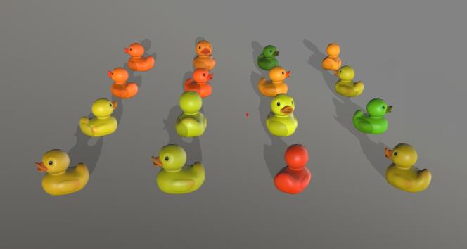

#MultiGLTFMarker



MultiGLTFMarker是[GLTFMarker](gltf-marker)的子类，用于将一个GLTF模型绘制在多个坐标上，能设置不同的偏移/缩放/旋转系统，并能进行交互。

MultiGLTFMarker能够用symbol设置模型的状态，例如缩放比例，透明度，旋转角度等，同时提供了方法用于更新模型，更新模型状态，开启暂停动画等。

MultiGLTFMarker利用了WebGL的instancing技术绘制，以提升批量绘制模型时的WebGL渲染性能。

## 构造函数

```javascript
import { MultiGLTFMarker } from '@maptalks/gltf-layer';

const multiGLTFMarker = new MultiGLTFMarker([
  {
    coordinates: [0, 0],
    translation: [0, 0, 0],
    rotation: [0, 0, 0],
    scale: [1, 1, 1],
    color: [1, 0, 0, 1]
  },
  {
    coordinates: [0, 0],
    translation: [0, 2, 0],
    rotation: [0, 0, 0],
    scale: [1, 1, 1],
    color: [1, 1, 0, 1]
  },
], {
  symbol: {
    url: 'path/to/gltf1.gltf'
  }
});
```
<details><summary>详细信息</summary>
<div>
参数：

* data\* **Object[]** Marker数据，其中每个数据对象包含的属性如下：

{@include: includes/multi-gltf-marker-data.md}

* options\* **Object** 配置参数，可选的配置项如下：

| 配置名               |  类型   |  描述                     | 默认值 |
|  ------             | :----:  | ----                      |   :-----------:  |
{@include: includes/gltf-marker-options.md}
{@include: includes/geometry-options.md}

</div>
</details>

## 样式说明

MultiGLTFMarker的options.symbol和GLTFMarker一样，包含以下的设置和属性。

{@include: includes/gltf-marker-symbols.md}

## 成员函数

<details><summary>addData(data)</summary>
<div>
<br/>

增加一个数据项，数据项的属性如下：

{@include: includes/multi-gltf-marker-data.md}

参数：

* data **Object** 数据项

返回：

* this

</div>
</details>

<details><summary>removeData(idx)</summary>
<div>
<br/>

删除一个数据项。

参数：

* idx **Number** 数据项的序号

返回：

* this

</div>
</details>

<details><summary>getData(idx)</summary>
<div>
<br/>

获取一个数据项。

参数：

* idx **Number** 数据项的序号

返回：

* Object

</div>
</details>

<details><summary>updateData(idx, name, value)</summary>
<div>
<br/>

更新一个数据项。

```js
const multiGLTFMarker = new MultiGLTFMarker([
  {
    coordinates: [0, 0],
    translation: [0, 0, 0],
    rotation: [0, 0, 0],
    scale: [1, 1, 1],
    color: [1, 0, 0, 1]
  },
  {
    coordinates: [0, 0],
    translation: [0, 2, 0],
    rotation: [0, 0, 0],
    scale: [1, 1, 1],
    color: [1, 1, 0, 1]
  },
], {
  symbol: {
    url: 'path/to/gltf1.gltf'
  }
});

multiGLTFMarker.updateData(0, 'color', [0, 1, 0, 1]);
```

参数：

* idx **Number** 数据项的序号
* name **String** 要更新的属性
* value **Number[]** 属性的值

返回：

* Object

</div>
</details>

<details><summary>updateAllData(name, value)</summary>
<div>
<br/>

更新所有数据项的属性值。

```js
const multiGLTFMarker = new MultiGLTFMarker([
  {
    coordinates: [0, 0],
    translation: [0, 0, 0],
    rotation: [0, 0, 0],
    scale: [1, 1, 1],
    color: [1, 0, 0, 1]
  },
  {
    coordinates: [0, 0],
    translation: [0, 2, 0],
    rotation: [0, 0, 0],
    scale: [1, 1, 1],
    color: [1, 1, 0, 1]
  },
], {
  symbol: {
    url: 'path/to/gltf1.gltf'
  }
});

multiGLTFMarker.updateAllData('color', [0, 1, 0, 1]);
```

参数：

* name **String** 要更新的属性
* value **Number[]** 属性的值

返回：

* Object

</div>
</details>

<details><summary>getCount()</summary>
<div>
<br/>

获取数据项的数量。

返回：

* Number

</div>
</details>

<details><summary>getIndexByPickingId(pickingId)</summary>
<div>
<br/>

用pickingId获取数据的序号。

pickingId是用identify或identifyAtPoint方法选取出的数据中，标识数据的一个内部id值。

返回：

* Number

</div>
</details>

## 继承自GLTFMarker的方法

{@include: includes/gltf-marker-methods.md}

{@include: includes/geometry-methods.md}

## 静态方法

{@include: includes/geometry-static-methods.md}

## 事件

{@include: ../vt/includes/js-events-example.md}

### 继承自GLTFMarker的事件

{@include: includes/gltf-marker-events.md}

### 继承自Geometry的事件

{@include: includes/geometry-events.md}