数据通过添加属性可以进一步分类，方便程序调用。在MapTalks IDE中，VT和GeoJSON图层下的数据，只能在对应的下拉菜单里选用已设置好的属性，无法新增或者编辑属性，比如[高度属性](../basic/height)。但我们可以为三维模型和矢量图层设置新属性。下面我们用矢量-点图层为例，讲解如何设置。

## 添加矢量图层

* 打开新建图层，选择“矢量”，图层ID选用默认名字：point0，图层类型选择“点”。

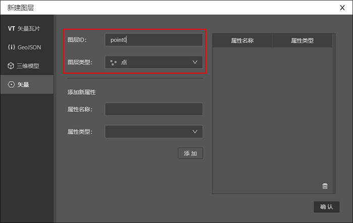

## 添加新属性

* 属性名称按实际业务需求填写。这里我们填入“name”。 属性类型有4种，时间、字符串、布尔和数字，意思是属性值可以填入时间、文字、布尔类型、数字。这里我们选择字符串。然后再选择单击“添加”。

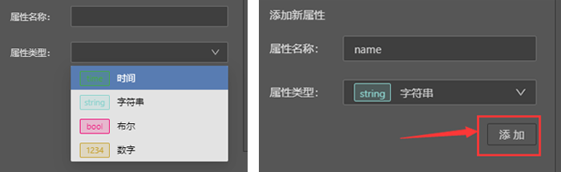

* 此时就可以发现右边的属性面板里增加了一条列表。单击确认，完成新建矢量图层的设置。（如果想继续增加属性，可以再次填写后点击添加）

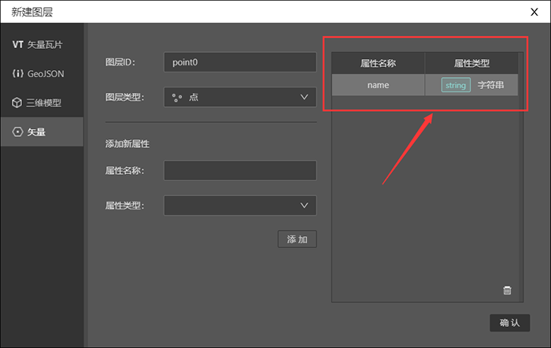

## 在地图上添加矢量点数据

* 图层面板上此时新增了矢量点图层-point0,单击添加按钮“+”，鼠标手势随之在地图上变成十字。

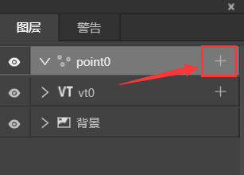
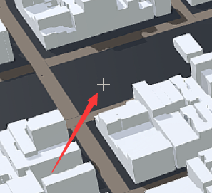

* 在地图上想标注的地方，单击鼠标右键，此时地图上就会出现一个蓝色圆点，同时弹出了“编辑”对话框，你会发现对话框里出现了属性名称：name。

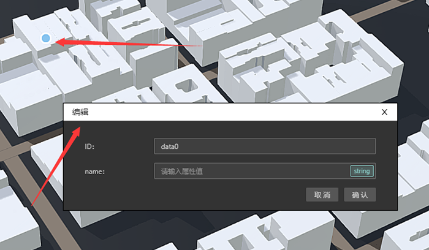

## 填写“编辑”面板

* 我们可以保持ID默认名称“data0”不变，在name这一项我们填入"A "，然后点击“确认”。此时在图层面板上，point0图层下即出现了数据data0。

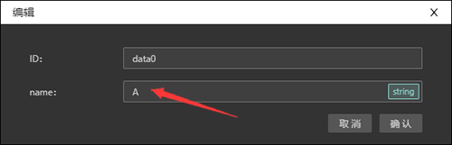
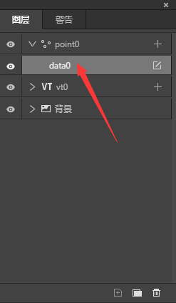

## 在渲染面板编辑

* 调转到渲染>文字>基础色>属性 下拉菜单里选择“name”。此时地图上标注的蓝色圆点上方出现了文字“A”。

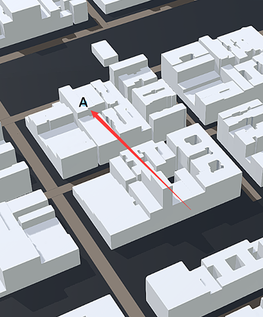

* 在图标面板中可以调整矢量图形的各种效果，在文字面板中可以调整文字的各种效果。

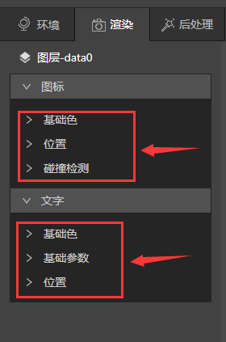

# 重新修改属性内容

* 在图层面板上选中“data0”右边的编辑图标，可以再次弹出编辑面板，修改ID名或者文字内容。

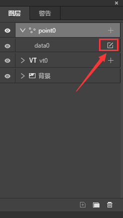

* 在图层面板上选中“point0”,右边渲染面板会出现图层的编辑选项。单击“编辑属性”按钮，会再次弹出“编辑属性”面板，允许用户增加或者删除内容。

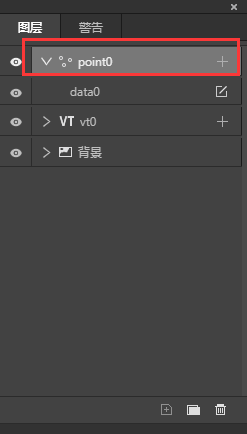
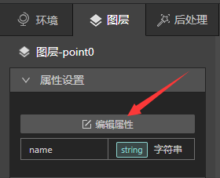

* 如果想继续在地图上标注，就回到图层面板上点击point0右边的添加图标，然后重复上述步骤。

