## 新建模型图层

在地图上添加模型，首先需要在图层面板上新建三维模型图层。在新建图层面板中，选中三维模型，可以不填写任何属性，直接确定。

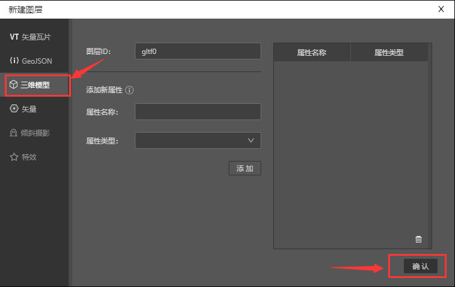

## 地图上添加模型。

### （1）添加默认模型

* 选中图层面板上模型图层右边的“添加”图标，鼠标手势会变成十字。

* 然后在地图任意地方单击一下鼠标左键，即会出现一个默认模型四面锥，同时地图下方自动弹出模型库。

### （2）更改模型尺寸、方向

* 鼠标左键单击模型，会弹出模型控制轴。

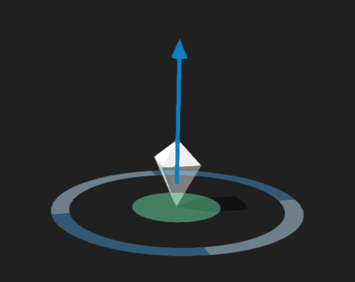

* 将鼠标放在中心绿色圆盘并拖拽，可以随意移动模型，拖动四个方向箭，可以按箭头所指方向拖动模型。

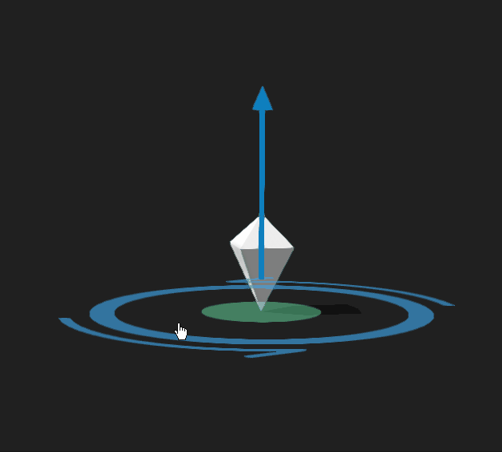

* 拖动向上的箭头，可以沿Z轴上下移动模型。

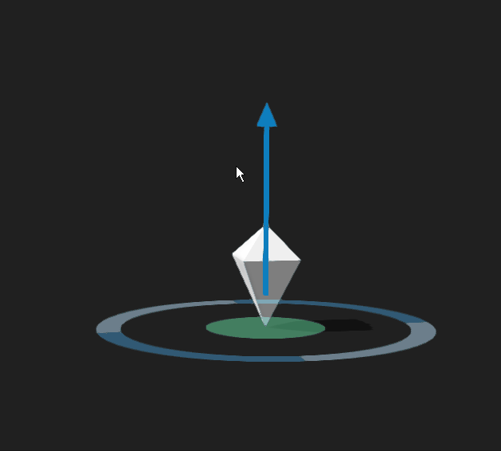

* 将鼠标放在圆环深蓝色部分，会变成旋转模式，转动旋转圈可以绕Z轴旋转模型。

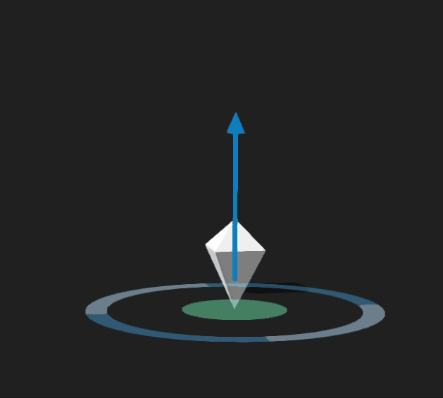

* 将鼠标放在圆环浅蓝色部分，会变成缩放模式，拖拽缩放圈可以缩放模型。

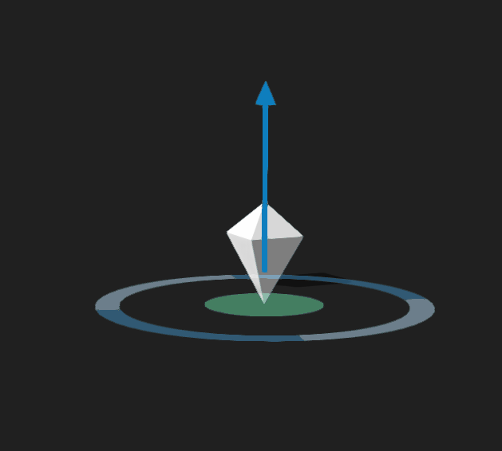

### （3）更换模型

* 先确模型为选中状态，你可以在地图上鼠标左键单击模型，或者图层面板上选中模型数据。然后在模型库里直接单击想更换的模型，完成更换。

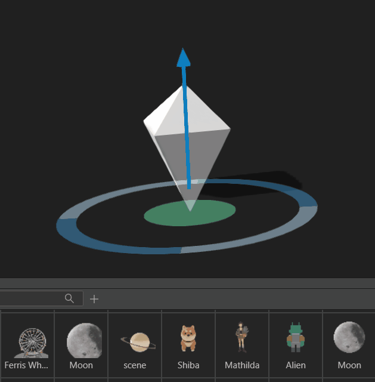

### （4）调整模型属性

* 右边属性面板可以调整模型属性，Studio对模型有2种渲染模型，PBR和wireframe。

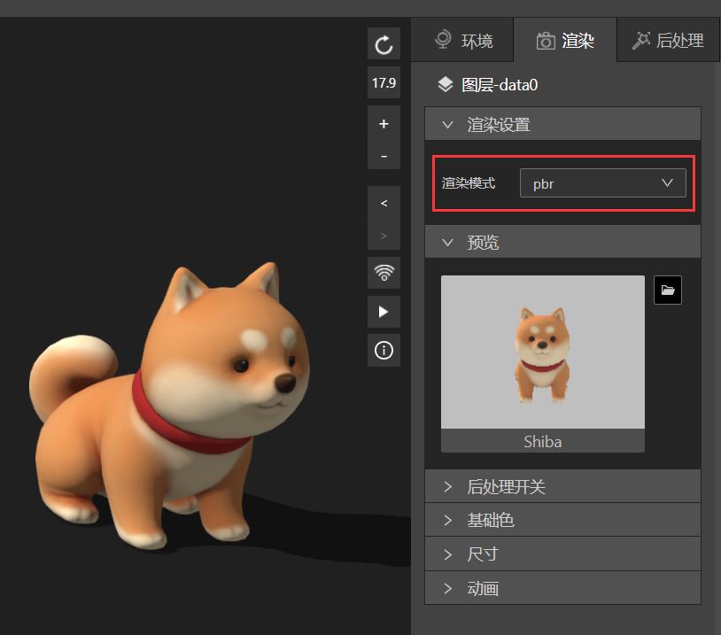

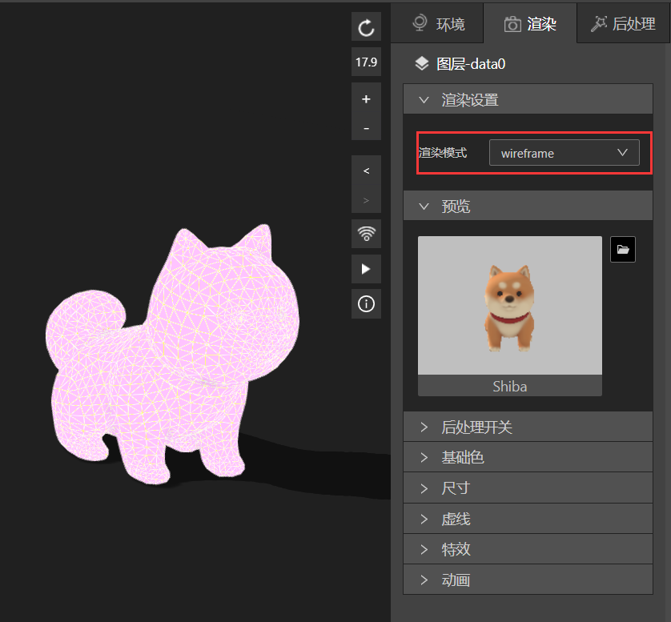

## 导入新模型

* 在模型库上面点击“添加”图标。

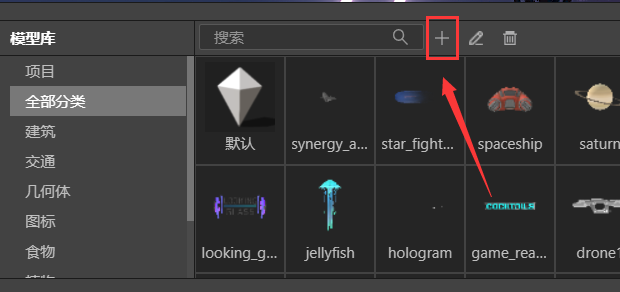

* 在弹出的“导入模型”面板里单击添加资源，就可以上传自己想添加的模型了。

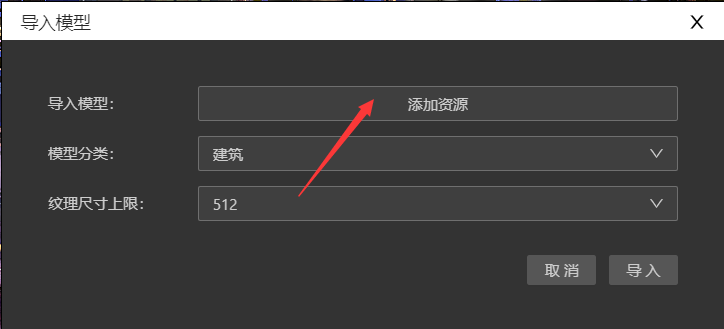
