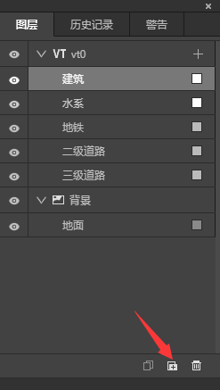
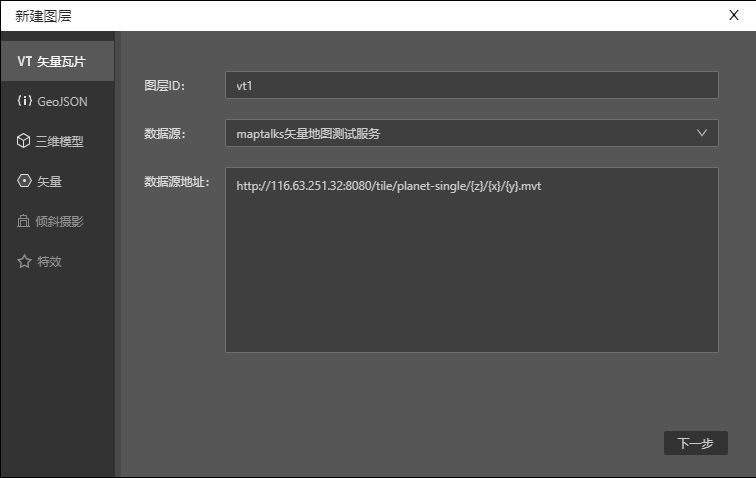

在[打开和创建工程文件](../../ide/guide/tutorial/create.md)这篇文章里我们学习了如何创建图层，那么创建完成后，如何新增图层呢？VT图层创建完成后，又如何添加数据呢？

## 新增图层

图层面板最下方有3个小图标，单击箭头所指的小图标，即弹出新建图层面板，就可以新建图层了。

## 添加VT数据

单击图层面板上VT图层右边“+”图标，就会弹出添加数据面板，勾选想要添加的数据，单击确认即可。

