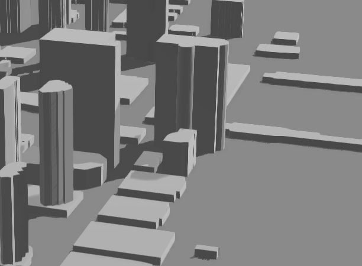
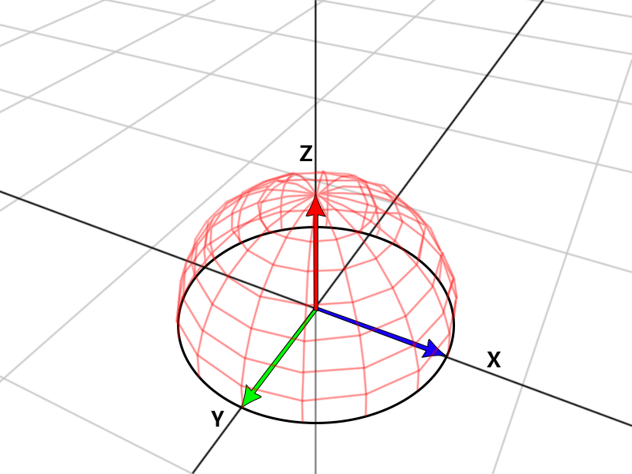
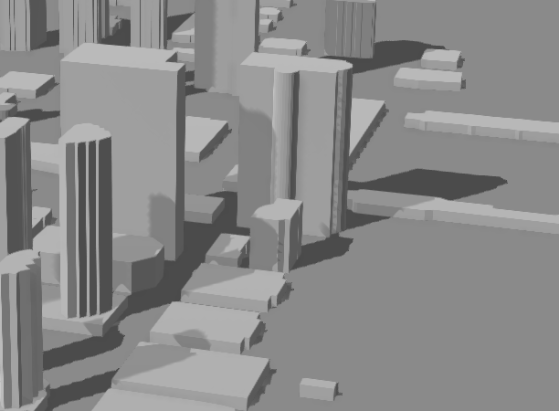
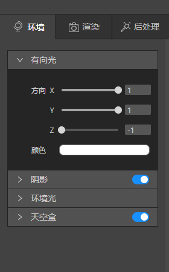
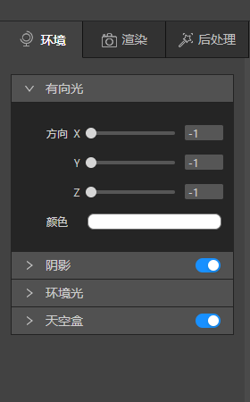

IDE新建msd文件时，场景默认自带一个有向光，有向光是指光照均匀地来自某一个方向，晴朗天气下的太阳经常被当作方向光源， 它距离太远所以光线被看作是平行的照到地面上。

可以看见上图有向光>方向里有3个选项XYZ，代表了光的3个方向，默认值为1、0、-1。

如需改变光照方向，分别拖动XYZ轴即可，方向光的方向和面的朝向点乘就可以得到两个方向的余弦值，这里我们无需考虑复杂的数学运算，你可以简单记住调整XY轴时， 结果为 1 则物体朝向和光照方向相同，为 -1 则物体朝向和光照方向相反，调整Z轴则是调整光照的高度。

