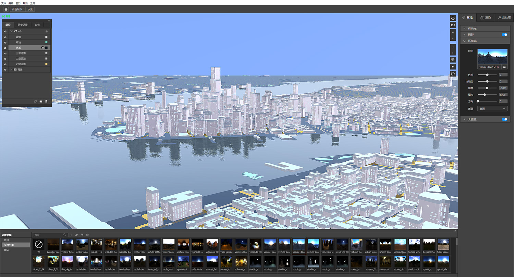
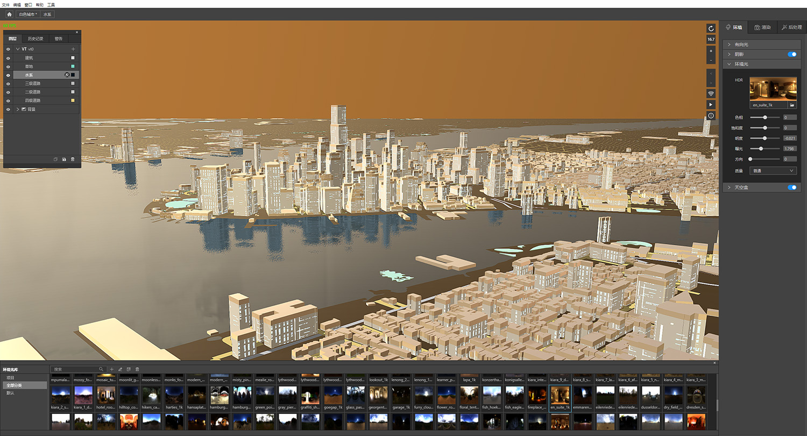
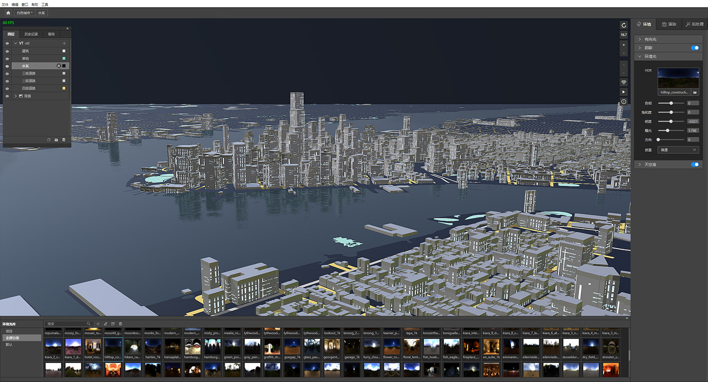
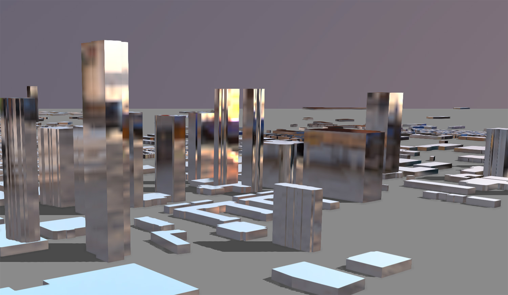
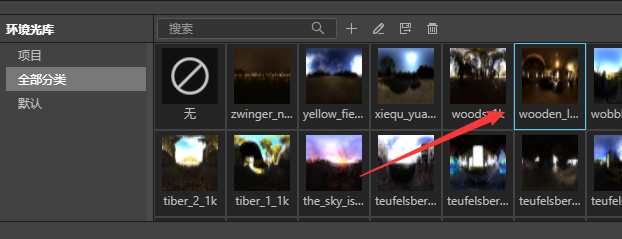

## 什么是环境光
IDE中环境光指HDR贴图，即High-Dynamic Range（高动态范围），作为背景光源广泛应用在三维场景中。如下图所示，更换3个不同的HDR贴图，就可以非常方便的模拟白天、傍晚和夜晚的光照效果。

环境光除了给场景提供光照效果，同时在光滑的三维物体表面还会产生细节丰富的自然反射效果，如下图所示。

## 增加环境光

打开环境光库，在环境光库里点击缩略图，就可以给地图增加环境光。

