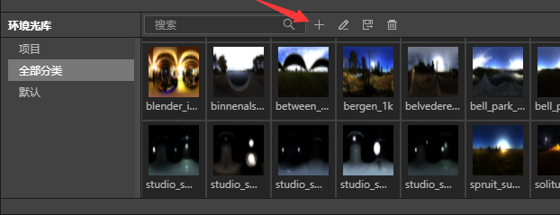
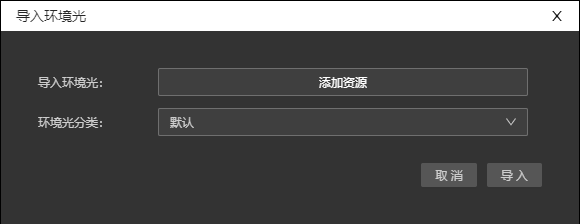
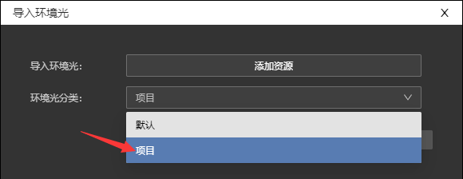
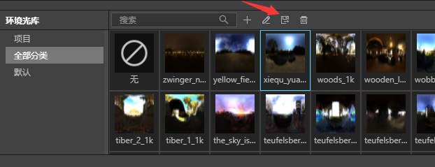
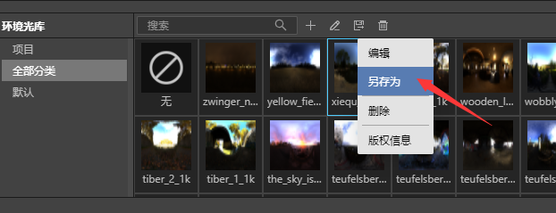
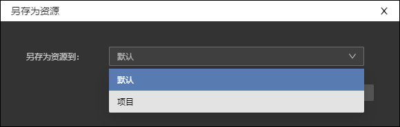

## 导入环境光文件

在环境光库上方有一排小图标，单击“+”即可弹出环境光文件导入对话框。目前IDE支持导入后缀为hdr的环境光文件。

## 导入位置

环境光文件可以选择导入到默认和或者项目。

默认：指将环境光文件导入到环境光库里，无论是新建还是打开其他msd文件都可以在环境光库里看见新增文件。

项目：指将环境光文件保存在当前msd文件里。

## 另存为环境光文件

单击环境光库上方第三个小图标。

或者在选中文件上鼠标右键单击，在弹出菜单里选中“另存为”。

即可弹出另存为对话框，环境光文件可以通过另存为在“默认”和“项目”里互相复制转移。

