在[《什么是PBR》](../../ide/guide/basic/pbr.md)这篇文章中我们介绍了一些三维渲染的基础原理，现在主流有2种PBR材质工作流：金属/粗糙度工作流（Metal/Roughness）和镜面反射/光泽度工作流（Specular/Glossiness）。

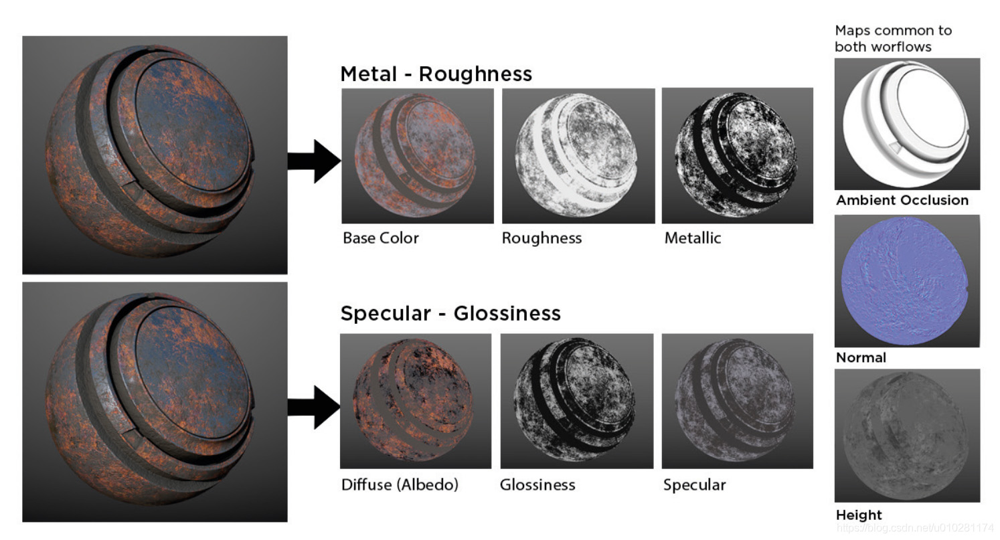

Maptalks IDE支持金属/粗糙度工作流（Metal/Roughness），我们可以导入下列6种纹理图片组成材质球：

* Base Color-基础色

* Metallic+Roughness-金属粗糙度

* Normal-法线纹理

* Height-高度纹理

* Ambient Occiusion-环境光遮蔽纹理

* Emission-自发光纹理

那很容易就可以发现三维渲染面板里红框内的选项就是对应着上面提到的6种纹理，这也是IDE材质球的核心组成部分，我们就先从这里开始介绍吧。

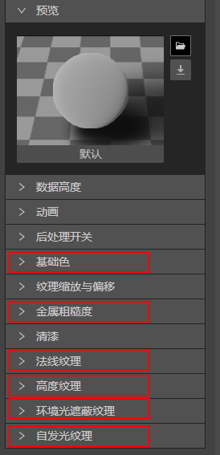

### （1）基础色:

用于定义物体表面反射的颜色。IDE还提供了丰富的色彩调整选项。

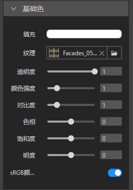
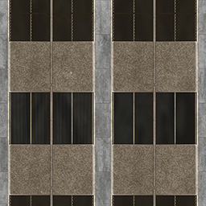

### （2）金属粗糙度

用于定义物体表面是平滑还是粗糙，物体是金属还是非金属。

  粗糙度：0表示光滑表面，1表示粗糙表面。

  金属度：0表示非金属，1表示金属

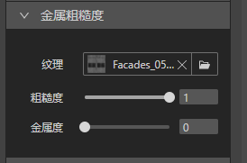
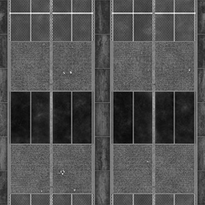

### （3）法线纹理

在物体表面实现凹凸效果，用于丰富细节。强度数值越大，凹凸效果越明显

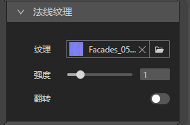
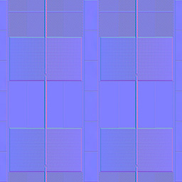

### （4）高度纹理

为法线贴图额外提供了更明显的深度，增强真实性。强度数值越大，立体效果越明显

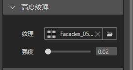
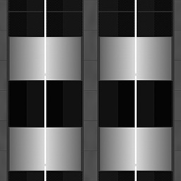

### （5）环境光遮蔽纹理

增强物体暗部阴影，使物体更加立体和逼真。

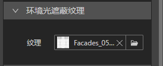
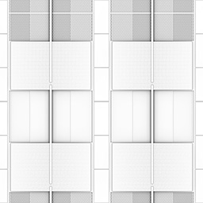

### （6）自发光纹理

实现指定区域颜色不受基础色和环境光影响。通过灵活应用我们可以实现很多有趣的效果，比如夜晚的透过窗户的灯光，制作半透明材质等。我们可以在[制作发光的窗户](../design-tutorial/windows)、[制作半透明材质](../design-tutorial/transparent)这2篇文章继续深入了解如何使用自发光纹理。

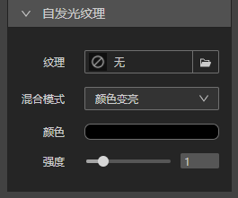
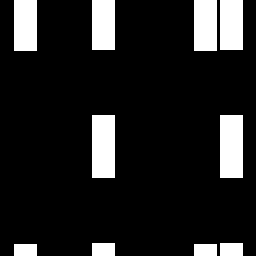

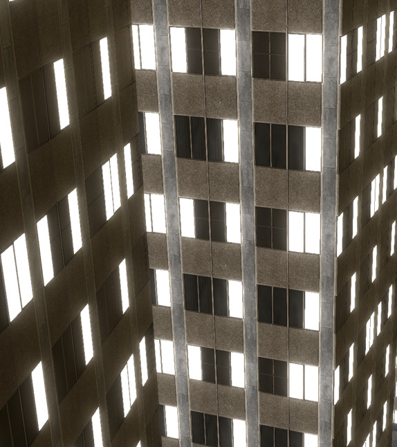

### （7）其他选项

想了解其他选项的功能请查阅下一篇 [三维渲染属性面板介绍（2）](./material2/)