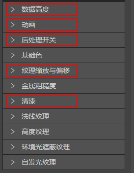
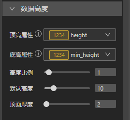
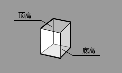
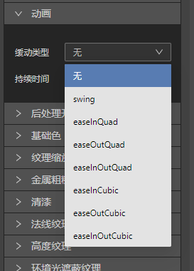
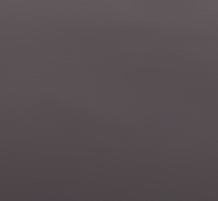
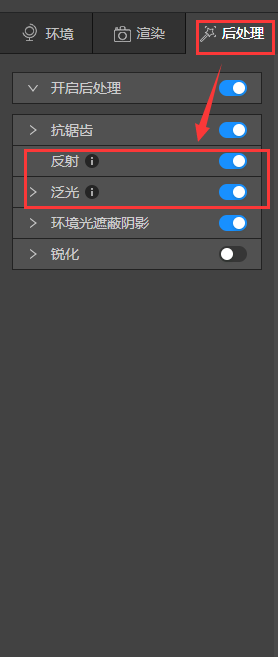
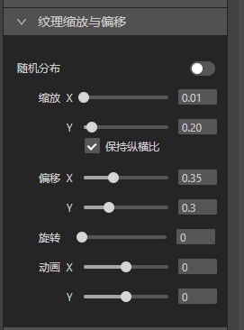
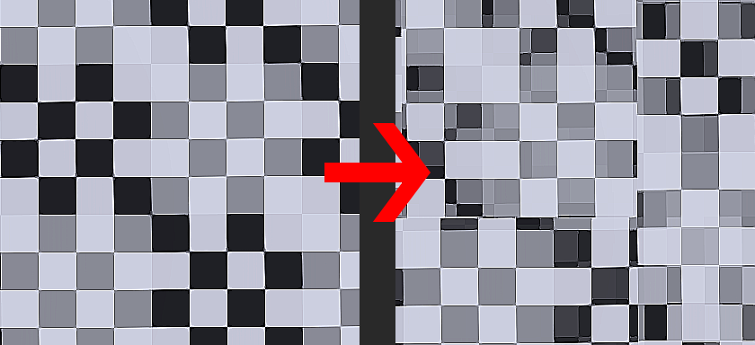
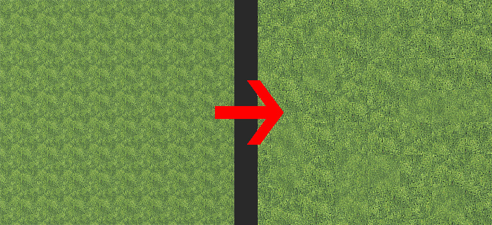
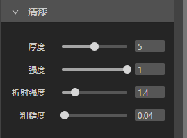

上一篇[三维渲染属性面板介绍（1）](../../design-guide/basic/material.md)介绍了6种纹理属性面板，除此之外IDE还提供了其他强大的工具帮助你更好的实现效果。

### （1）数据高度

* 顶高、底高属性：指数据的的顶部和底部的高度数据，如果新建图层时选用了IDE提供的默认数据源，这里会提前选好，如果选用了其他来源的底图数据，IDE无法自动识别哪一项数据是高度属性，需要手动在下拉菜单里选择正确的顶高和底高属性。

* 高度比例：可以将高度数据按倍数比例放大。1就是1倍，2就是2倍，以此类推。

* 默认高度：如果顶高属性里有数据，IDE优先渲染顶高数据，如果顶高属性里没有高度信息，按默认高度渲染。默认高度单位是米，10就是10米。

* 顶面厚度：指数据增加侧面后，侧面的厚度。侧面厚度单位是米，2就是2米。可以查阅[给建筑物增加屋顶](../design-tutorial/roof)这篇文章学习具体如何增加侧面。

### （2）动画

这个选项可以在拖动地图载入数据时，增加动画效果。

比如选中easelnQuad时，拖动地图缓动效果如下。

### （3）后处理开关

介绍后处理开关前，我们要先介绍一下后处理面板。IDE后处理面板选项都是全局设置，意思是开启某个效果后，地图上所有的数据都会加载这个效果，抗锯齿、环境光遮蔽、锐化全局开启很正常，但显然所有数据开启反射和泛光不正常，所以针对这2个选项，IDE在渲染面板增加了后处理开关。确认后处理面板里反射或者泛光是开启状态后，跳转到渲染>后处理开关，单独开启按钮就可以了。

看到这里也许会有人产生疑问，为什么要这样大费周折的设计，而不是单独给每个数据增加反射和泛光面板呢？因为反射和泛光非常占资源，为了避免出现地图拖动卡顿现象，IDE选择了全局设置，在保证效果的前提下，我们尽可能的优化性能，在艺术性和技术可行性上取得最大的平衡。

### （4）纹理缩放与偏移

* 随机分布：打破贴图的重复性

  当我们开启随机分布按钮后，IDE会如下图将纹理图片随机打乱。

   我们从材质库>草地选择一个材质球赋予地面，打开随机纹理按钮后，就可以得到自然过度的草地效果了。

* 缩放：将纹理图片沿X、Y轴放大缩小。勾选保持纵横比后，会等比例放大缩小。

* 偏移：将纹理图片沿X、Y轴移动。

* 旋转：可以将纹理图标360度旋转。

* 动画：可以将纹理图片沿X、Y轴自动播放。这个功能可以制作一些有趣的效果。

 

 ### （5）清漆

 增加物体高光层，模拟物体表面刷漆后的效果。

  
