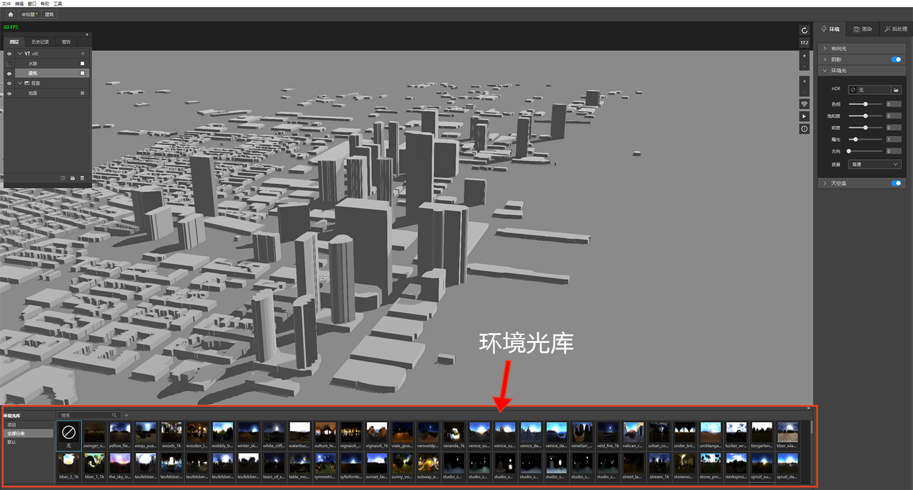
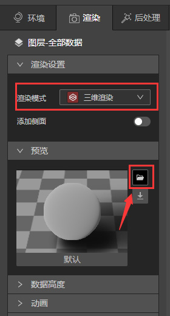
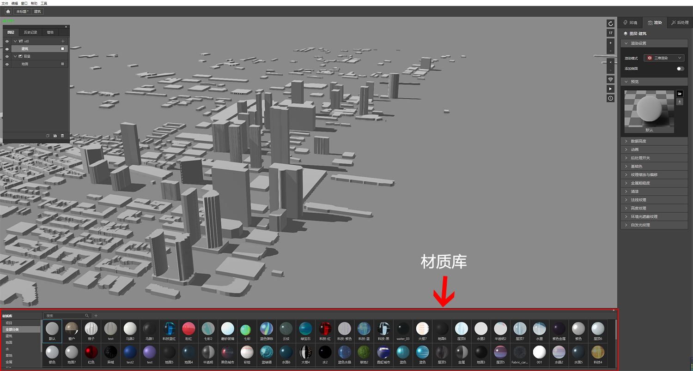
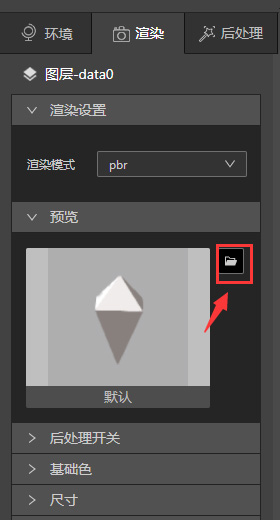
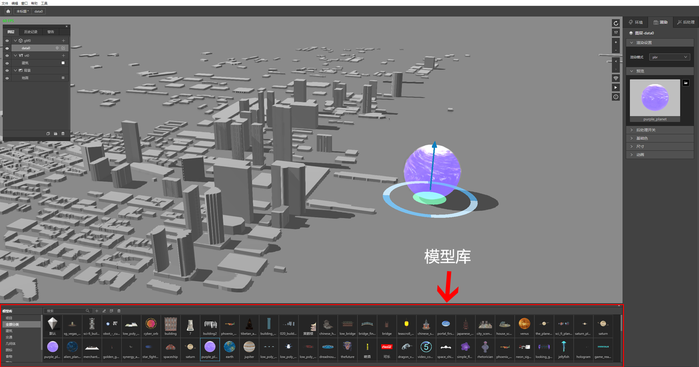

## 环境光库

环境>环境光>HDR，单击下图红圈的按钮就可以打开或者关闭环境光库。

## 材质库

数据只有在三维渲染模式下才可以更换材质，所以要先添加VT或者Geojson数据并转成三维模式才能打开材质库，下面是具体步骤:

* 启动IDE，新建一个文件，新建VT图层，VT图层里添加数据。

* 跳转到渲染>渲染设置>渲染模式，将数据从二维渲染切换到三维渲染。

* 跳转到渲染>预览，单击预览旁的按钮，就可以打开或者关闭材质库。

## 模型库

添加三维模型，地图上选中模型后，单击预览图右上方的按钮，就可以打开或者关闭模型库。

