新建材质面板中，配置有2个选项，“默认模式”和“金属度（b通道）粗糙度（g通道）模式”，这是指金属度粗糙度纹理图片2种不同的压缩优化方式。

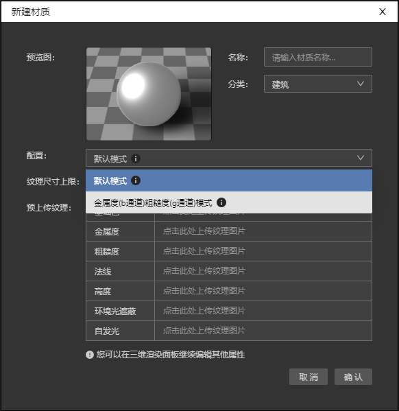

## 默认模式
该模式下，用户可以分别上传金属度和粗糙度2张纹理图片。

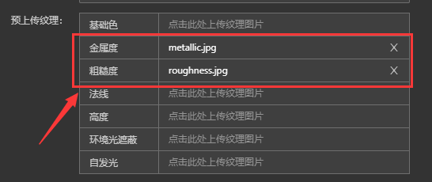

IDE会将2张图片自动压缩成1张纹理图片，减少图片数量优化地图性能。

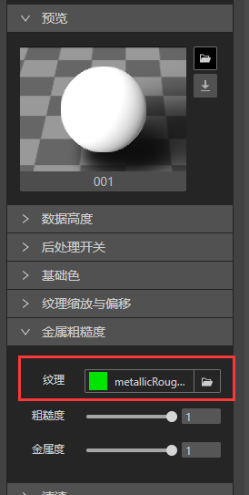

## 金属度（b通道）粗糙度（g通道）模式

该模式下，金属度和粗糙度信息已经分别整合在纹理图片b颜色通道和g颜色通道里，用户只用上传一张纹理图片。

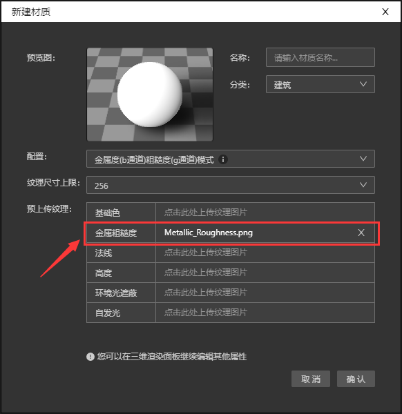

 ## 制作金属粗糙度二合一纹理图片

 这种纹理图片一般由资源提供者事先准备好，当然我们也可以通过Substance Painter软件自行实现整合，下面是具体步骤。

1 、先准备一个三维平面的正方形模型，可以用Blender或者其他三维软件。

2、打开Substance Painter，导入该模型

3、在Substance Painter资源库里添加金属度和粗糙度纹理图片

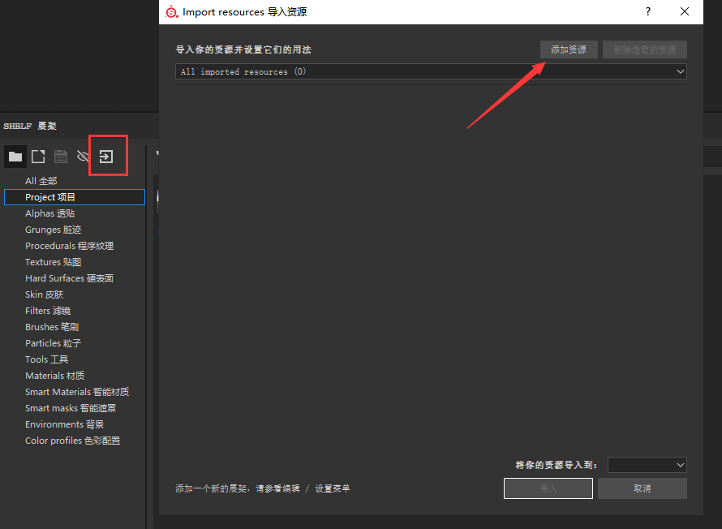

4、将上传的金属度和粗糙度图片定义为纹理texture，导入位置在项目文件。

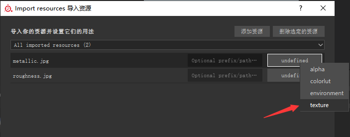
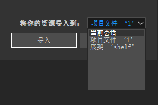

5、选择材质面板，单击Metallic和Roughnses选项

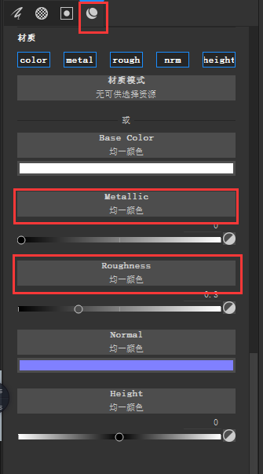

6、在弹出的下拉菜单搜索框内。搜索金属度和粗糙度图片的名字，然后单击对应的图片。

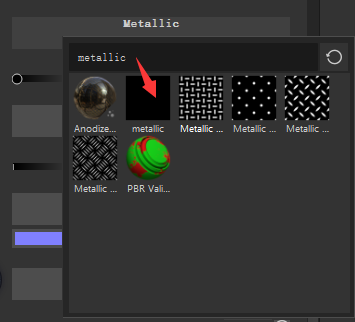

7、这样纹理设置就完毕了，我们开始导出纹理图片。

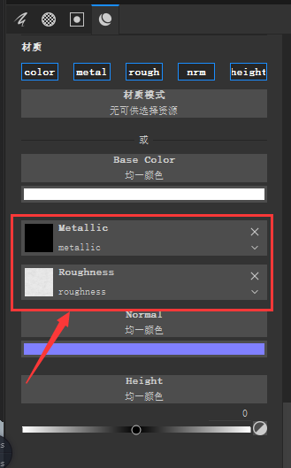

8、打开文件下的“导出贴图”

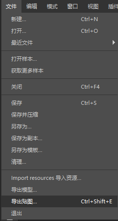

9、在弹出的面板中选择配置，我们开始自定义二合一配置文件。

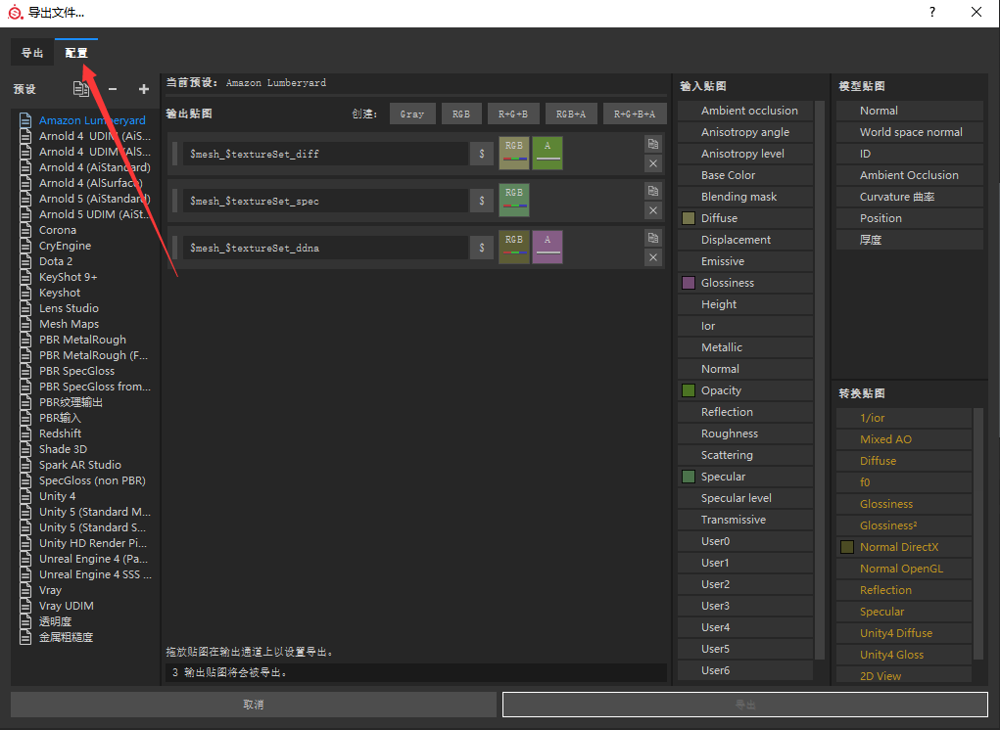

10、单击“+”图标，左边列表底部新增“new-export-preset”文件，双击可以改变文件名。

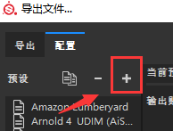
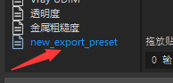

11、右边配置面板里，选择“R+G+B”，下面就会出现RGB单独颜色通道的设置选项。

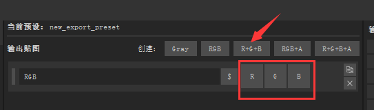

12、可以将“RGB”改成“MetallicRoughness”，或者其他名字，导出的贴图将使用这个名字。

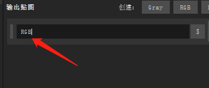

13、在右边“输入贴图”列表里找到Roughess,将它拖拽到G通道上，然后在弹出的下拉菜单里选择Gray Channel。

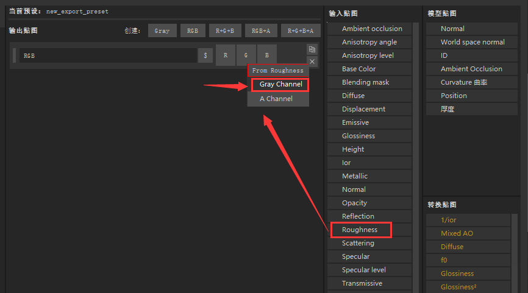

14、G通道变成蓝色，并出现一条灰色的线，意味着G通道已成功设置成记录粗糙度信息，B通道也是同样操作。

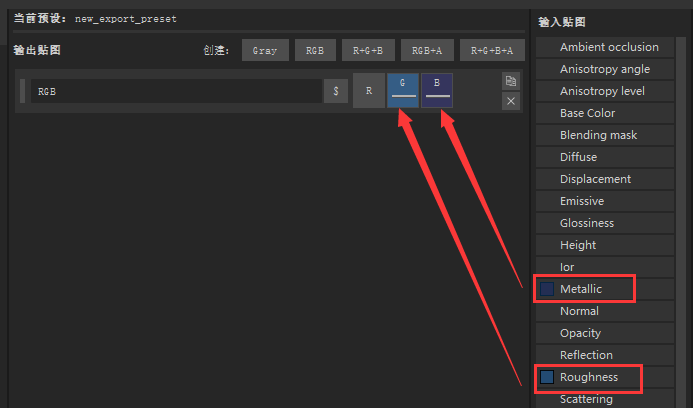

15、配置文件已经全部完成，单击“导出”切换到导出面板。

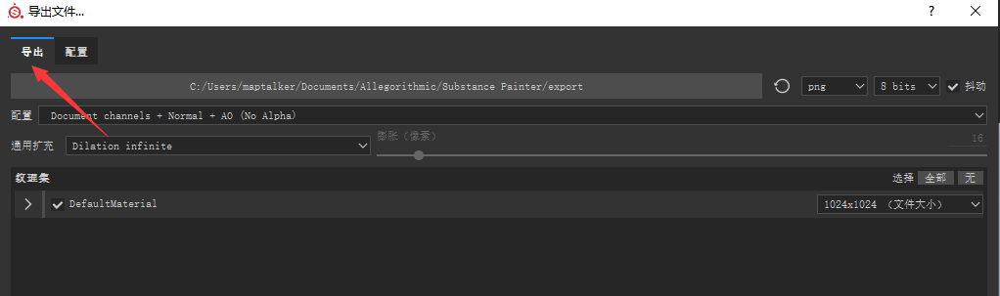

16、选择文件保存位置

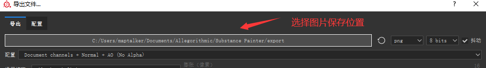

17、在配置选项下拉菜单里找出刚刚设置好的配置文件。选择文件尺寸大小。

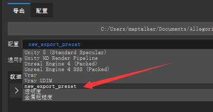
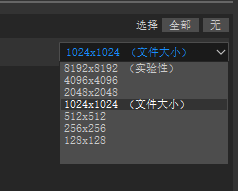

18、选择导出

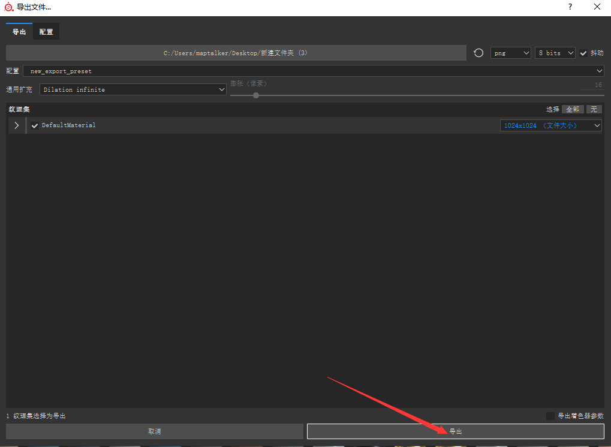

19、打开文件夹，就可以看见刚刚导出的金属粗糙度合并的纹理图片了。

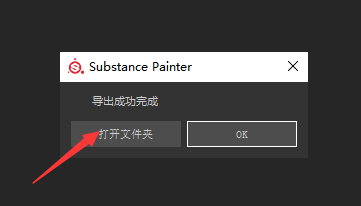
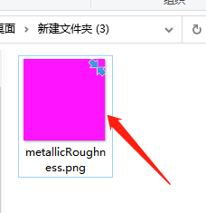

