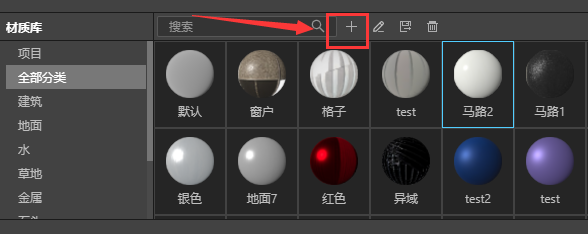
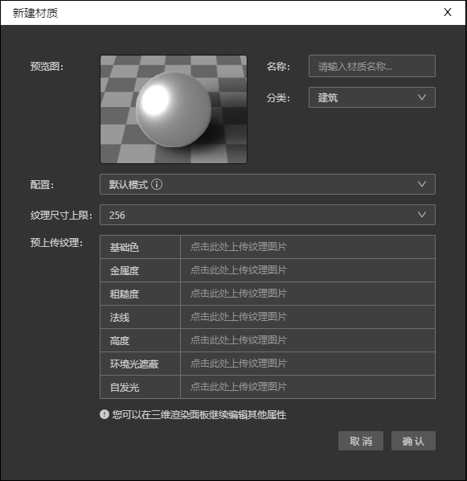
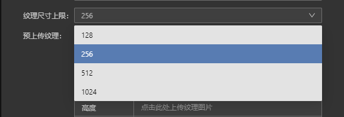
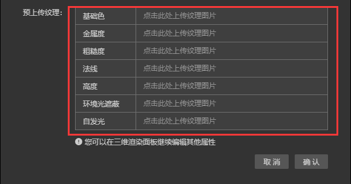
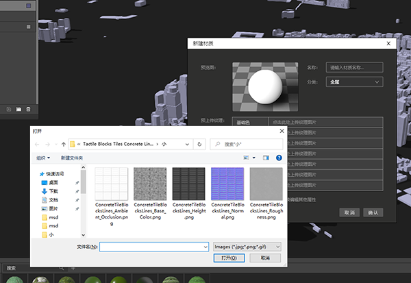
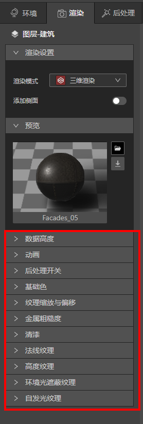
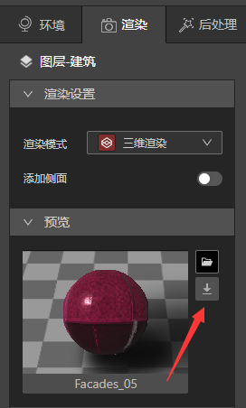

## 打开材质库

* 打开材质库，具体步骤可以查阅[环境光库、材质库、模型库打开方法](../basic/resource)。

* 单击材质库“新建”按钮，弹出新建材质面板。

## 新建材质面板

* 配置：有2个选项，可以查阅[新建材质配置](../basic/setting)了解更多。

* 纹理尺寸上限：指上传图片的尺寸上限，默认上限是256px，如果应用在地图上时觉得纹理清晰度不够，可以回到这里重新选择尺寸上限再次上传。

* 预上传纹理：单击上传框可以上传对应的纹理图片。

* 上传完毕后，点击确认，新的材质球就可以保存在材质库里了。

## 编辑材质球

* 创建新的材质球后，我们可以在地图上应用，看看是不是想要的效果，如果有不理想的地方，我们可以继续在渲染面板编辑材质球。

* 调整完毕后，我们可以单击渲染面板的“预览”最右边的保存按钮，另存为新的材质球。

