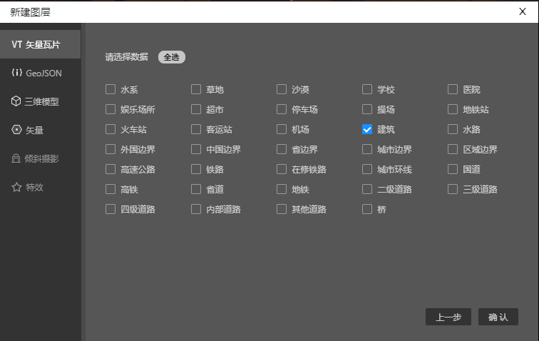
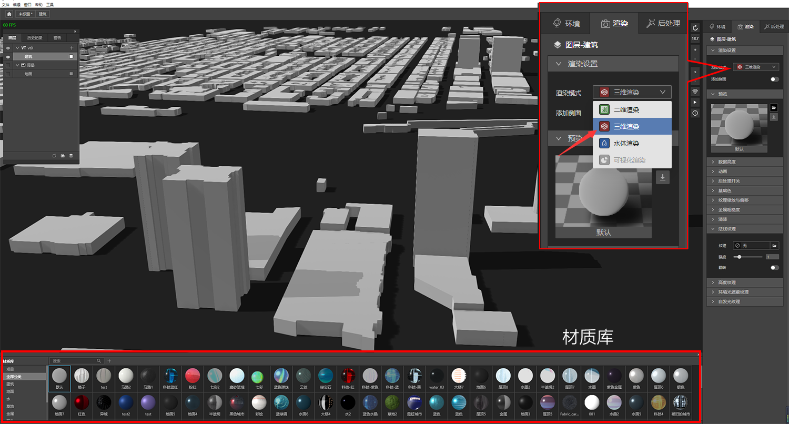
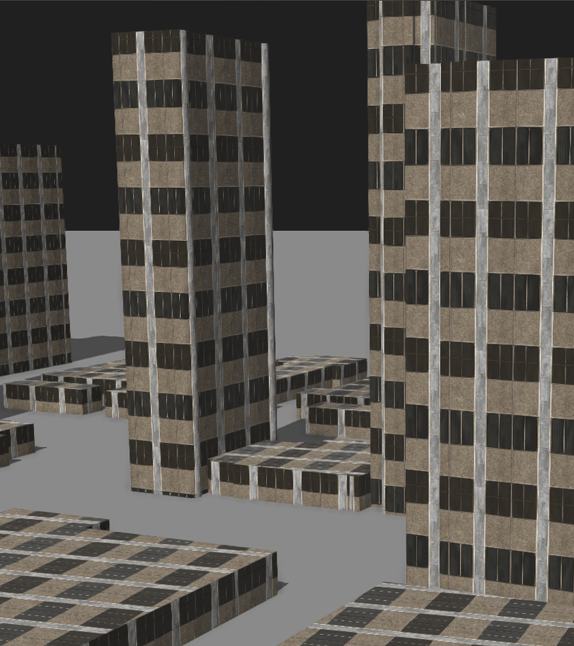
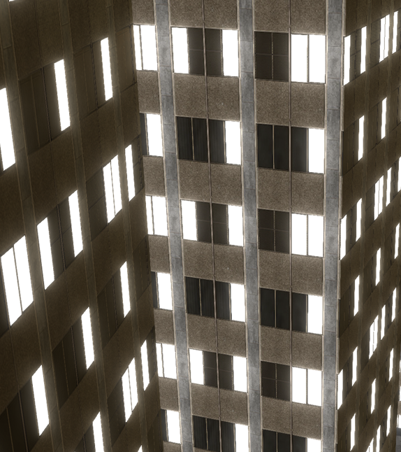

在[《什么是PBR》](../../ide/guide/basic/pbr.md)这篇文章中我们介绍了材质球的原理，现在主流有2种PBR材质工作流：金属/粗糙度工作流（Metal/Roughness）和镜面反射/光泽度工作流（Specular/Glossiness）。

Maptalks IDE支持金属/粗糙度工作流（Metal/Roughness），材质球由下列6种纹理图片构成：

* Base Color-基础色

* Metallic+Roughness-金属粗糙度

* Normal-法线纹理

* Height-高度纹理

* Ambient Occiusion-环境光遮蔽纹理

* Emission-自发光纹理

## 更换材质球的准备工作

### （1）新建图层添加数据

只有三维渲染下的数据才能赋予材质球，所以要先准备好VT或者Geojson图层，打开IDE，新建一个VT图层，添加“建筑”数据。

### （2）二维渲染模式切换到三维渲染模式

切换三维模式后，地图上建筑数据变成三维，同时在界面最下方会自动弹出材质库，准备工作就完成了。

## 更换材质球

### （1）材质库里单击材质球

在材质库里随意单击一个材质球就可以更换材质了，我们可以选择建筑>Facades_05

### （2）调整材质属性值

编辑区预览下方有很多选项，下图红圈内就是6种纹理图片的属性菜单。

* 基础色: 用于定义物体表面反射的颜色。IDE还提供了丰富的色彩调整选项。

* 金属粗糙度: 用于定义物体表面是平滑还是粗糙，物体是金属还是非金属。

  粗糙度：0表示光滑表面，1表示粗糙表面。

  金属度：0表示非金属，1表示金属

* 法线纹理: 在物体表面实现凹凸效果，用于丰富细节。

  强度数值越大，凹凸效果越明显

* 高度纹理: 为法线贴图额外提供了更明显的深度，增强真实性。

  强度数值越大，立体效果越明显

* 环境光遮蔽纹理: 增强物体暗部阴影，使物体更加立体和逼真。

* 自发光纹理: 实现指定区域颜色不受基础色和环境光影响。

  虽然这个材质球没有自发光纹理，但通过灵活应用我们可以实现很多有趣的效果。比如夜晚的透过窗户的灯光，大面积叠加图案等。我们可以在[制作发光的窗户](Windows)、[叠加纹理](texture)这2篇文章继续深入了解如何使用自发光纹理。

