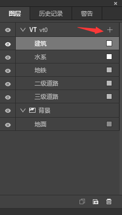
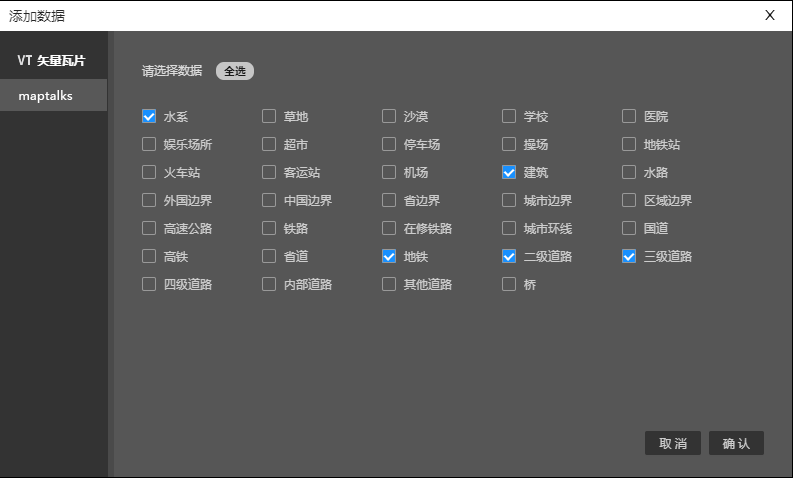
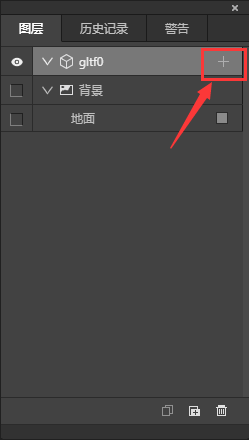
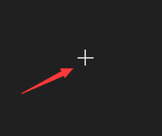
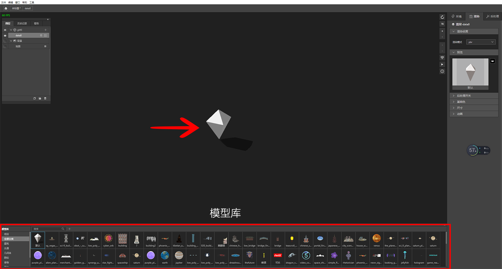
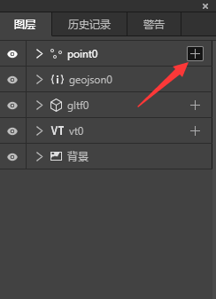
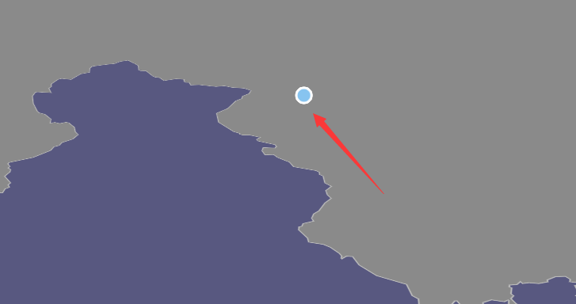
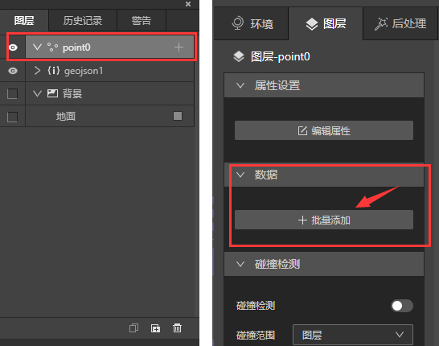
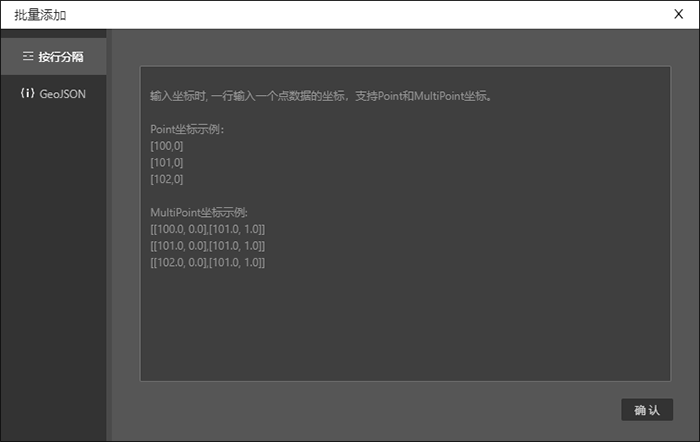

## 添加VT数据

图层面板上单击图层右边“+”图标，即弹出添加数据面板，勾选想要添加的数据，单击确认即可。

## 添加三维模型

* 图层面板上单击模型图层右边的“添加”图标，鼠标手势会变成十字，按esc可以取消添加状态。

* 地图任意地方单击鼠标左键，即会添加一个默认模型，同时地图下方自动弹出模型库。

## 添加矢量数据

* 图层面板上单击矢量图层右边的“添加”图标，鼠标手势会变成十字，按esc可以取消添加状态。

* 地图任意地方单击鼠标左键，即会添加矢量数据。

## 矢量图层批量添加数据

* 在图层面板上选中矢量图层，右边编辑区就会弹出对应的图层编辑选项，单击批量添加。

* 按照提示复制数据后，就可以批量添加矢量数据了。

