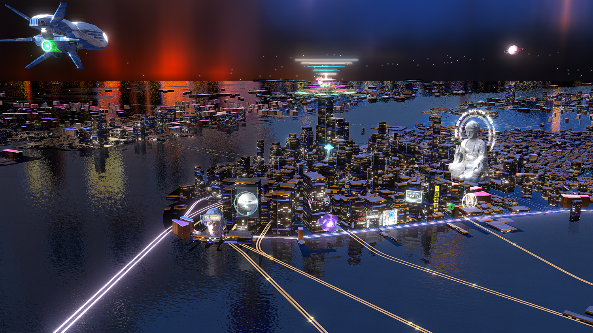

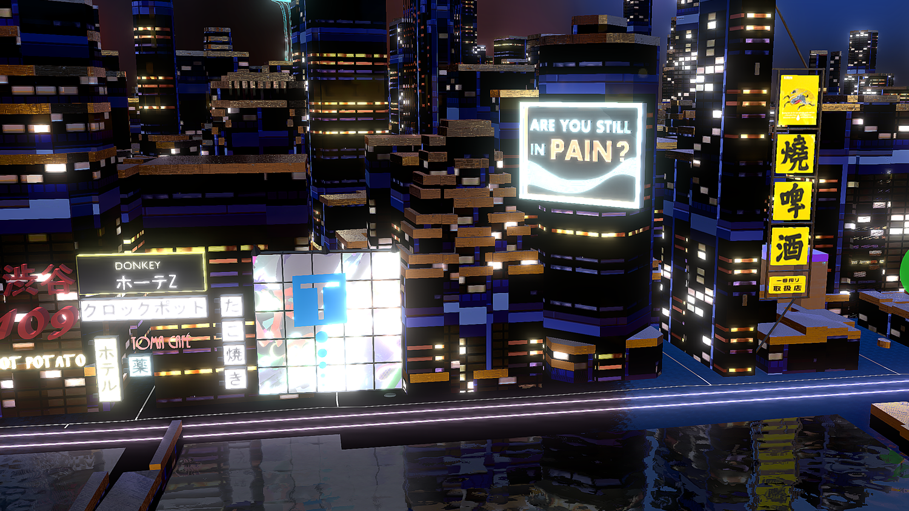

## 简介

大家知道IDE通过赋予三维数据材质球，简单方便的一键更换效果，基于材质球实际由纹理图片构成，通过对纹理图片的加工、创作，以及海量的图片资源，实际IDE可以创建任何风格的地图，这给予了艺术家们极大的创作空间，在这段教程中，我们将展示IDE如何制作赛博朋克风格的地图。

绚丽的霓虹灯、鳞次栉比的摩天楼、充满未来科技感的全息投影、以及沉重的深色色调，这些元素都构成了赛博朋克典型风格，也是我们创作的方向，下面就让我们开始吧。

## 首先创建三维城市

### （1）准备好图层数据。

* 启动IDE，新建一个文件，新建VT图层，VT图层里添加建筑和水系数据,改名“城市建筑”。将背景>地面数据打开显示。

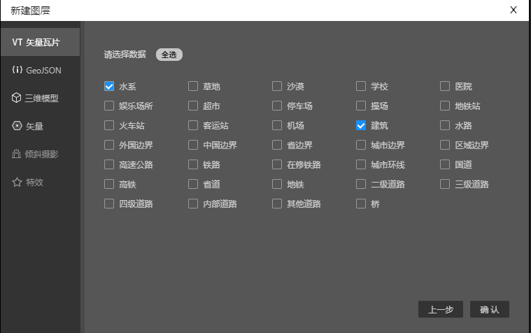
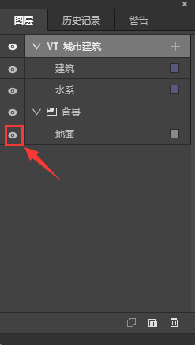

* 在渲染设置中分别将建筑、水系和地面数据从二维渲染切换到三维渲染。水系跳转到三维>数据高度>默认高度，将10改成0

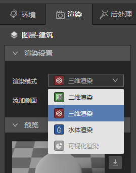
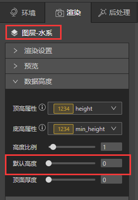

* 文件准备就绪，让我们进入下一步。

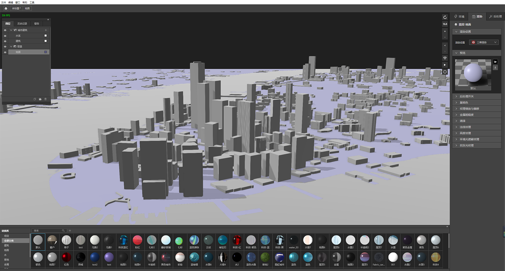

### （2）用Photoshop制作纹理图片

* 开始创作前我们可以先参考城市夜景图片，如果仔细观察，可以看到亮灯窗户不规则排列、灯光颜色有暖色和冷色、灯光并不是平滑的而是有深有浅等等。

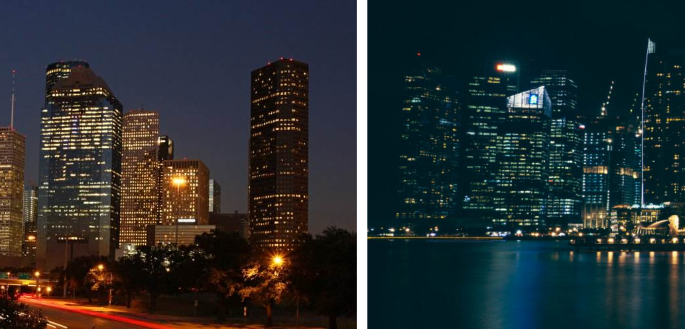

* 基于上面观察的特点，我们就可以用Photoshop创作合适的基础色纹理图片了，比如下图就是一次尝试方向。

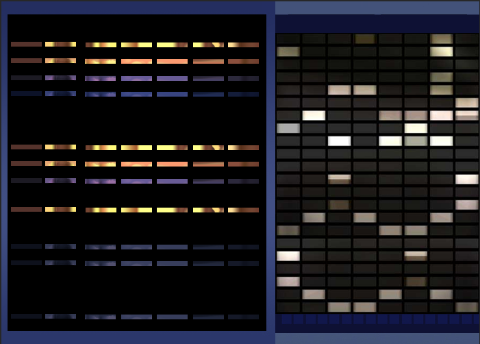

* 用Photoshop制作自发光纹理图片。

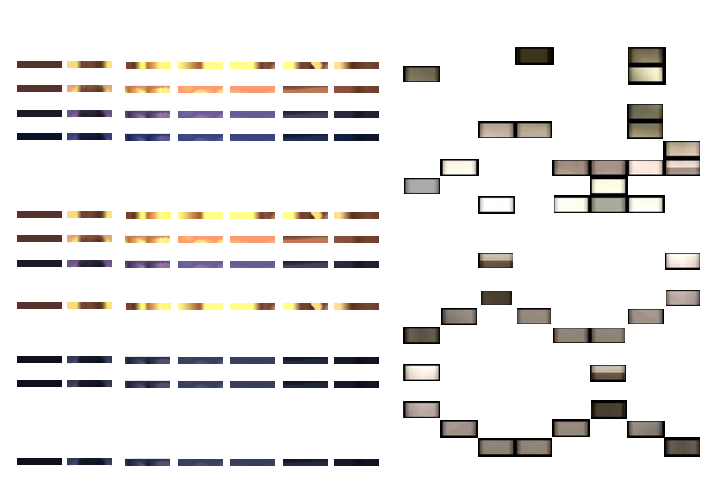

### （3）用IDE给建筑数据添加纹理图片

* 选中建筑，在基础色纹理和自发光纹理分别导入选中刚刚在Photoshop里制作的纹理图片，导入的时候注意尺寸上限，默认是256px，如果图片尺寸超过上限，IDE会自动压缩。

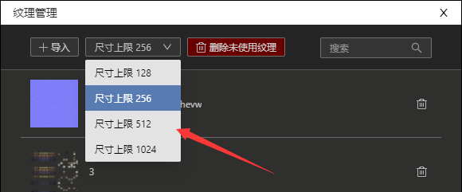

嗯，加载纹理图片后，现在看起来怪怪的，和“好看”实在相差甚远，不要紧，让我们接下来就开始调整材质吧

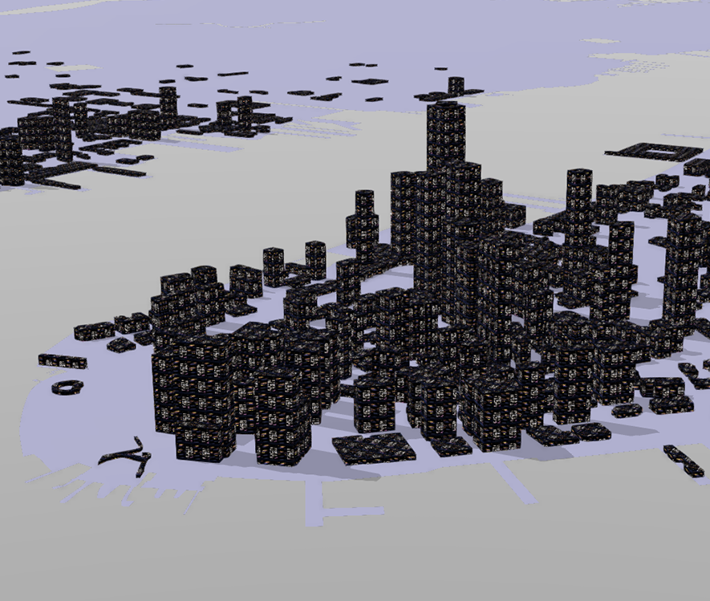

### （4）调整材质

* 调整纹理图片尺寸，让大小合适。

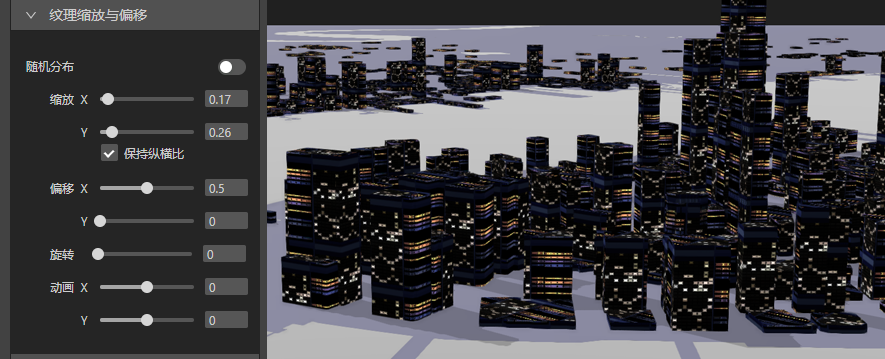

* 根据地图上实际渲染的画面，我们可以直接调整基础色颜色、金属粗糙度等选项，直到颜色满意为止。

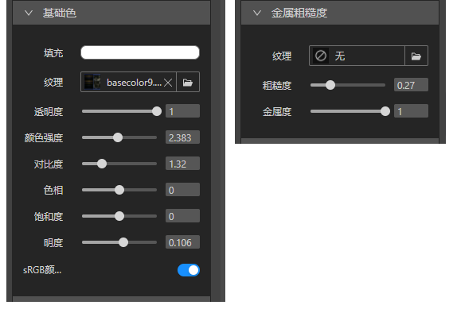

* 接下来让窗户发亮，打开后处理开关>泛光按钮，将自发光纹理>强度降低到0.2 ，后处理>泛光设置数值，让灯光亮度自然。

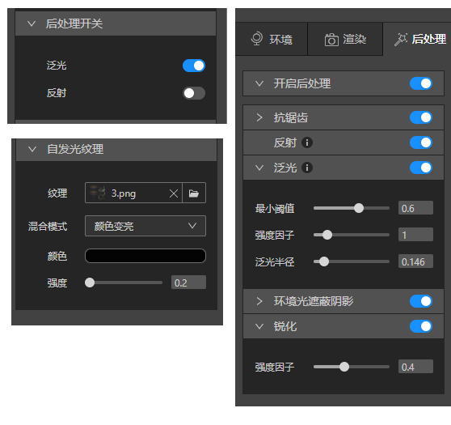

* 这一切调整完成后，我们可以单击预览旁的另存为图标，将这个新材质球保存在材质库里，这样就可以反复使用拉。

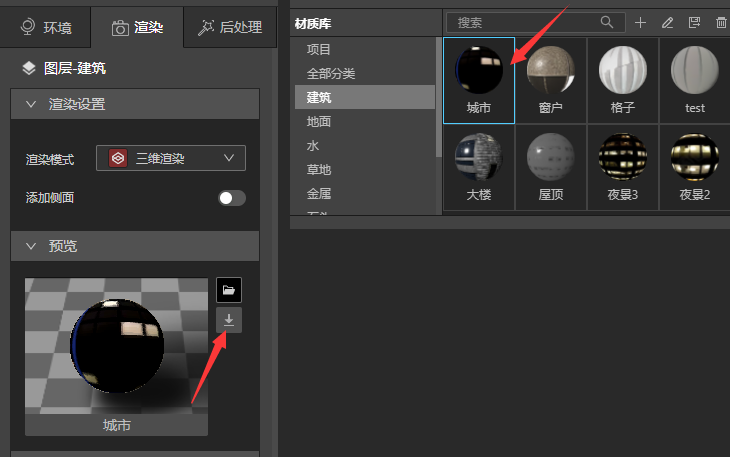

### （5）给建筑增加屋顶

具体步骤可以查阅 [给建筑物增加屋顶](../design-tutorial/roof)，最后我们得到了下图，建筑的调整就差不多完成了。

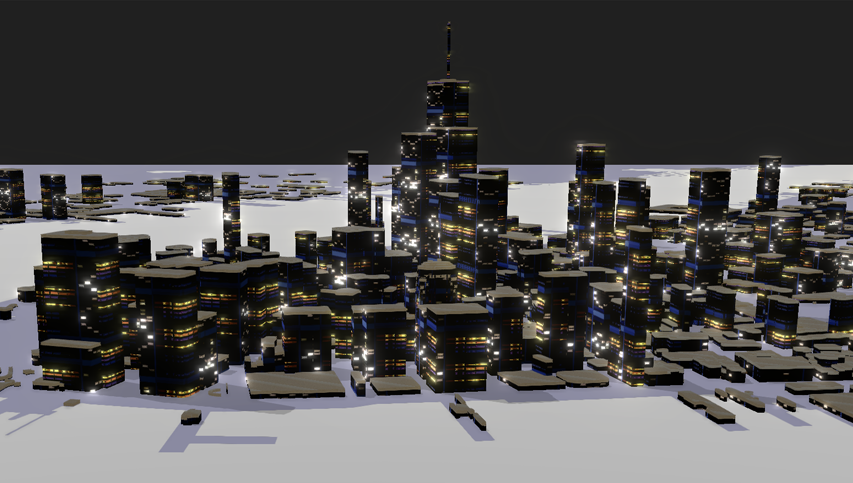

## 设置环境光

环境光能确立整个地图的基调，同时它也会影响三维数据基础色的表现，是三维地图中非常重要的一环，IDE提供了很多默认环境光贴图，同时支持上传新的文件，接下来就是多尝试吧。
如下图调整了有向光、环境光和天空盒，我们就得到了一个漂亮的天空。

## 地面数据加载材质球

地面我希望是一种深色金属的质感，可以反射天空，所以在材质库里我选择了Black，效果如下：

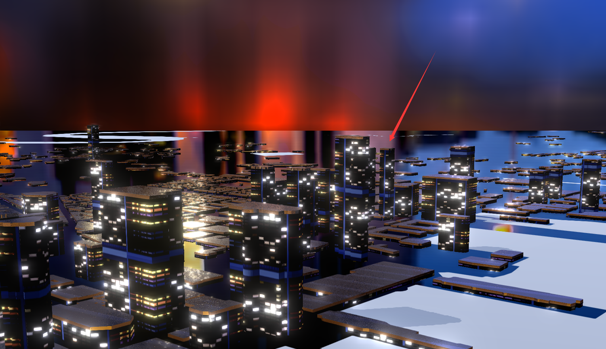

我希望地面能增加一些质感，不要这么光滑，我们可以在法线纹理里上传一张纹理图片，调整合适的强度。

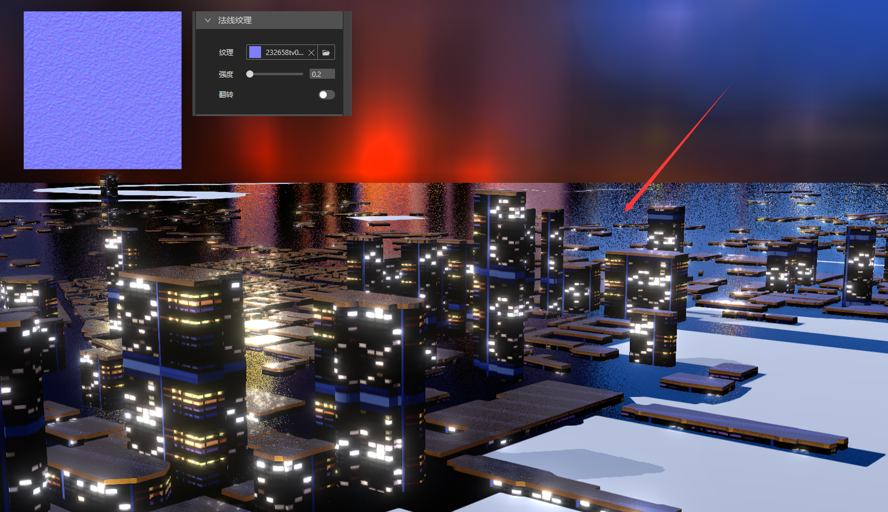

## 水面增加建筑物倒影

* 选中水面数据，材质库里找到“water_01”，鼠标左键单击赋予水面材质。

* 跳转到后处理开关>反射 将按钮打开，水面就可以反射建筑倒影了。

* 还可以调整水面的颜色，这里我选择将基础色>明度降低，使色调和整体气氛相符。

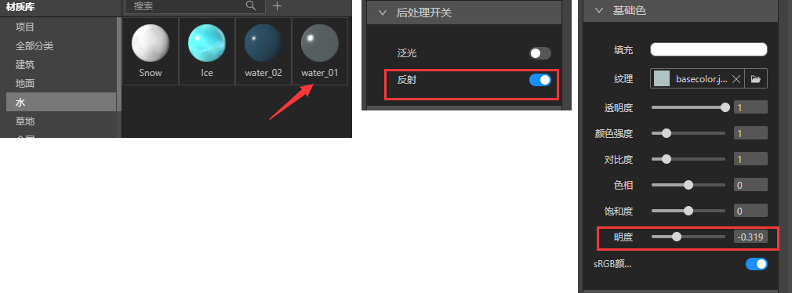

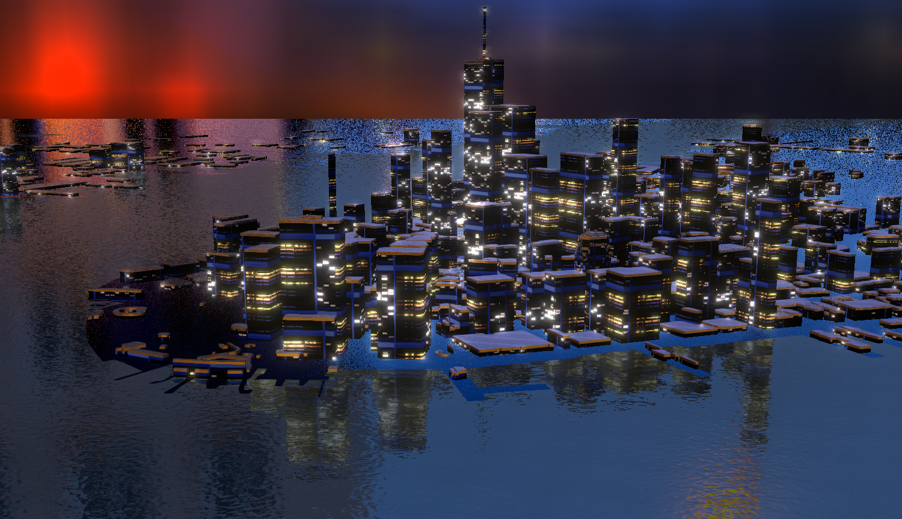

## 让水面流动起来

IDE有2种方法实现水面自然流动的效果，1是渲染设置里选择水体渲染，2是纹理动画。水体渲染流动效果比纹理动画更自然逼真，但是纹理动画可以反射环境光，丰富细节，这2个方法各有优点，在这个案例里，我希望整个地图色调能复杂多变，所以选择了纹理动画。

* 跳转到渲染>纹理缩放与偏移>动画   将X调成0.07，水面就流动起来了。
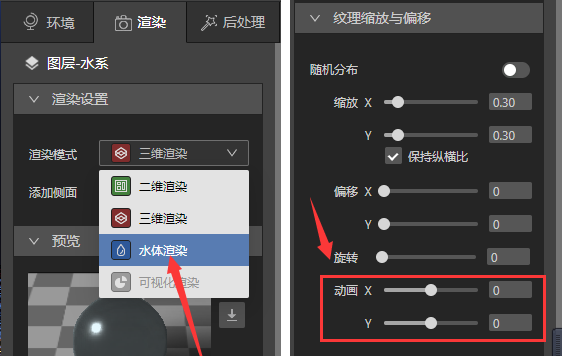
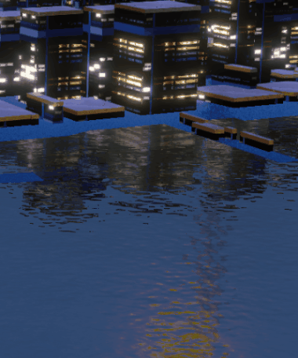

## 道路数据制作发光效果和动画

具体步骤可以查阅[实现道路泛光效果](../design-tutorial/road)、 [模式填充-给道路增加动画效果](../design-tutorial/fill-animation)这2篇文章。

## 地图上添加模型

添加各种各样的模型丰富这个世界，具体步骤可以查阅[图层内添加数据](../basic/vt)、[编辑三维模型](../basic/gltf)。

## 小结

到这里，地图设计已经基本完成了，希望大家能通过这个案例制作过程加深对IDE的了解，愿各位设计狮程序猿们都能做出好看有趣的三维地图。

* 材质球可以非常方便的制作、更换纹理图片、再另存为新的材质球。

* 水面流动效果可以通过水体渲染和纹理动画2种方式实现。

* 如果加载在数据上的纹理图片清晰度不够，可以在纹理管理面板更改尺寸上限重新上传。
