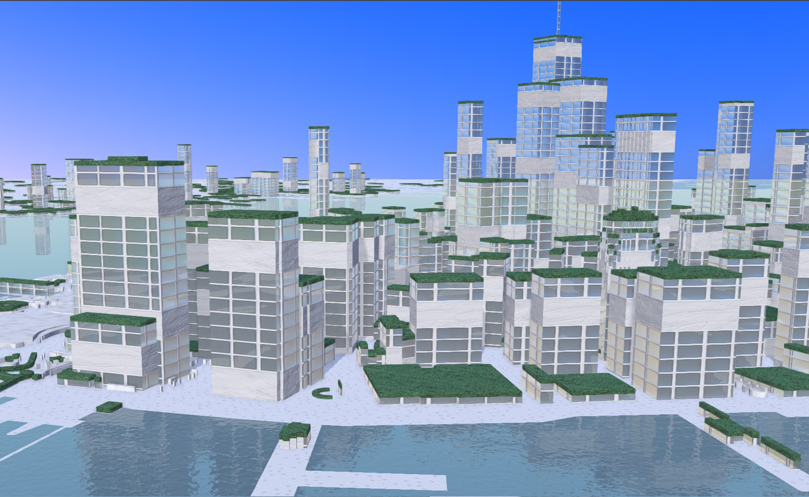

网上有海量的三维纹理图片资源，同时还有各种专业的三维软件辅助，但我们也可以通过一些简单的办法快速做出纹理图片，比如上面玻璃建筑就是一次尝试，下面就让我们开始吧。

## 准备工具软件

大家知道IDE三维材质球是由[六种纹理图片](../basic/material.md)组成，这次我们需要用到2个工具软件，1个是Photoshop制作基础色纹理、金属粗糙度纹理，另外一个是shaderMap4制作法线纹理、高度纹理和环境光遮蔽纹理。

Photoshop大家都很熟悉了，ShaderMap4是一款"傻瓜式"软件，给一张普通贴图，它可以一键自动生成PBR材质贴图，使用非常方便，而且普通版可以免费使用，大家可以去它的[官网](https://shadermap.com/home/)下载，

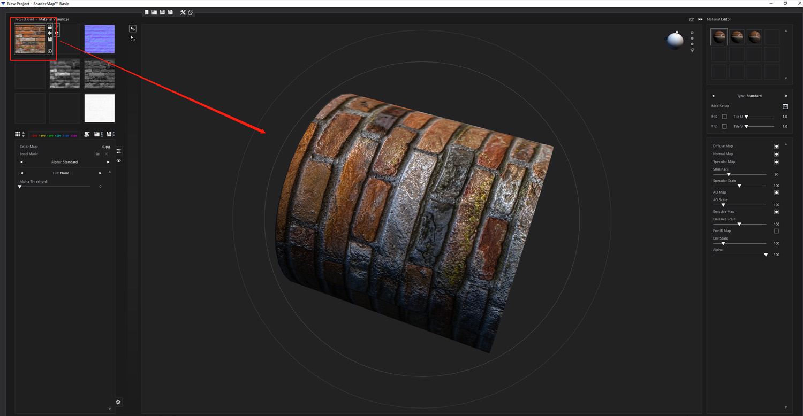

## 制作基础色纹理

* 1、用Photoshop新建一张256x256px图片，如下图将玻璃位置单独单独设置一个颜色。

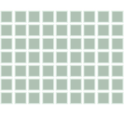

* 2、将玻璃位置透明度降低到50% 。这样就可以在地图上实现玻璃部分透明效果。

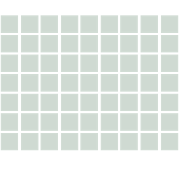

* 3、增加墙壁肌理感，在网上搜大理石，挑选一张觉得合适的图片，比如下图。然后增加在墙壁部分,这样就完成基础色纹理的制作啦。

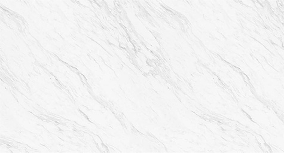
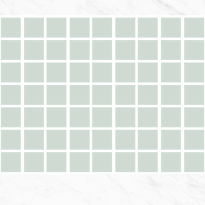

## 制作金属粗糙度纹理

大家知道金属度越高，反射光线越强，在现实世界中，玻璃是光滑的表面能反射部分的光线，墙壁是粗糙的表面不大反射光线，所以我们需要分别制作金属度和粗糙度图片，告诉IDE哪些部分是金属哪些部位是粗糙的，你也可以理解成是一种遮罩，然后通过金属粗糙度面板再调整具体数值。下面是制作方法：

* 1、金属度纹理：用Photoshop将刚才制作的基础色纹理打开，将窗户部分填充白色ffffff，代表金属度数值是1；墙壁部分填充黑色000000,代表金属度数值是0。

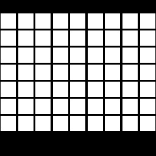

* 2、粗糙度纹理：再用Photoshop将窗户和墙壁颜色互换，窗户用黑色代表粗糙度数值是0，墙壁用白色代表粗糙度数值是1。
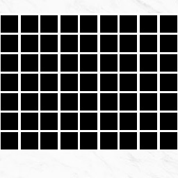

## 制作法线纹理、高度纹理和环境光遮蔽纹理

* 将基础色图片导入到ShaderMap4,一键生成法线纹理、高度纹理和环境光遮蔽纹理、，然后将纹理图片导出。

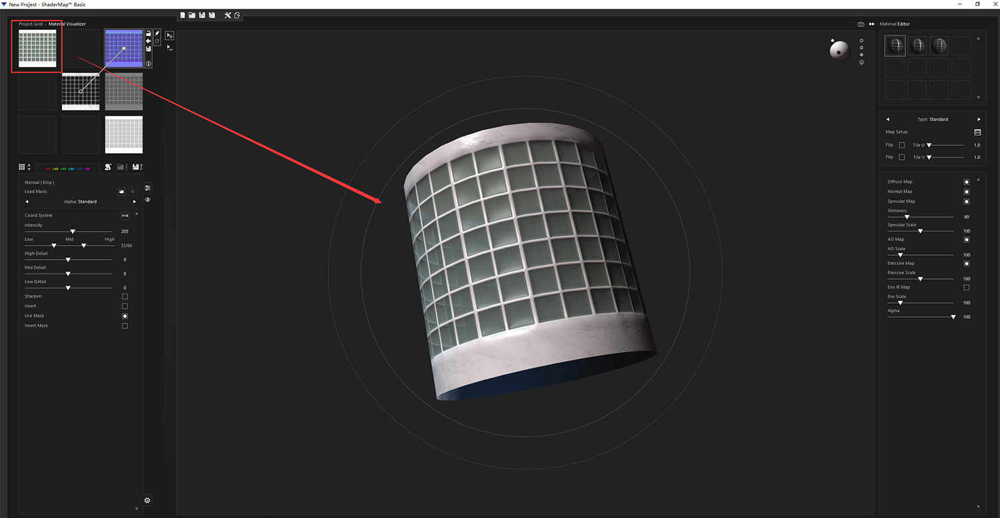

## IDE导入材质球

* 1、打开IDE，新建VT图层，添加建筑数据，将建筑从二维转成三维渲染。

* 2、材质库单击新建材质，在弹出对话框中上传之前做好的纹理，确定后就大功告成了。

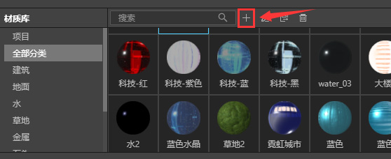

## IDE调整材质

* 1、单击材质库里刚刚新建的glass材质球，赋予建筑，效果如下图。

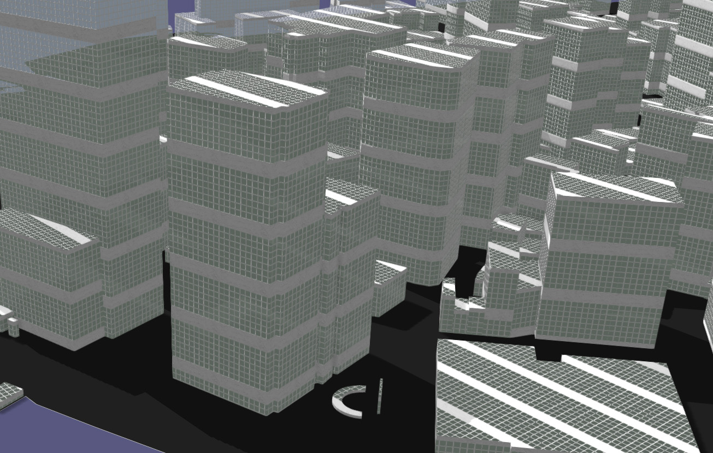

* 2、在IDE编辑材质，根据地图实时渲染的效果，调整纹理图片尺寸、颜色、金属粗糙度等属性。

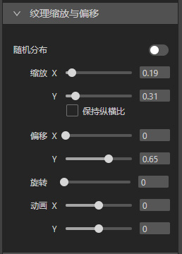
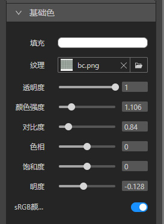
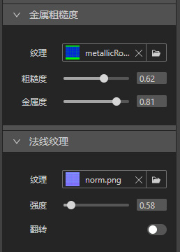

* 3、在调整的过程中如果觉得哪里不合适，还可以通过点击纹理旁边的按钮重新上传纹理图片。

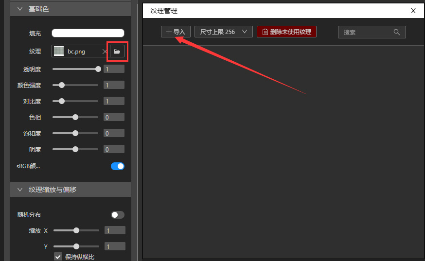

* 3、给建筑[增加侧面](../design-tutorial/roof.md)，赋予顶部不同的材质球，[增加环境光](../basic/light-hdr.md)，[添加水面增加反射](../design-tutorial/reflection.md)等一些其他的调整后，最后我们就完成了。

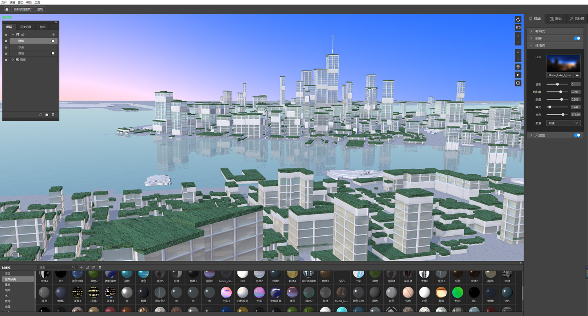

## 总结

* 1、用Photoshop和ShaderMap可以非常简单快捷的制作纹理图片。

* 2、材质球的编辑除了更改面板下的属性数值，还可以通过纹理旁边的按钮重新上传新的纹理图片。

* 3、用Photoshop制作的金属粗糙度纹理，其实也可以理解成遮罩，告诉IDE哪些部位是金属哪些是粗糙面，然后再根据地图实时预览，通过金属粗糙度面板二次调整。