随着地图缩放，有些在当前级别设置合适的数值会变的不合适，比如在16.9级别时，道路宽度设置成10px，看起来非常美观。

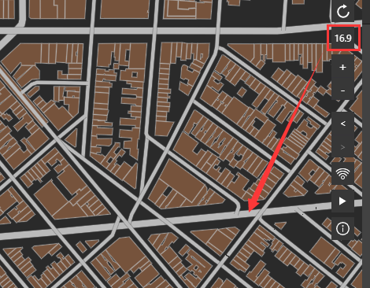

但是地图跳转到10.4级别时，会发现道路变的拥挤不堪，十分难看。

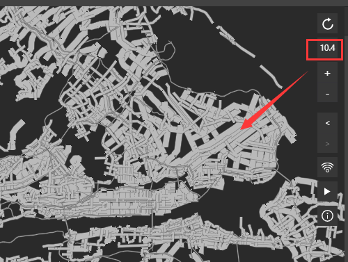

为了解决这个问题，IDE增加了分级设置功能，可以简洁高效的在不同的级别设置不同的值，本教程将演示具体如何使用。

## 准备好文件
启动IDE ，新建一个文件，新建VT图层，VT图层里添加建筑和若干道路数据，单击确认。

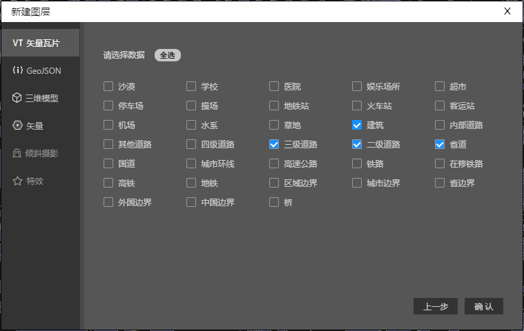

然后选中一条道路数据，打开右边属性面板的基础色，可以看到道路默认宽度是2。

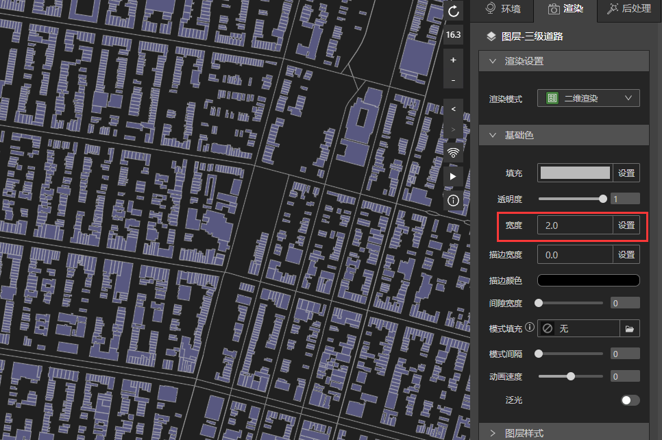

将地图级别调到20，文件准备完毕，我们开始准备道路宽度分级设置。

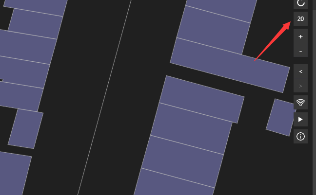

PS：一般来说，道路宽度我们都是从地图大级别开始设置，这样从宽到窄比较容易定位。

## 道路宽度分级设置

### （1）打开分级设置面板

单击宽度旁边的“设置”，会弹出分级设置下拉菜单，此时是关闭状态，单击按钮开启。

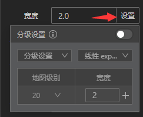

### （2）设置当前地图级别合适的宽度
将“宽度”下的数值“2”改成“50”，然后单击数值右边的“+”或者键盘上的“enter”键，此时地图上道路宽度随即变宽，同时在分级设置面板下面会更新一条列表，记录在20级别当前道路宽度是50。

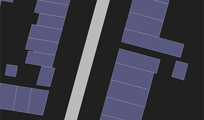
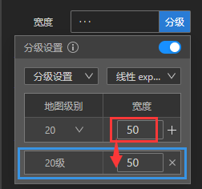

### （3）跳转地图级别

我们用鼠标滚动缩放地图，此时地图级别里的数值也跟随着一起变动

PS：我们也可以单击地图级别下的箭头，在弹出面板里直接填上想跳转的地图级别。

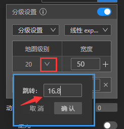

在16.8级别我们观察地图，会发现50道路宽度明显太宽了，需要改细一点。

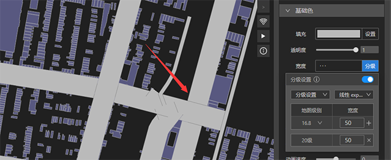

### （4）增加分级设置列表

我们回到分级设置面板，将宽度下的数值从50改成10，然后单击“+”或者键盘上的enter键，此刻地图上道路宽度随即变窄，同时在分级设置面板上多了一条记录列表。

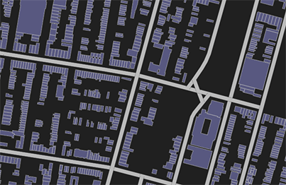
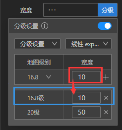

### （5）完成分级设置

以此类推，我们很快就可以完成分级设置。在整个设置过程中，你可以根据地图上观察到的情况，随时增加、更改或者删除列表，非常方便。

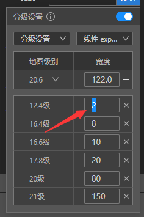
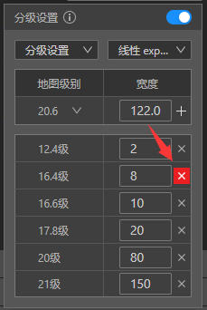

最后我们看看最终结果吧，是不是很简单呢？^ ^

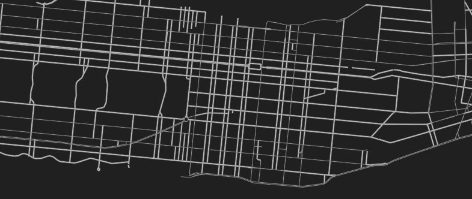

## 其他设置介绍

### （1）分级和分值

控件设置下拉菜单里有分级和分值2个选项，分值设置教程请看这里。

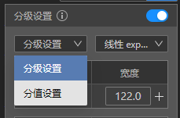

### （2）渐变方式

渐变方式下拉菜单里有3个选项，线性exponential、区间interval和单值categorical

● 线性渐变exponential：在指定的地图级别之间，比如20-15之间，属性数值可以线性顺滑的渐变。

● 区间渐变interval：在指定的地图级别之间，比如20到15之间，属性数值保持不变，到达15时，数值才会变化。

● 单值categorical：属性数值只在指定的地图级别变化，比如只有20和15这2个地图级别，数值才会变化，其他级别都是系统默认数值。

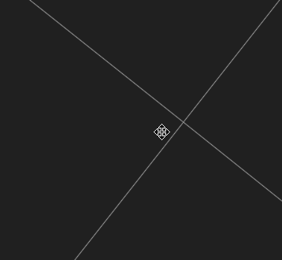

Ps:选择单值后，滚动鼠标缩放地图时，因为鼠标滚动精度问题，可能分级列表上显示为20，实际地图缩放级别为20.5，自然地图上不会有任何变化。这时候选择跳转地图直接到20，就可以观察到变化了。