本教程中，我们将演示如何运用模式填充功能给道路增加动画效果。

## 准备好道路图层和动画图层。

### （1）新建VT图层添加道路数据

启动IDE，新建msd文件，文件里新建2个VT图层。

第一个VT图层里添加铁路和高速公路，确认后在图层面板上取名：道路。

第二个VT图层再次添加铁路和高速公路，确认后在图层面板上取名：动画。

文件准备就绪，让我们进入下一步。

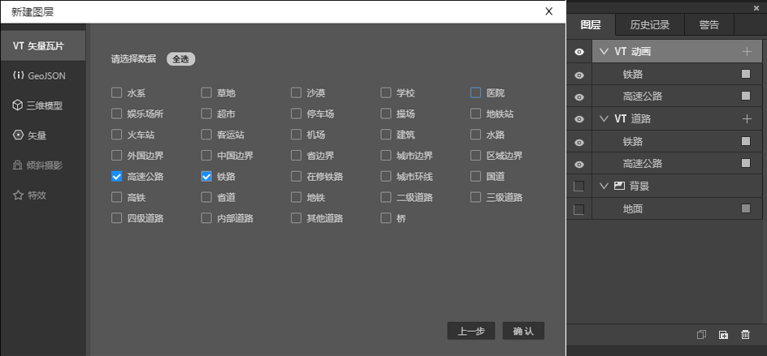

## 后处理面板设置泛光属性

如下图调整具体数值。

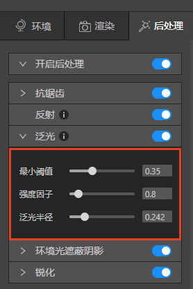

## 设置道路图层

### （1）选中道路数据

在图层面板上选中道路图层下的数据，或者在地图数据上右键单击，在弹出菜单中选中。

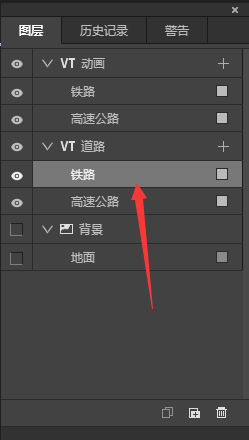
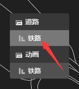

### （2）设置道路数据颜色属性

如下图设置铁路和高速公路属性。

铁路：渲染>基础色>填充颜色：A96522，透明度：0.91，将泛光按钮打开。

高速公路：渲染>基础色>填充颜色：446B89，宽度：3，将泛光按钮打开。

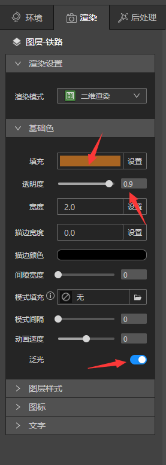
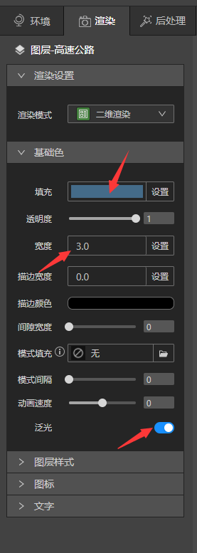

地图上就可以看见下图效果。

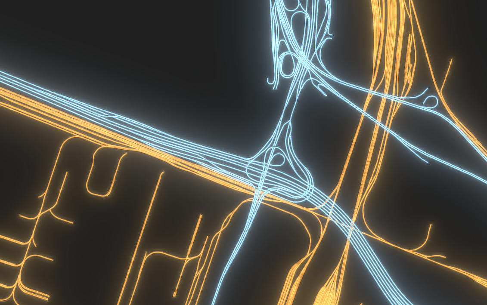

## 设置动画图层

### （1）选中铁路数据，上传填充图片

渲染>基础色>模式填充，单击打开图标

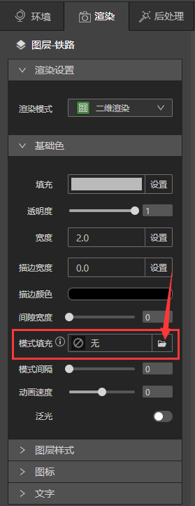

在模式填充的下拉菜单里单击“+”图标，上传图片“金色.png”和“蓝色.png”。

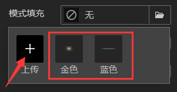

### （2）设置模式填充

选中“金色”后。如下图设置属性，打开泛光按钮。

* 宽度：调整填充图片的大小。

* 模式间隔：调整填充图片之间的距离。

* 动画速度：调整动画的速度；数值大小代表动画速度；正负值代表动画方向。

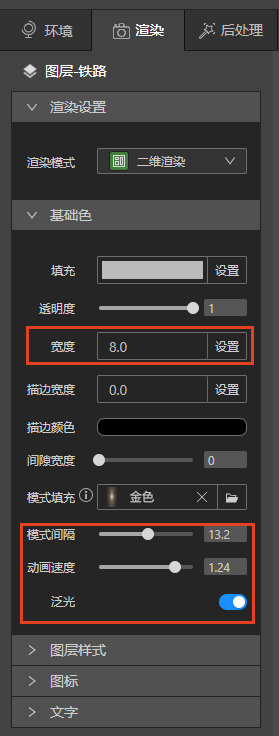

此时地图上铁路就可以看见光点了。

### （3）选中高速公路数据，设置模式填充

选中动画图层下的高速公路，模式填充中选择“蓝色”，如下图设置属性，打开泛光按钮。

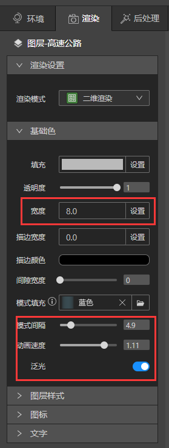

### （4）完成设置

这就是最终做出来的效果，是不是很简单呢？：）

