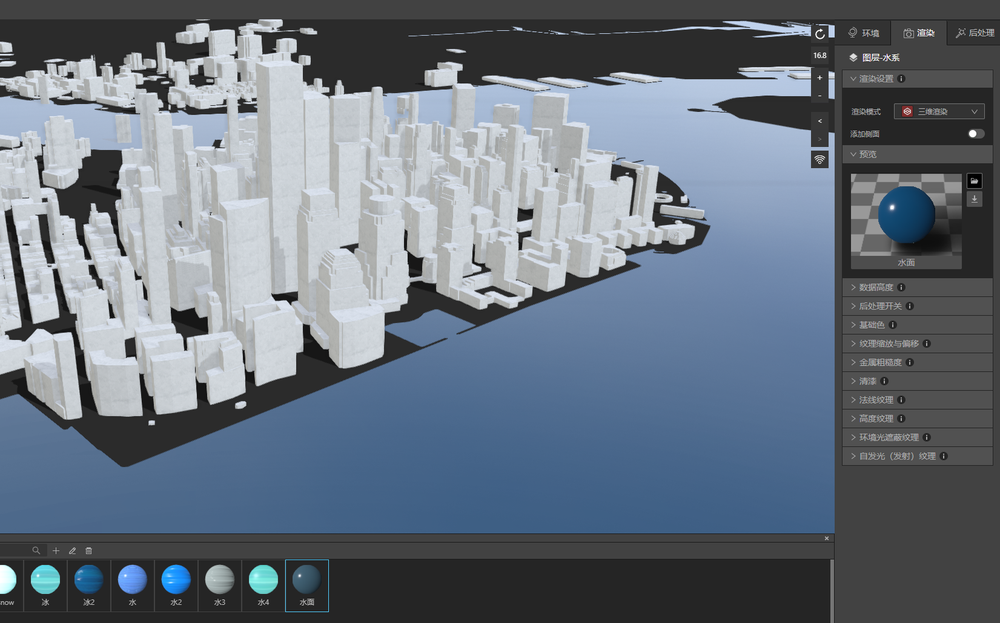
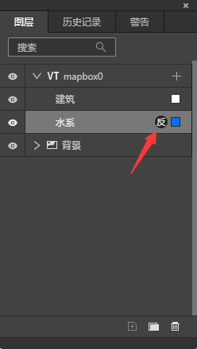
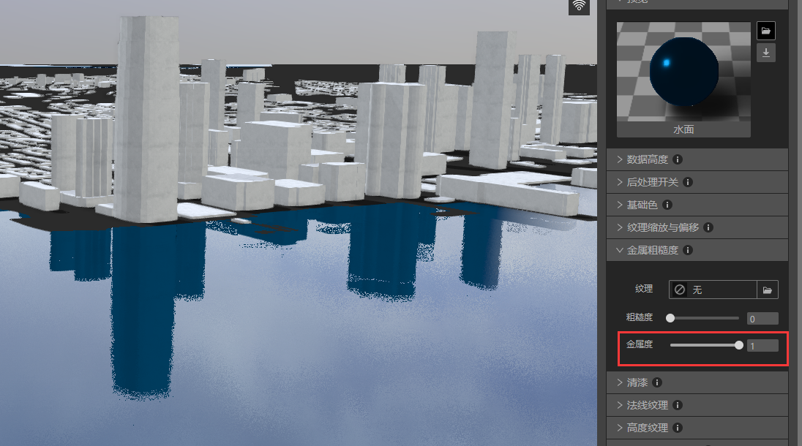
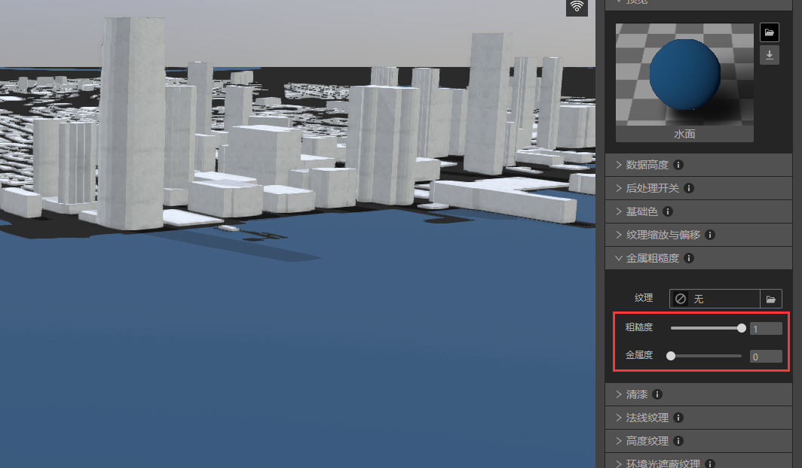
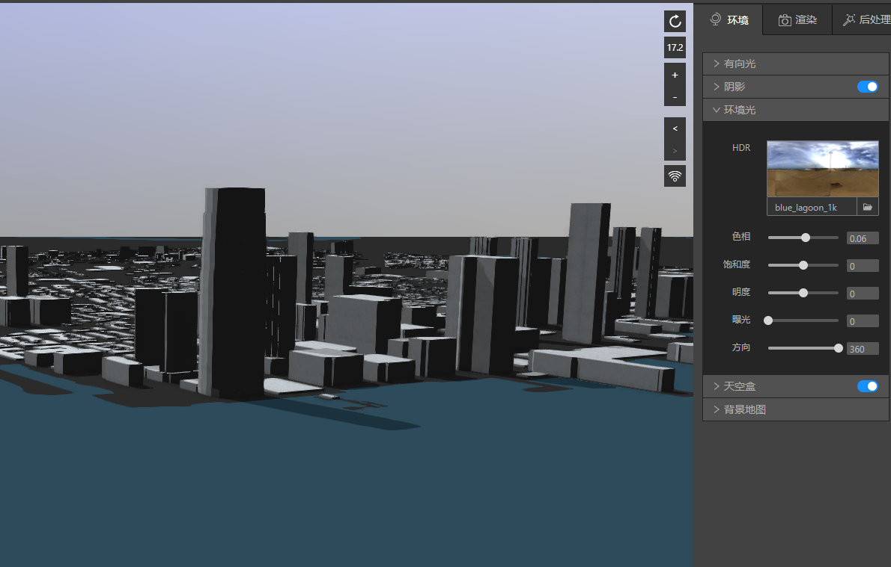

本教程中，我们将演示如何让水面增加建筑物倒影。

## 准备好建筑物和水面

启动IDE，新建一个文件，新建VT图层，VT图层里添加建筑和水系数据。

在渲染设置中分别将建筑和水系数据从二维渲染切换到三维渲染。

材质库里分别选2个材质球赋予建筑和水系，在地图上应用。

文件准备就绪，让我们进入下一步。

## 打开水系图层的反射按钮

### （1）后处理>反射按钮

反射是全局设置，确认反射按钮是开启状态。

### （2）打开水系数据的反射按钮

选择水系，渲染>后处理开关>反射，将按钮打开。

### （3）完成反射设置
此时水系将会出现建筑物的倒影。

同时图层面板上水系图层右边会出现“反”图标，代表该图层反射按钮是开启状态。

## 会影响反射效果的几种情况

### （1）金属度和粗糙度

金属度越高、粗糙度越低，反射效果越清晰；金属度越低、粗糙度越高，反射效果越差。

金属度是1，粗糙度是0的时候，反射非常清晰，效果如下：

金属度是0，粗糙度是1的时候，反射已不可见，效果如下：

### （2）法线

法线纹理强度越小，反射效果越清晰；法线纹理强度越大，反射效果越模糊

法线纹理强度是0，反射非常清晰，效果如下：

法线纹理强度是5，反射非常模糊，效果如下：

### （3）环境光

环境光HDR曝光数值越高、反射越浅；曝光数值越高低、反射越深；

HDR曝光数值是5，反射颜色变浅，效果如下：

HDR曝光数值是0，反射已不可见，效果如下：

## 小结

越光滑的物体表面反射越清晰，越粗糙的物体反射越模糊，所以选择金属类、水、或者其他表面光滑的材质球会非常容易呈现强烈的反射效果，反之如果选择草地、木头等这类粗糙表面的材质球，就算增加金属度，清漆等数值，也不容易呈现清晰的反射效果。
