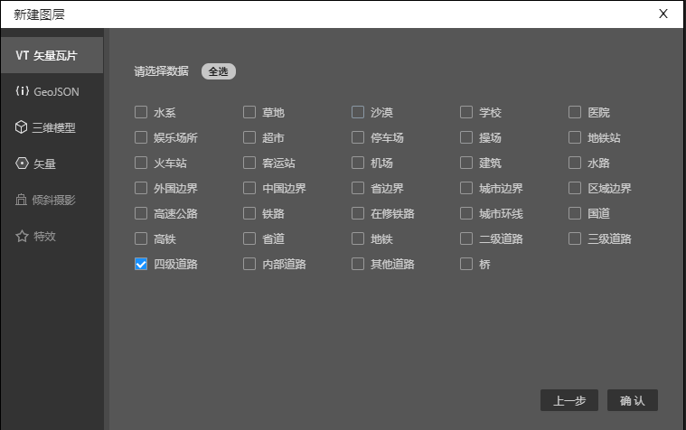
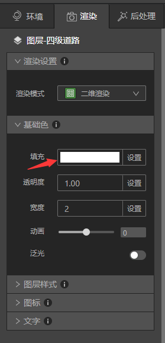
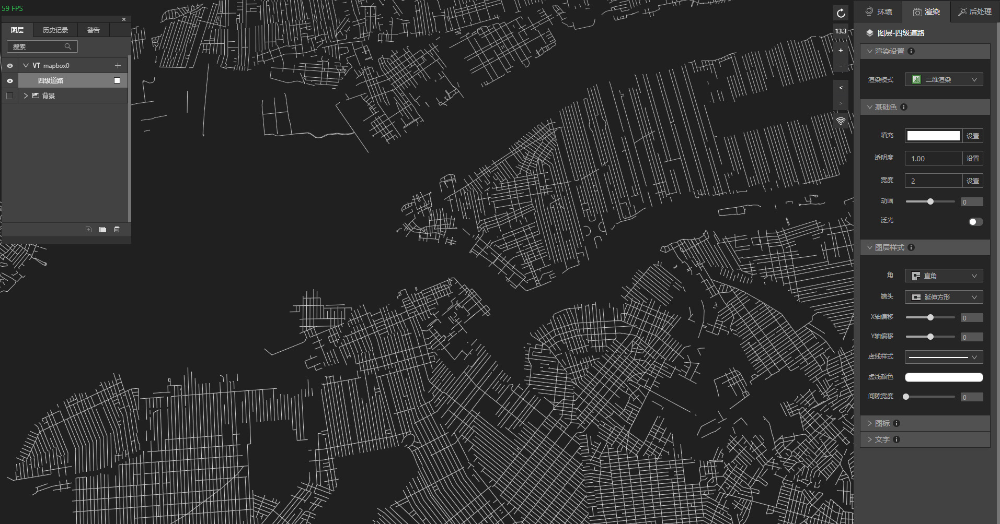
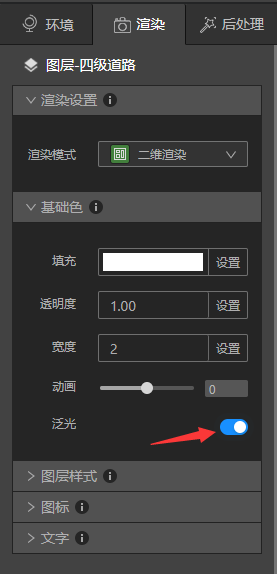
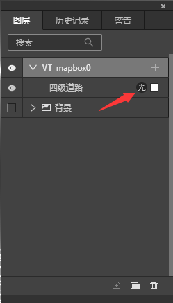
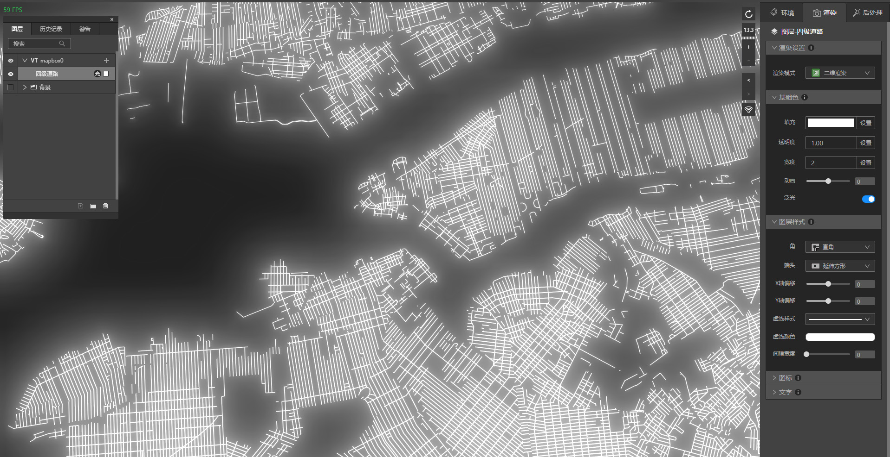

本教程中，我们将演示如何实现道路泛光效果。

## 准备好道路图层

启动IDE ，新建一个文件，新建VT图层，VT图层里添加道路数据。

地图上即出现了道路数据，接下来在渲染面板中，将基础色“填充”改成白色000000。你也可以改成任意想要的颜色，但是颜色越浅泛光的效果越明显，颜色越深泛光效果越差。

文件准备就绪，让我们进入下一步。

## 泛光设置

### (1) 打开泛光按钮

渲染>基础色>泛光，单击按钮，打开泛光。这时候图层面板“四级道路”旁边会出现“光”图标，代表该图层的泛光按钮打开了。

现在地图上就可以看到道路泛光的效果了。

### (2) 后处理面板调整泛光参数。
泛光是全局设置，后处理>泛光默认是打开状态，也可以根据需求调整默认值。

* 最小阈值：通过颜色RGB值，可以算出颜色的亮度值，颜色亮度值低于设置的最小阈值不会发光。

* 强度因子：颜色亮度的强度，数值越大颜色越亮。

* 泛光范围：照亮周边区域的范围，数值越大照亮的区域越大。

### (3) 其他调整泛光效果方法

渲染>基础色>透明度，可以通过调整透明度增减泛光的效果。

