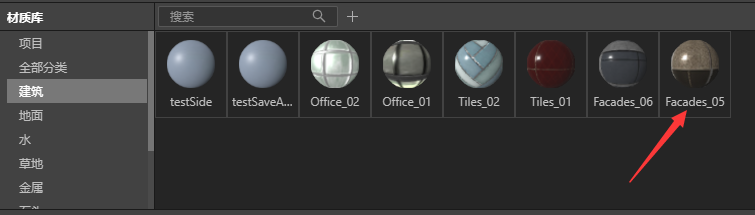
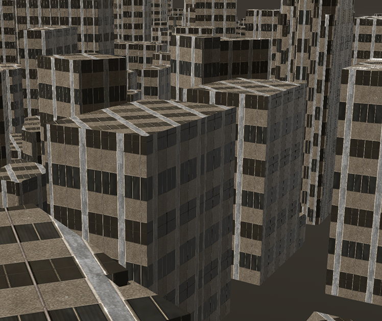
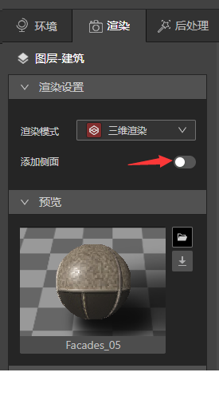
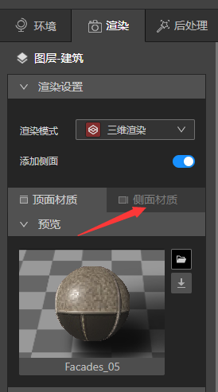
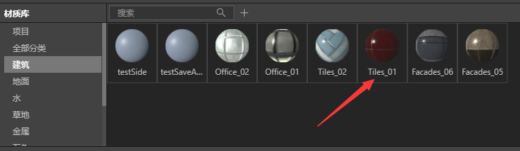
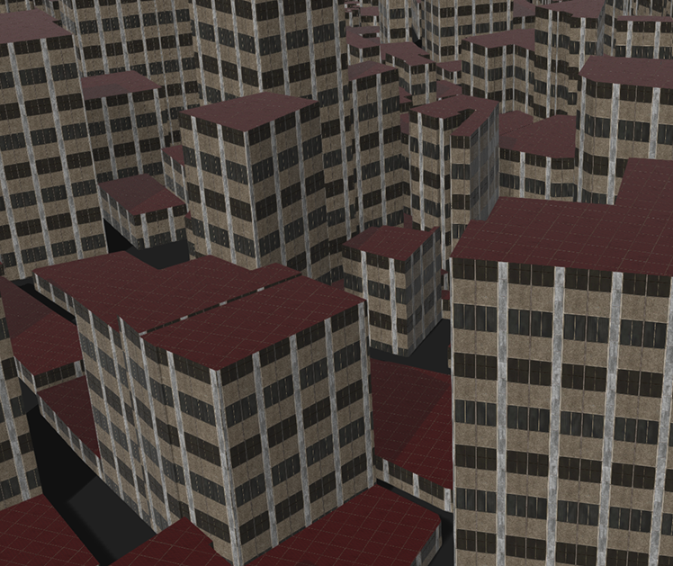
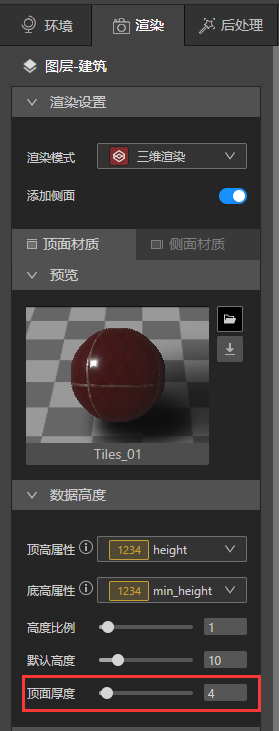
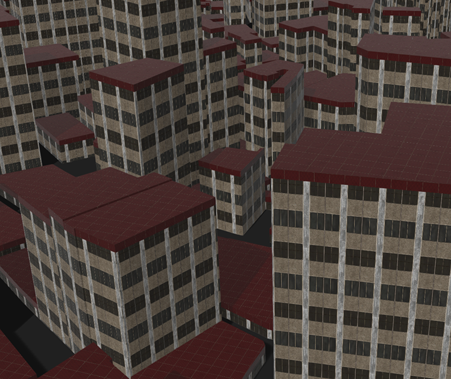
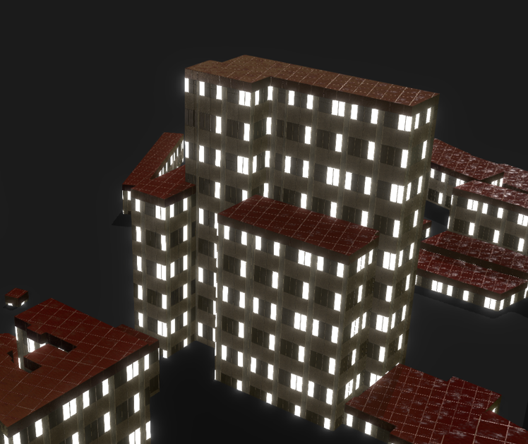

本教程中，我们将演示如何简单方便的给建筑物增加屋顶

## 准备好建筑物

* 启动IDE，新建文件，新建一个VT图层，添加建筑数据。

* 在渲染设置中将建筑从二维渲染切换到三维渲染。

* 材质库选择建筑>Facades_05，单击赋予建筑数据材质。

* 文件准备就绪，让我们进入下一步。

## 添加侧面

### （1）打开添加侧面按钮

跳转到 渲染>渲染设置>添加侧面 单击按钮，你会发现下方多出“顶面材质”和“侧面材质”2个选项卡。

### （2）顶面赋予新材质球

选择“顶面材质” ，在材质库里选择一个新的材质球，就可以让建筑物顶部增加一个不同的材质。

### （3）增加顶部厚度

跳转到渲染>数据高度>顶面厚度,将数值从“0”改到“4”，或者任意觉得合适的数值，顶部就会实时增加厚度了。

## 其他调整

我们还可以给窗户添加灯光，具体做法请查阅上一篇[制作发光的窗户](../design-tutorial/windows), 给与一个夜晚的环境光，在图层面板上将地面图层显示出来，将颜色改成黑色等等，简单调整下我们又可以得到下面的效果，IDE给与了三维地图无限的可能性，大家可以尽情的探索。

