IDE可以制作很漂亮的半透明材质三维地图，下面我们来介绍具体步骤。

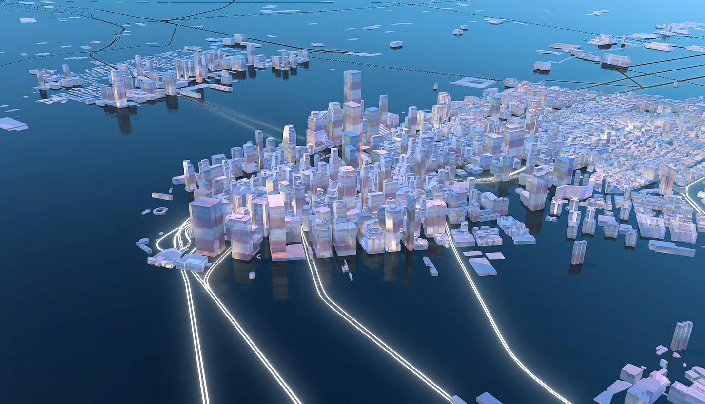

## 观察真实的半透明材质。
如果我们观察自然界中真实的半透明材质，比如水晶、磨砂亚克力等，他们一般有如下特征：

(1) 能透过一部分光，从正面能看到背面模糊的背景，如图1、2、3。

(2) 类似金属能反射周围的环境，表面材质越光滑反射越锐利清晰如图1，表面材质越粗糙反射越模糊如图2.

(3) 内部如果有气泡或者其他杂质，能呈现一种丰富多彩的色彩氛围，明显图1图3就比图2要更有活力的感觉。

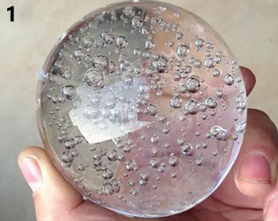
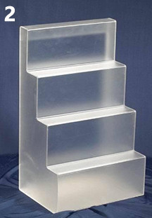
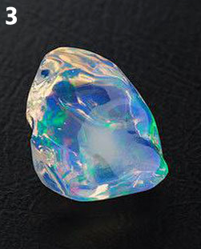

当然我们还可以观察到更多特征，不过抓住上面3条最能体现“半透明”特征的点，我们就可以非常简单在IDE里制作半透明材质了。

## 准备文件

* 启动IDE，新建文件，新建一个VT图层，添加建筑数据。

* 在渲染设置中将建筑从二维渲染切换到三维渲染。

* 文件准备完毕，我们开始在属性面板进行下一步的制作。

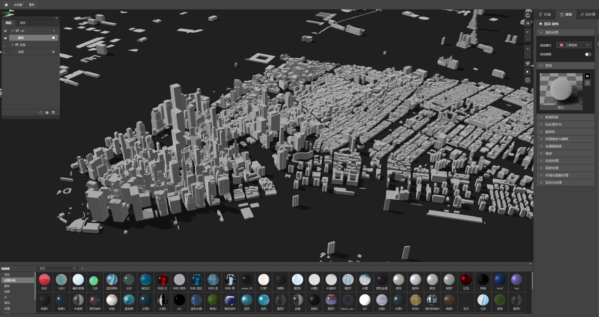

## 设置属性面板

### （1）设置建筑透明度

半透明重点1是要透过背景，但不能完全透明，针对这一条，我们将渲染>基础色>透明度选项改成0.5,地图上建筑物效果如下图。

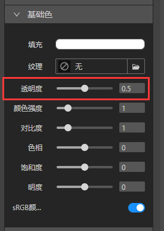
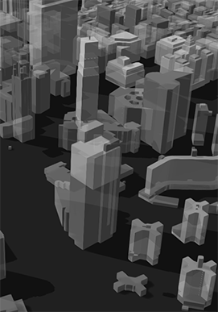

### （2）设置建筑反射环境

半透明重点2是要能反射周围环境，要做到这一点我们需要2步。

* 环境>环境光>HDR，选择一个HDR文件。HDR越清晰，细节越丰富越好，因为这能让建筑反射更多的内容，能更好的体现半透明的特征。

* 渲染>金属度粗糙度，粗糙度选项改成0，让建筑物可以完全反射环境。

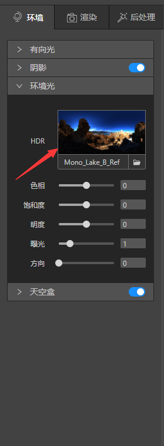
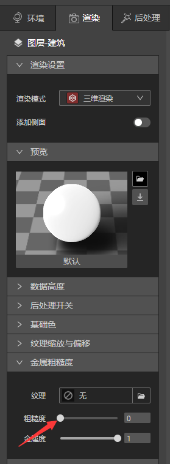

做完这2项后，发现建筑物一下变得blingbling的啦

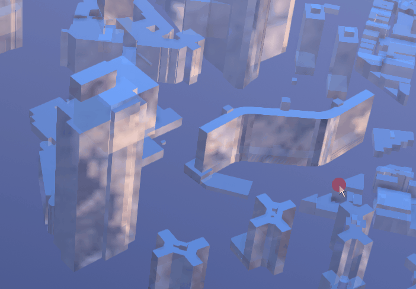

### （3）增加细节

半透明重点3是增加材质的细节，让颜色更丰富，IDE渲染面板下有3个工具面板能尽可能的模拟这个效果。

* 基础色面板：上面有各种调整颜色的工具，你可以尽情发挥创造力，调整合适的颜色。

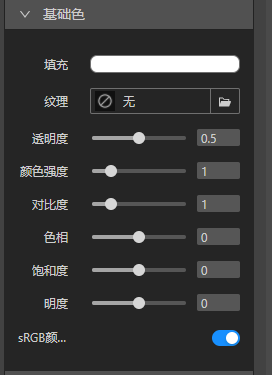

* 纹理缩放与偏移：这个面板可以统一调整纹理图片的各种尺寸。

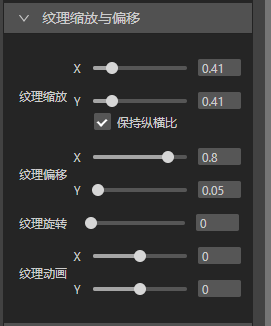

* 自发光纹理：在纹理窗口可以上传图片，与建筑基础色颜色混合，产生更丰富的效果。

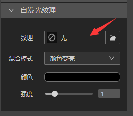

我们以实际举例，首先将自发光纹理下的强度改成0.36，然后导入3张不同风格的图片，（导入图片的具体操作请查阅[制作发光的窗户](../design-tutorial/windows)）再经过“基础色”和”纹理缩放与偏移“面板微调后，建筑呈现了更丰富的色调，下面来看看实际效果吧。

（例1）

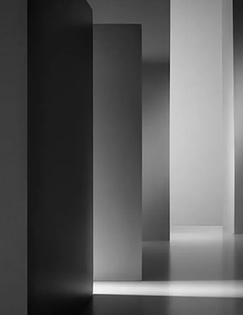
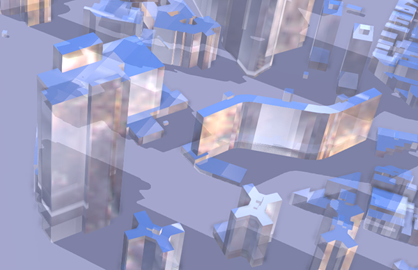

（例2）

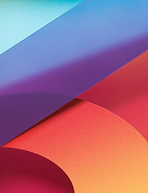
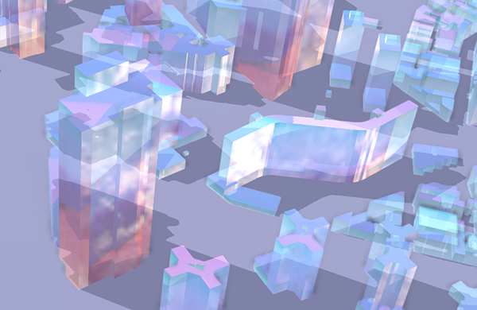

（例3）

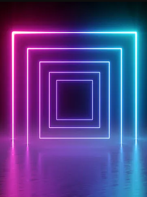
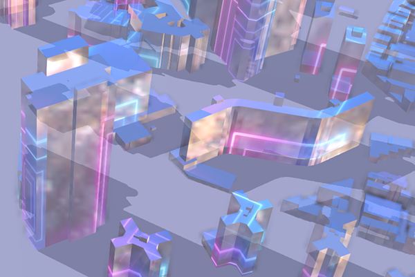

## 保存材质球

利用海量的图片资源，我们可以非常简单做出各种各样风格的半透明材质，非常期待大家的创作！当然也不能忘记保存了，点击预览图旁边的另存为按钮，在弹出的“另存为材质”面板里填上材质名称和选择材质分类，你就可以在材质库里找到自己设计的材质球啦。

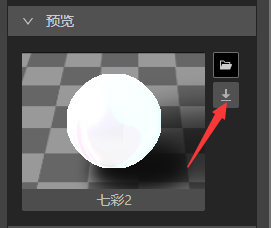

