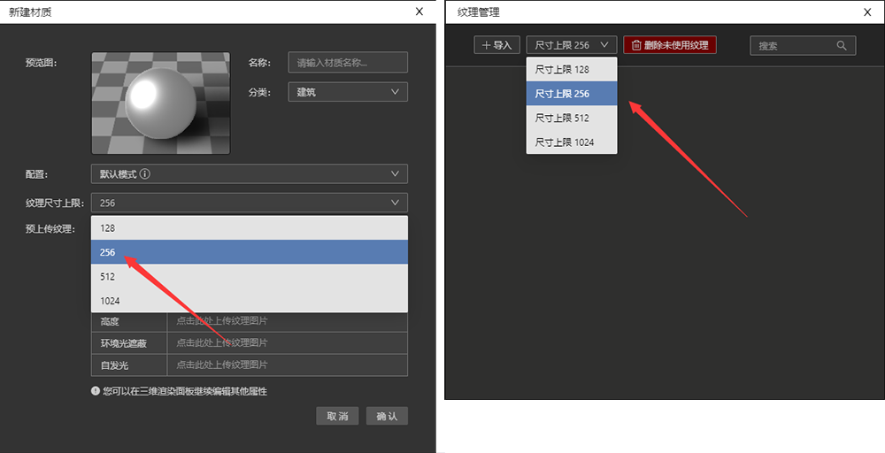

### 1、IDE图层面板能否像Photoshop一样，在图层下新建组？

不能，因为IDE里图层本质是数据，要考虑程序调用的需求。

比如道路和建筑2种数据，如果想要把它们分开，需要新建2个VT图层，单独放置这2种数据，而不是在一个VT图层下再建立2个组，这个和PS的图层概念不一样。

### 2、为什么我上传清晰度很高的纹理图片在地图上看起来很模糊？
在新建材质面板或者纹理管理面板上传纹理图片时，需要选择纹理尺寸上限，默认是256px，意思是如果纹理图片长宽尺寸超过了256px,IDE会自动压缩纹理尺寸，您可以根据实际需求选择合适的纹理尺寸上限。

### 3、为什么有时候移动地图时，图层纹理会闪动？

有纹理的图层移动时，有时候会出现下面这种闪动的现象，仔细观察发现是地图移动停止的瞬间，纹理边缘高光部分从清晰变模糊，这是为什么呢？

这是因为后处理面板>抗锯齿>TAA 按钮打开了，TAA全称是Temporal Anti-Aliasing，意思是“时间性抗锯齿”，TAA技术可以对图像边缘进行柔化处理，使边缘看起来更平滑，但为了工作效率，Studio设置地图移动时TAA不生效，所以当地图停止移动时，纹理看起来就会比移动中柔和一些。越复杂的纹理TAA作用越明显，越简单的纹理TAA作用越隐约。

当我们关闭这个按钮，再移动地图就会发现这种闪动的现象消失了。

### 4、 为什么地图图层选用某些材质球后，旋转地图时地面会有流动感？

这是因为这个材质球有高度纹理，当取消高度纹理或者将强度降为0的时候就会发现流动感消失了
