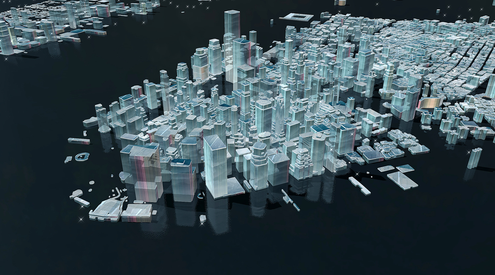

欢迎大家使用设计指南！

我们希望能帮助设计师和程序员了解IDE的基础操作、设计思路、实现效果的最佳路径，从而通过IDE制作出更具有视觉冲击力、沉浸感和美感的地图。设计指南中体现了我们对三维地图的探索和思考，同时我们会继续扩展不同的设计主题，也非常希望能收到来自你的建议和灵感，我们将会在这里一起分享学习，共同设计未来。

设计指南将以文字+图片的形式介绍IDE基本功能，让大家简单轻松的快速上手，同时我们也会提供具体设计案例，学习运用更多的技巧，希望大家能在操作过程中体会到乐趣。

下面我们就开始吧。

