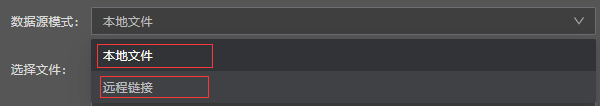
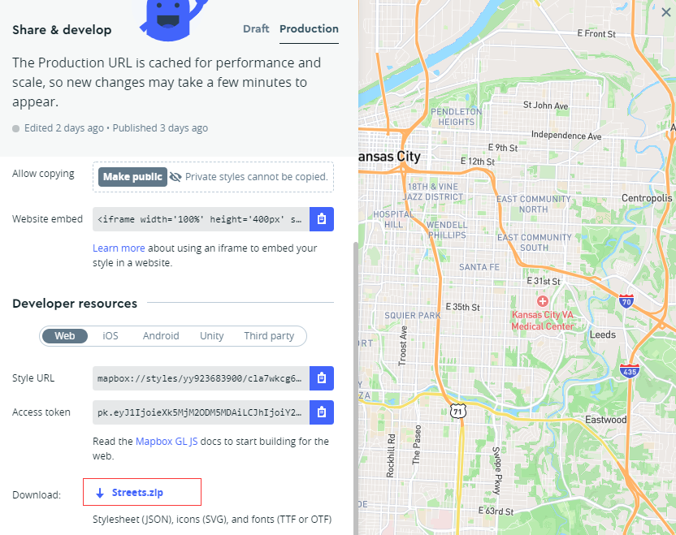
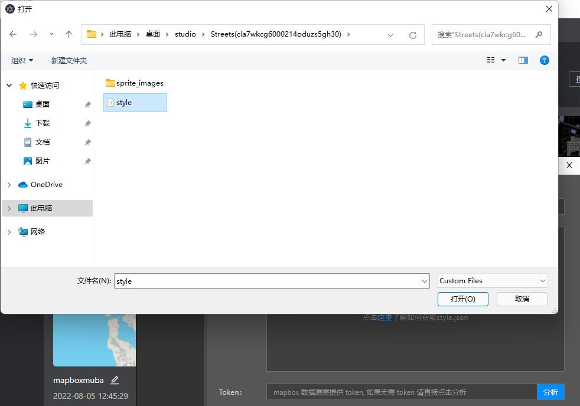
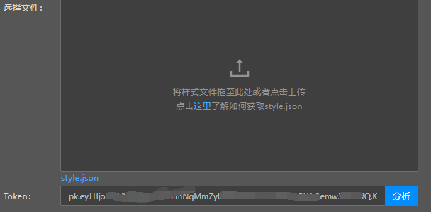
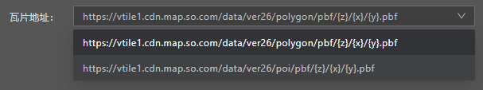
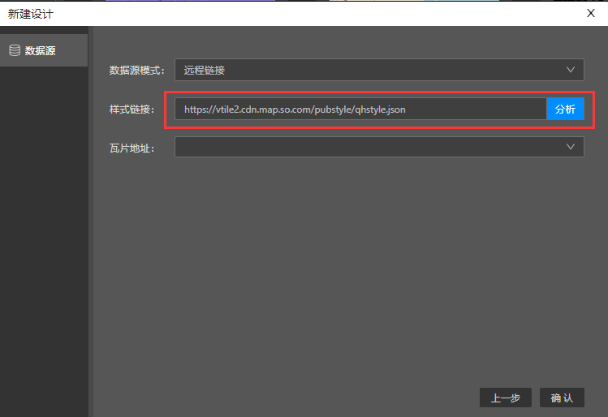
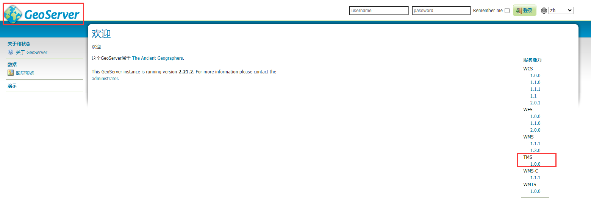
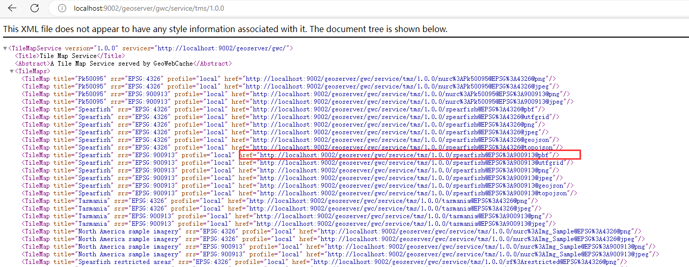
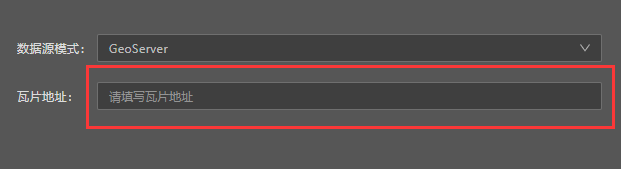

## 本地文件模式

目前数据源模式支持本地文件和远程链接两种，默认是本地文件模式。

#### 文件格式

这里的文件一般指的是从 mapbox，arcgis 等平台导出的 style json 文件。以 mapbox 为例，下面是 mapbox studio 里面导出 style json 文件的入口，只需要导出 zip 包，解压后在 designer 里面导入其中的 style json 文件即可。（对于 mapbox 底图已经设计好的样式，designer 会尽可能转换成 maptalks 支持的样式格式设置到地图上，资源文件除外。）

#### 文件导入

导入解压后的 style.json 文件。

#### 填写 Token

导入文件成功后，如果有些数据源访问需要 token，需要把 token 填上，然后点击分析，如果不需要 token，就可以直接点击分析按钮。

#### 瓦片地址

如果之前的操作没有问题，这里在点击分析后，就会展示出分析到的矢量瓦片服务地址，可能会有多个，默认选择第一个，也可以根据需要来切换地址。

## 远程链接模式

将数据源模式切换成远程链接，然后在样式链接输入框中填写远程 style json 的链接（注：如果数据源访问需要 token，请携带在 url 链接上），点击分析按钮即可。

## GeoServer

同样我们也支持通过 GeoServer 发布的矢量瓦片服务。关于如何使用 GeoServer 如何发布矢量切片，可以参考这篇教程 [矢量切片教程](https://zhuanlan.zhihu.com/p/62751184)。

在参考教程发布好矢量切片后，要注意的是，需要点击 logo 回到首页，然后可以看到右边有个 TMS 服务选项。

点击 TMS 服务里面的文档，就可以看到刚才发布的矢量切片的链接，例如我这边刚发布的链接是这个：

将数据源模式切换成 GeoServer，然后在瓦片地址框填入刚才发布的矢量切片链接，之后点击确认即可。

