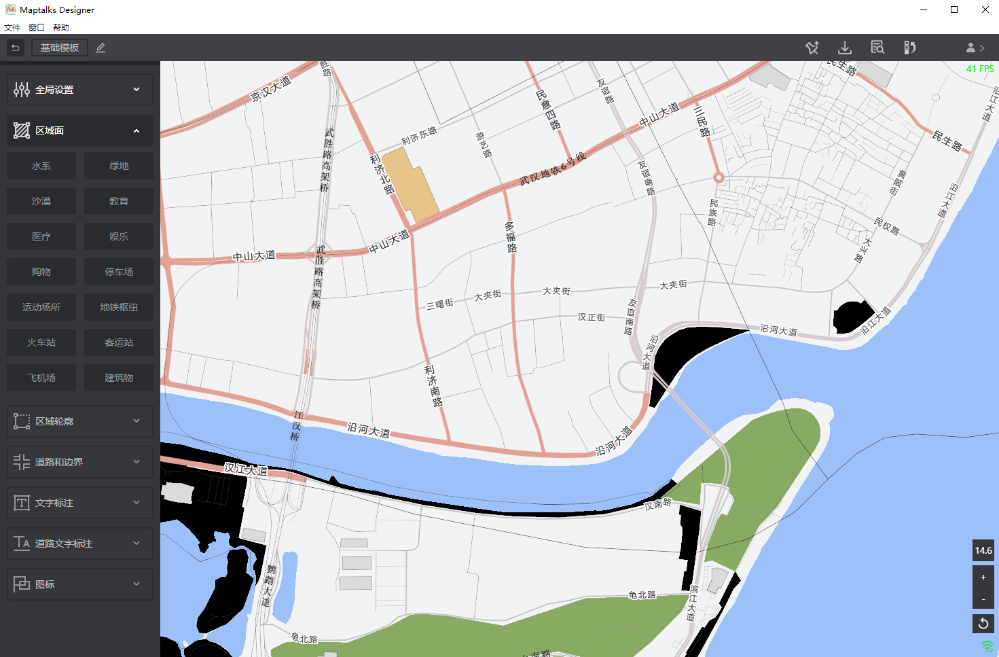
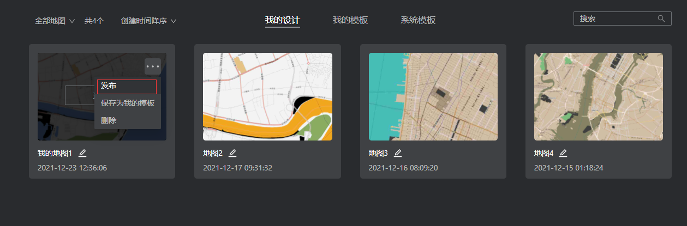
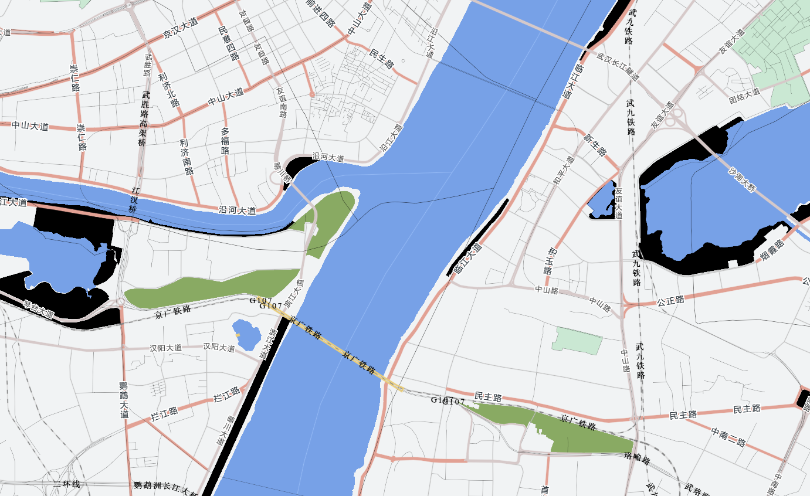
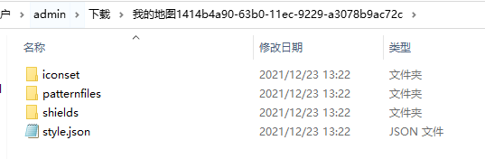

## 一个完整示例

　　在本教程中，我们会介绍如果使用我们的Designer，并将设计的结果应用到您的实际项目中。

## 创建您的第一个地图

　　在您登录后，在首页，选择系统模板，根据您的需要，选择一个基础模板进入。



　　根据您自己的需要，调整图层的属性，比如，选择"区域面", "水系",修改颜色为"77A1E7"。其他图层的各种属性根据您的需要进行修改。

　　完成修改后，将地图进行"另存为"，注意，只有"我的设计"进来的，才能"保存"，进行修改，模板进入的，只能另存为"我的设计"，然后进行"保存"操作。

　　在"文件"菜单，选择"另存为"，在弹出的面板中，输入需要另存为的名字"我的地图1"，然后点击"确定"，就完成了另存为的操作，且此时，地图的角色变基为了"我的设计"，后续操作都是操作"我的设计"中的"我的地图1"这个地图，跟模板无关。

　　返回首页，您可以看到在"我的设计"下面，多出了一个"我的地图1"的地图。

## 发布使用

　　我们提供了两种方式，一种方式发布到我们的云端，包括样式，图标等资源，然后您可以通过给layer设置url的方式，另一种是导出，然后您自己部署样式和资源。请您根据自己的场景，选择合适的方式使用。下面，我们将详细介绍两种方式。

### 1、url部署方式
 在首页的"我的设计"下，找到您想要发布的设计，点击"发布"按钮。



　　之后，您可以看到这个设计的左下角有个绿色圆圈，代表您发布了，且发布的信息与当前设计是一致的，如果是黄色的，代表设计有修改，而发布的内容比较老，想同步必须再次发布。

　　发布之后，在"发布"按钮的下面，多出来一个"拷贝发布地址"的按钮，点击它，即可得到发布的url，拿到这个url，您即可在您的程序里面使用了，如：

```
<!DOCTYPE html>
    <html lang="en">
      <head>
        <meta charset="UTF-8" />
        <meta name="viewport" content="width=device-width, initial-scale=1.0" />
        <meta http-equiv="X-UA-Compatible" content="ie=edge" />
        <title>designer export</title>
        <style>
          * {
            margin: 0;
            padding: 0;
          }
        </style>
        <link rel="stylesheet" href="./css/maptalks.css" />
        <script src="./js/maptalks.js"></script>
        <script src="./js/maptalksgl.js"></script>
        <script src="./js/maptalks.vt.js"></script>
        <script src="./js/maptalks.vt.basic.js"></script>
        <script src="./js/stats.min.js"></script>
      </head>
      <body>
        <div id="mapContainer" style="width: 100vw; height: 100vh;"></div>

        <script>
          //init map
          var map = new maptalks.Map("mapContainer", {
            center: [114.31278121672256,30.54605528757483],
            minZoom: 1,
            zoom: 10,
            zoomControl: {
              position: { bottom: "76", right: "10" },
              slider: false,
              zoomLevel: true
            },
            defaultRendering: true,
            seamlessZoom: true,
            spatialReference: "preset-vt-3857"
          });

          //init layer
          var layer = new maptalks.VectorTileLayer("vt", {
            urlTemplate: "http://116.63.251.32:8080/tile/planet-single/{z}/{x}/{y}.mvt",
            spatialReference: 'preset-vt-3857',
          }).addTo(map);

          window.layer = layer;

          layer.setStyle("http://meow.maptalks.com/designer/style/您的用户id/您的样式id/style.json");

          map.on('click', function(e) {
            const result = layer.identify(e.coordinate);
            console.log(JSON.stringify(result));
          });

          const stats = new Stats();
          stats.showPanel(0); // 0: fps, 1: ms, 2: mb, 3+: custom
          document.body.appendChild(stats.dom);

          map.on("framestart", function(e) {
            stats.begin();
          });

          map.on("frameend", function(e) {
            stats.end();
          });

          new maptalks.control.Toolbar({
            position: { bottom: "40", right: "10" },
            items: [
              {
                item: "reset",
                click: function() {
                  map.setPitch(0);
                  map.setBearing(0);
                }
              }
            ]
          }).addTo(map);

        </script>
      </body>
    </html>
    
```

　　打开浏览器，看到的效果为：



### 2、自主部署

　　不需要发布样式，只需要在设计内页，"文件"菜单，"导出"，您会得到如下的资源：



　　然后在您的项目中，引入资源，使用这个样式
```
<!DOCTYPE html>
<html lang="en">
  <head>
    <meta charset="UTF-8" />
    <meta name="viewport" content="width=device-width, initial-scale=1.0" />
    <meta http-equiv="X-UA-Compatible" content="ie=edge" />
    <title>designer export</title>
    <style>
      * {
        margin: 0;
        padding: 0;
      }
    </style>
    <link rel="stylesheet" href="./css/maptalks.css" />
    <script src="./js/maptalks.js"></script>
    <script src="./js/maptalksgl.js"></script>
    <script src="./js/maptalks.vt.js"></script>
    <script src="./js/maptalks.vt.basic.js"></script>
    <script src="./js/stats.min.js"></script>
  </head>
  <body>
    <div id="mapContainer" style="width: 100vw; height: 100vh"></div>

    <script>
      //init map
      fetch("./style.json")
        .then((data) => {
          return data.json();
        })
        .then((data) => {
          //init map
          var map = new maptalks.Map("mapContainer", {
            center: [114.27419435046454, 30.5679303378798],
            minZoom: 1,
            zoom: 14.63645632619806,
            maxZoom: 20,
            zoomControl: {
              position: { bottom: "76", right: "10" },
              slider: false,
              zoomLevel: true,
            },
            defaultRendering: true,
            seamlessZoom: true,
            spatialReference: "preset-vt-3857",
          });

          //init layer
          var layer = new maptalks.VectorTileLayer("vt", {
            urlTemplate:
              "http://116.63.251.32:8080/tile/planet-single/{z}/{x}/{y}.mvt",
            spatialReference: "preset-vt-3857",
          }).addTo(map);

          window.layer = layer;

          layer.setStyle({
            $root: "./",
            $iconset: "./",
            style: data,
            background: {
              enable: true,
              color: [0.945, 0.953, 0.957, 1],
              opacity: 1,
              depthRange: [1,1]
            },
          });

          map.on("click", function (e) {
            const result = layer.identify(e.coordinate);
            console.log(JSON.stringify(result));
          });

          const stats = new Stats();
          stats.showPanel(0); // 0: fps, 1: ms, 2: mb, 3+: custom
          document.body.appendChild(stats.dom);

          map.on("framestart", function (e) {
            stats.begin();
          });

          map.on("frameend", function (e) {
            stats.end();
          });

          new maptalks.control.Toolbar({
            position: { bottom: "40", right: "10" },
            items: [
              {
                item: "reset",
                click: function () {
                  map.setPitch(0);
                  map.setBearing(0);
                },
              },
            ],
          }).addTo(map);
        });
    </script>
  </body>
</html>
```
　　最终会得到一样的效果。

　　注意，不要缺少background.depthRange: [1,1], 这个非常重要。

　　如果您需要将此处的底图作为IDE的背景底图，那么只能走第一种发布这条路，然后再参考IDE的文档，接入底图。

