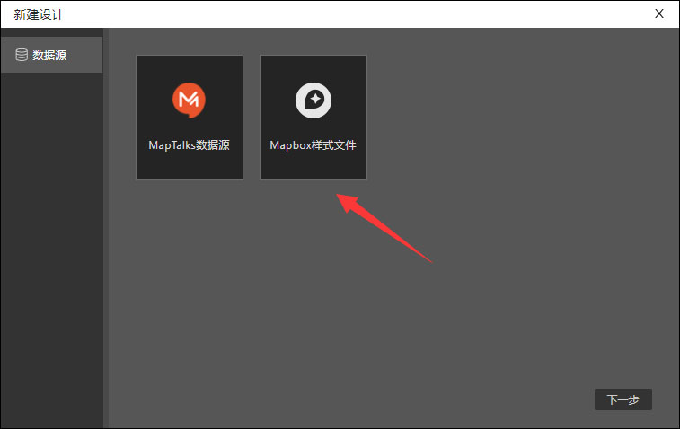
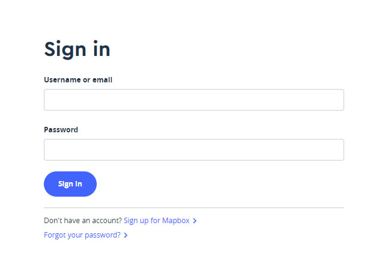
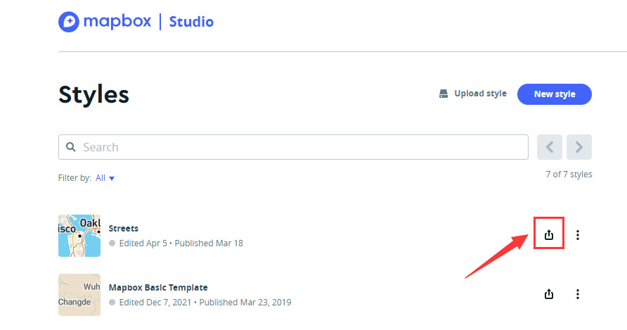
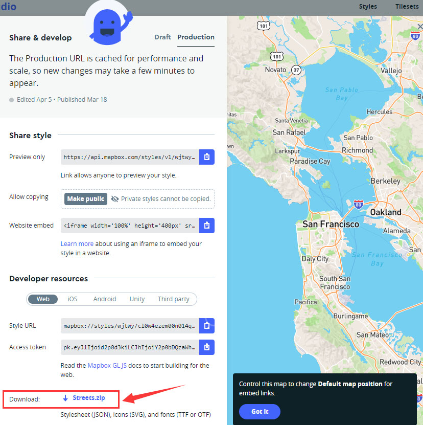
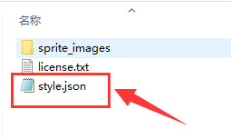
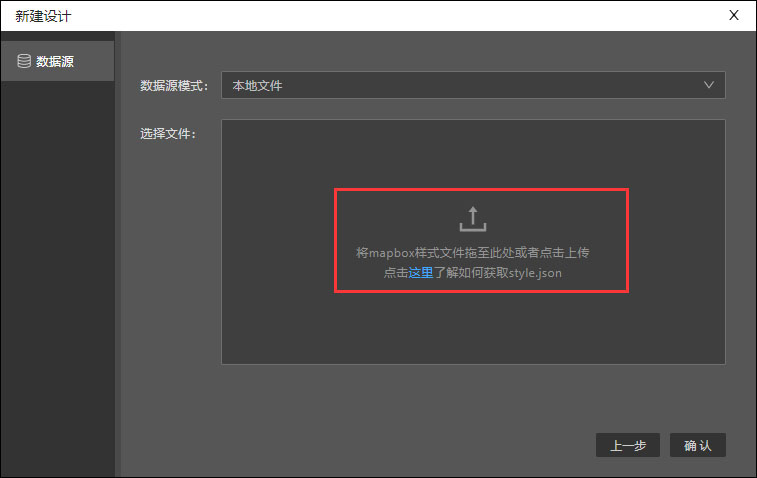

在designer中，新建设计时可以选择上传mapbox样式文件，那么在哪里下载该样式文件呢？下面我们将具体介绍步骤。

1、登录mapbox studio官网 ：https://studio.mapbox.com/

2、登录账户

3、登录成功后即进入styles页面，选择一个模板，单击红圈内图标。

4、在弹出的share&develop页面， 单击最下面红圈内的ZIP文件包。

5、将ZIP文件包解压后，就可以看见红圈内的style.json文件了。

6、在designer新建设计时选择mapbox样式文件后，按照提示，将刚刚下载的style.json文件拖至红圈内或者点击上传即可。
