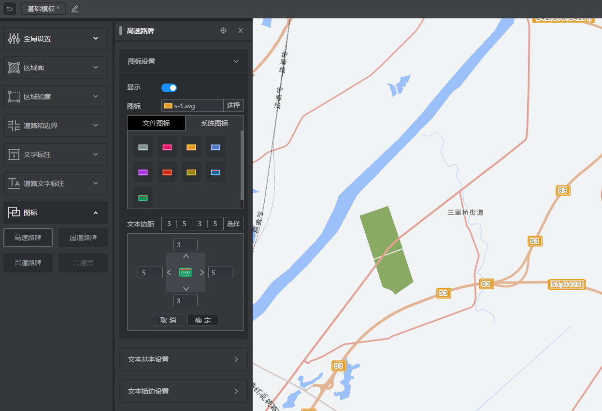
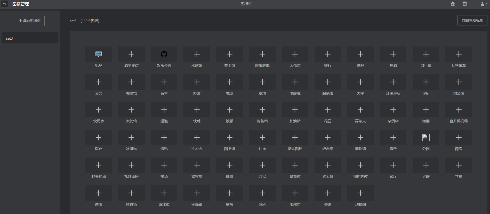
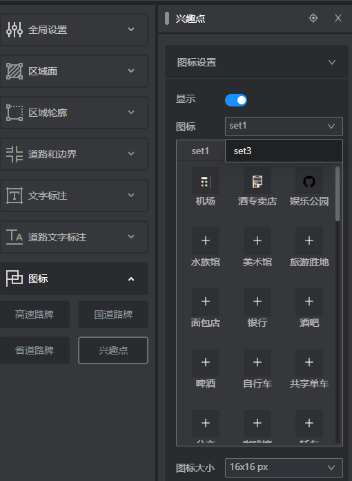
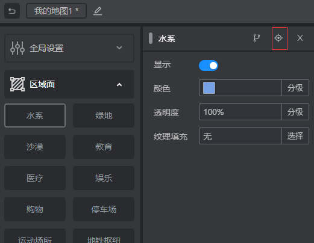
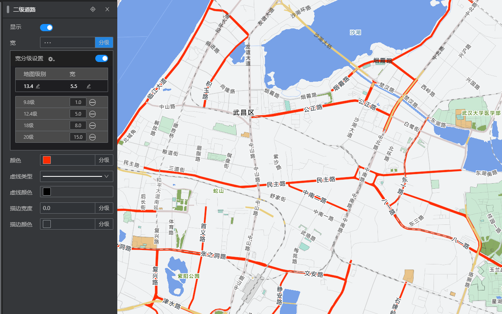
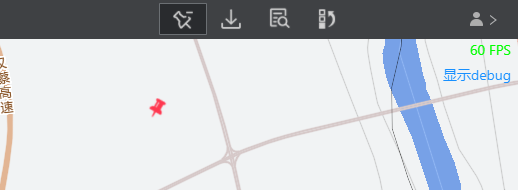
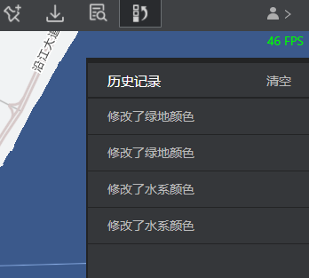

## 设计技巧与辅助工具
　　在本章中，我们将介绍设计一个好看的地图的经验，以及各种辅助工具。

## 如何设计一个好看的地图

　　先根据一个最贴合的系统模板或者个人模板，这样能最小化改动你的设计。

　　在设计的时候，可以先遵循大块的面数据，然后到大量的道路数据，常用文字，最后再到细节的原则。然后根据zoom调整分级的设计。

　　比如，我们先调整背景色，然后再调整水系，绿地，这样大的基调定了，然后再调整各种小块的面图层。之后，你会发现，道路的线会不那么美观，这种情况下，分级来调整各种道路的线宽颜色等。最后再去调整不常见的道路。

　　在设计的过程中，会反复滚动，来查看不同zoom级别的效果。您可以从小zoom一直到大zoom, 一般针对级别对应的图层规律是，小级别考虑，行政文字、边界、以及大的面图层，比如绿地，沙漠等，6级之后设计的重点在于道路，14级之后的数据非常丰富，且不是很容易产生不美观的感受，这种根据您自己的需要调整就可以了。

　　在设计的过程中，你可能需要经常找图层，定位到某条数据。关于这一部分，请参考下方快速定位图层这小节。

## 关于图标设计

　　图标这块分为了路牌和兴趣点。

　　我们预设了一定的系统路牌，如果不符合您的要求，请自行制作和上传文件图标，格式只支持svg的矢量图标, 防止使用位图在调整的过程中发生变形模糊。

　　我们预设了几套兴趣点图标，您也可以自己设计上传维护自己的图标集，在首页的右上角，有个管理个人图标的按钮，点击进入，您可以得到下面的页面，并在其中设置自己的兴趣点图标。

　　之后，在设计内页，你可以看到您的兴趣点图标集，然后使用它。

　　小技巧：其中“默认图标”您可以设置为一个透明的svg, 这样，如果其他图标没设计，那么这些没上传的图标可以是透明的。如果您的其他图标没设置，设置了默认图标，则其他没设置图标的图标会采用默认图标。我们建议设计全所有图标。这样，如果不想显示图标，可以直接关闭显示按钮，而想显示的话，选一套图标集就好，如果里头某个图标不符合您的要求，您也可以针对该项目，覆盖想覆盖的图标。

## 快速定位图层
　　我们为您提供了一个快捷找图层数据的方式，我们提前在武汉市内找了每个图层的一条数据，点击下方的按钮，能为您快速跳转到该图层的一条数据的中心点上，地图会移动和缩放到该地点，方便您快速找到图层数据。您也可以自己找到自己熟悉的区域，自行定位。

　　对于兴趣点图标，就只能靠您一个一个查找了。

## 分级设置

　　分级设置的主要地方在于道路的宽。我们以二级道路为例。

　　为了方便您快速看到效果，我们把颜色先调整为一个红色。

　　然后再打开分级，滚动地图到9.8级，设置宽度为1，滚动到12.4级，设置宽度为5，滚动到18级，设置宽度为8.0，滚动到20级，设置宽度为15。以上输入的数值，您可以根据您的设计需要来调整，然后反复滚动级别，来查看是否达到最佳效果。

　　在宽分级设置的右侧有个小图标，点击它，可以选择线性渐变和非线性渐变。非线性渐变，会在设置的确切的级别，突然到设置的值，线性渐变，会均匀过渡。您可以打开系统模板，查看其中的道路的设置效果，或者您自己尝试一下。

　　达到最佳效果后，您可以再调试到合适的颜色。

## 全屏
　　您可以随时在设计过程中全屏查看地图设计效果。在"窗口"菜单，可以点击"全屏", 或者按"F11"， 即可进入全屏，按"Esc"按钮，即可退出。

## 锚点
　　锚点是改变zoom时候的中心点位置，它位于设计内页，右上角。如下图，点击它会添加或者删除地图上的锚点。您可以移动锚点位置，来决定zoom时的中心点。此功能在您使用分级控件的时候很方便。

## 历史记录

　　您可以在历史记录功能里回退到最近20步的操作。

