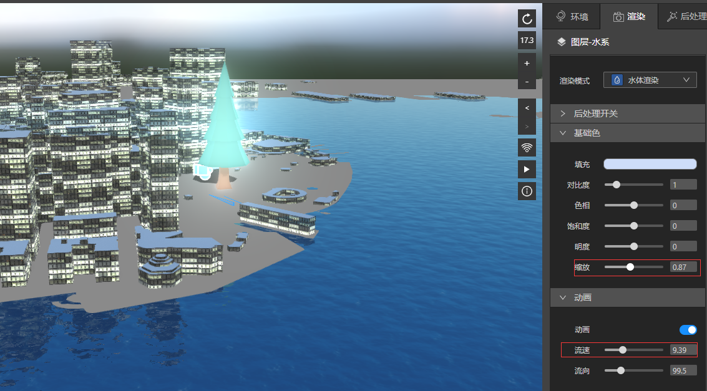
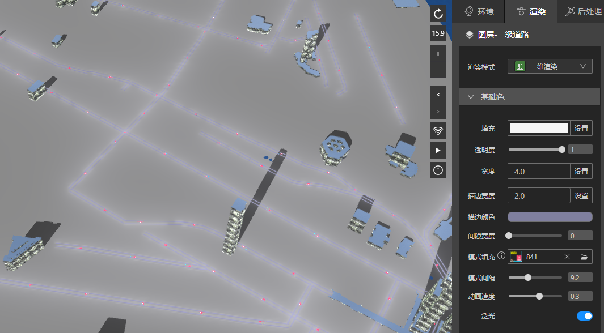
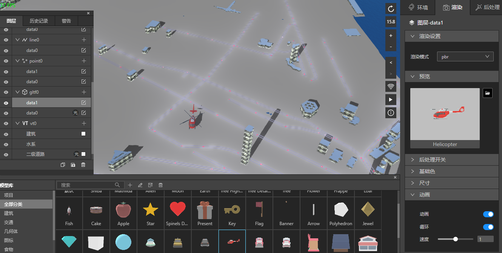
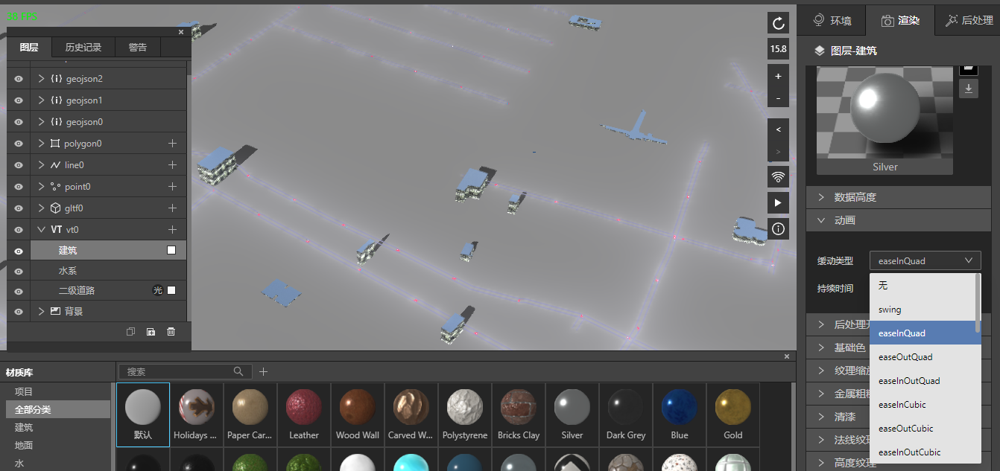

## 动画

动画分散在软件的各处。

比如有水体渲染，水流的感觉。通过调节缩放控制波纹大小，调节流速让水流块或者慢。

比如vt的线插件参数处，可以设置模式填充，模式间隔，动画速度，再配合上泛光和描边，可以做出很好看的道路上光点运动的效果。

比如gltf图层中有运动的模型，可以开启动画。

*开启动画后，飞机的螺旋会转动*

比如vt的三维渲染，当数据从可视区外出现在可视区的时候，可以出现缓缓的动画。

*建筑出现在视野里时，会有高度慢慢起来的动画*

