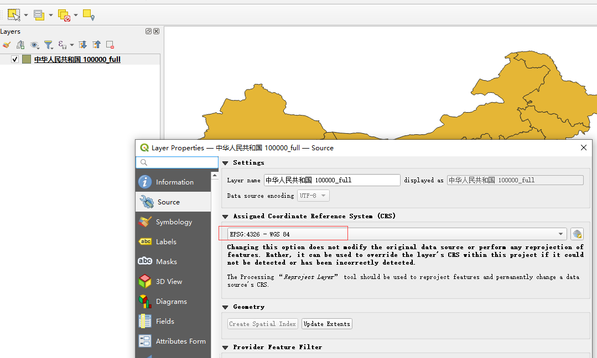
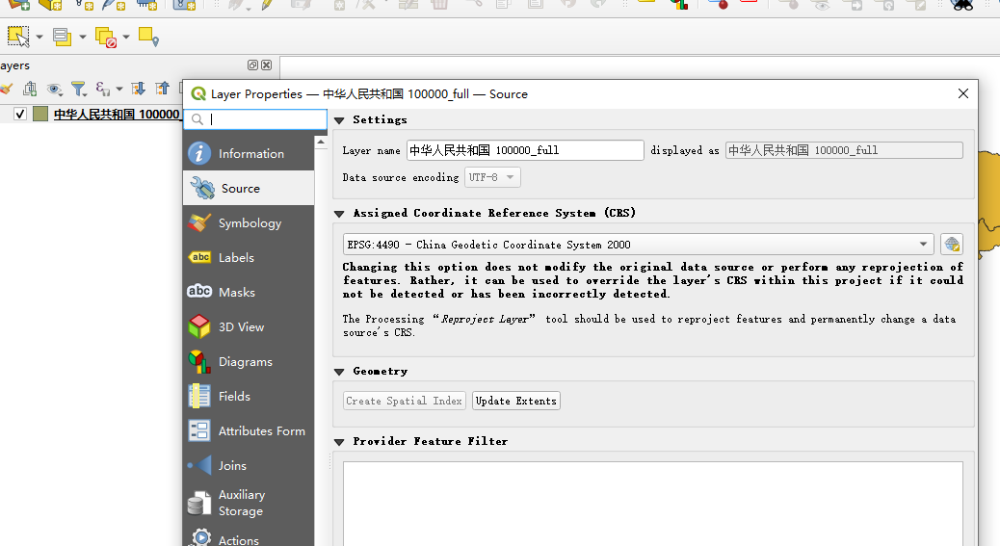

## 坐标系

　　开发地图应用服务时，一定会接触到各种坐标系，多种数据时，不同坐标系会导致地理位置信息混乱，在地图上可能出现数据坐标点极大的偏差。统一坐标系是让地图应用合理的前提。

### 地理坐标系和投影坐标系

　　总的来说，坐标系可以分为两大类：地理坐标系（Geographic Coordinate System, GCS）和投影坐标系（Projected Coordinate System, PCS），地理坐标系进行地图投影后就变成了投影坐标系。

　　其中地理坐标系又可分为参心坐标系和地心坐标系，常见的参心坐标系北京54、西安80，常见的地心坐标系有WGS84、GCJ-02、BD-09、GCS2000。

　　我们主要讨论的是地心坐标系。参心坐标系您可以自行查阅相关文章。

### WGS84

　　WGS84是为 GPS 全球定位系统建立的坐标系统，是世界上第一个统一的地心坐标系，因此也被称为大地坐标系、原始坐标系。一般通过GPS记录仪记录下来的经纬度，就是基于WGS84坐标系的数据。

　　WGS84坐标是观测历元的动态坐标，用于导航，强调实时性、动态性。

　　例如，OSM就是采用的WGS84坐标系。GPS数据一般是WGS84坐标。这种坐标系在国外非常普遍。

### GCJ-02

　　GCJ-02 是由中国国家测绘局（G表示Guojia国家，C表示Cehui测绘，J表示Ju局）制订的地理信息系统的坐标系统，是在WGS84经纬度的基础上执行加密算法而成。因为GPS得到的经纬度直接在GCJ-02坐标系下会定位到错误的地点，有种到了火星的感觉，因此在坊间也将GCJ-02戏称为火星坐标系。

　　国测局规定，国内出版的各种地图系统（包括电子形式），必须至少采用 GCJ-02 对地理位置进行首次加密的坐标系，高德和Google在国内都是使用GCJ－02坐标系。

### BD-09 / GCJ-02

　　百度使用的是在GCJ-02基础上再一次加密的BD-09坐标系。

### CGCS2000

　　CGCS2000，是2000国家大地坐标系，是我国当前最新的国家大地坐标系。

　　CGCS2000坐标是2000.0历元的瞬时坐标，用于各种生产活动，强调统一性、规范性、自洽性、稳定性。

## maptalks采用的CGCS2000坐标系

　　我们的vts数据源采用的CGCS2000坐标系，如果您采用我们的vts数据源（maptalks矢量瓦片），请在导入其他数据，如geojson等数据之前，先把数据处理为CGCS2000坐标系。

## QGIS转换WGS84为CGCS2000

　　打开QGIS, 然后拖入要转换的数据，如"中华人民共和国.geojson"

　　然后右键点击图层，在弹出框中选择属性，查看当前坐标为wgs84。

　　之后再右键选中后，点击"Layer CRS"，点击"Set Layer CRS"。

　　CGCS2000对应的编号为4490，输入4490搜索，然后选中它，点击确定。

　　之后再通过查看属性查询当前的坐标系。

　　如果你使用其他软件，可以自行搜索相关的坐标转换办法。