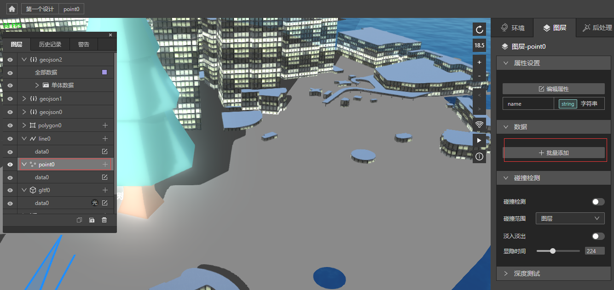
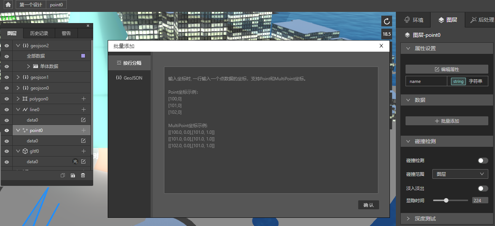
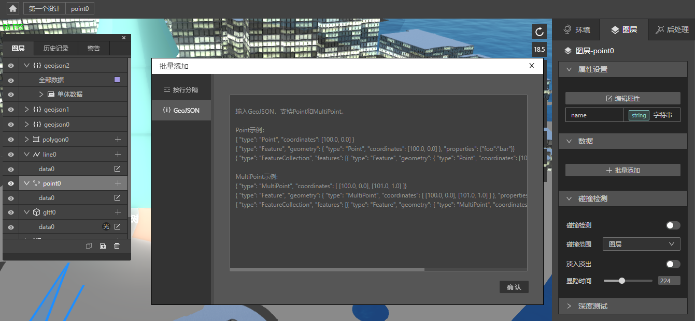
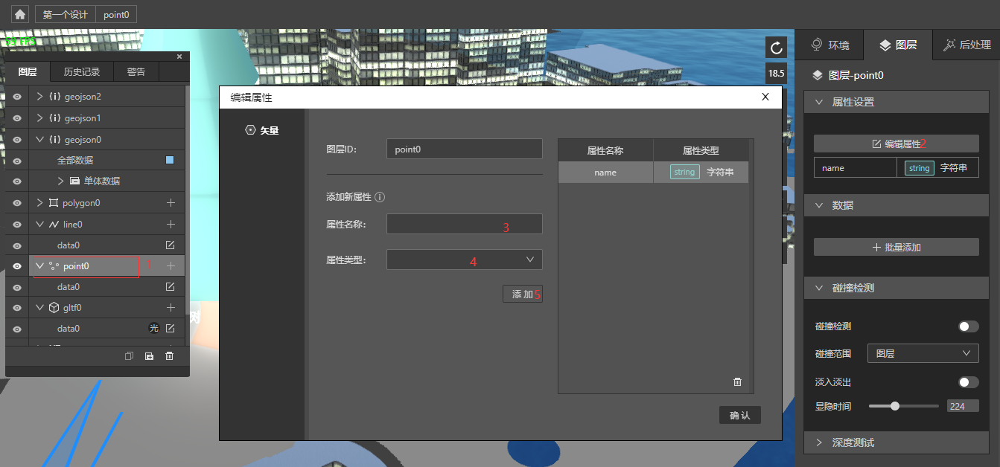
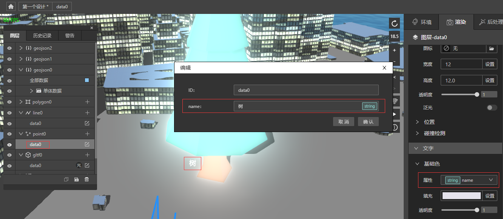
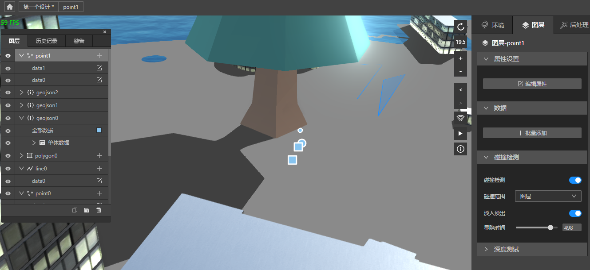
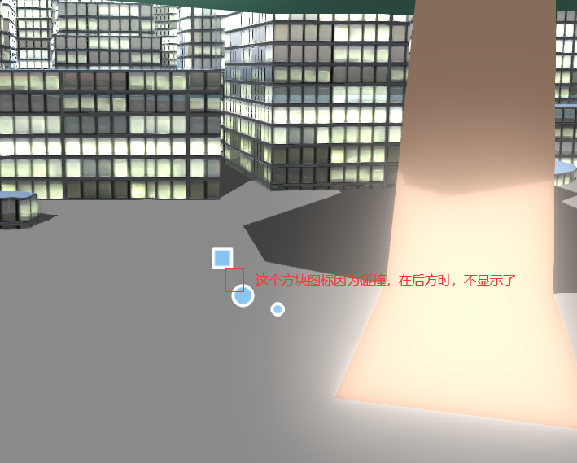
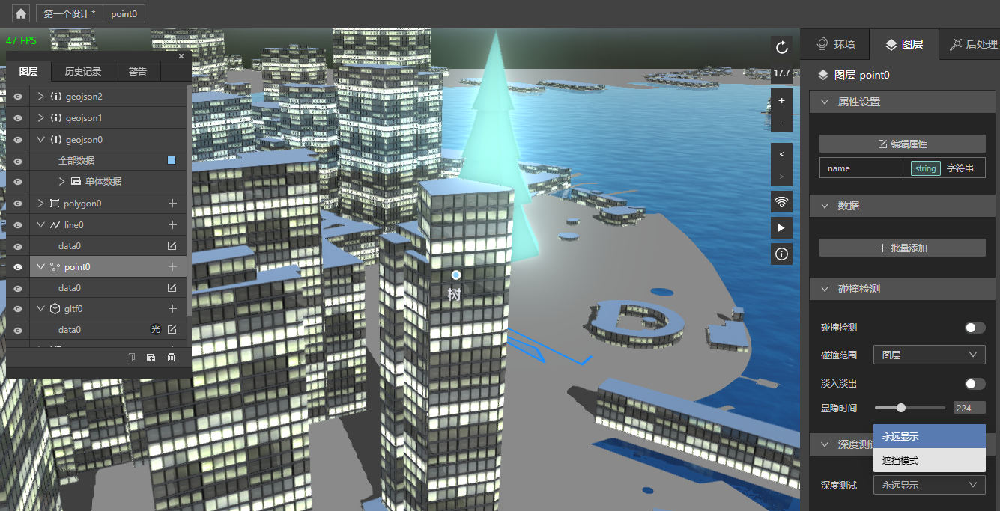
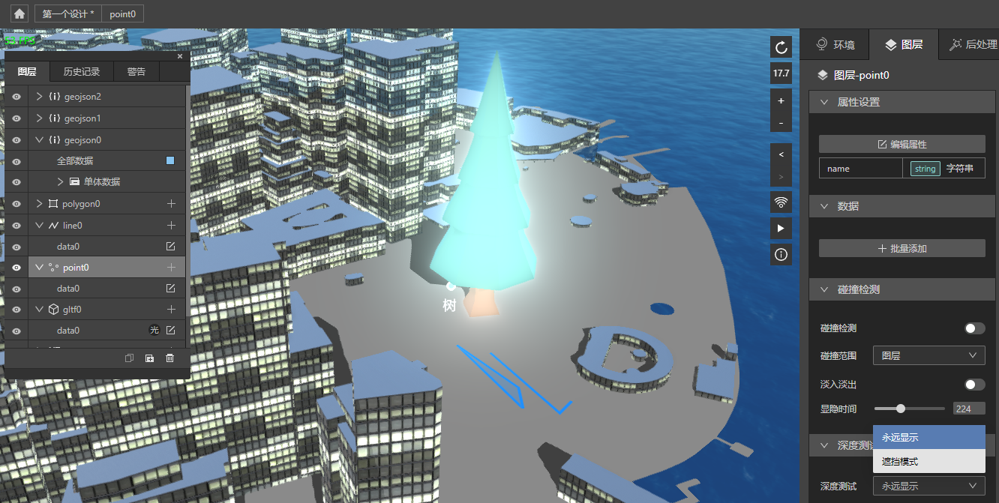
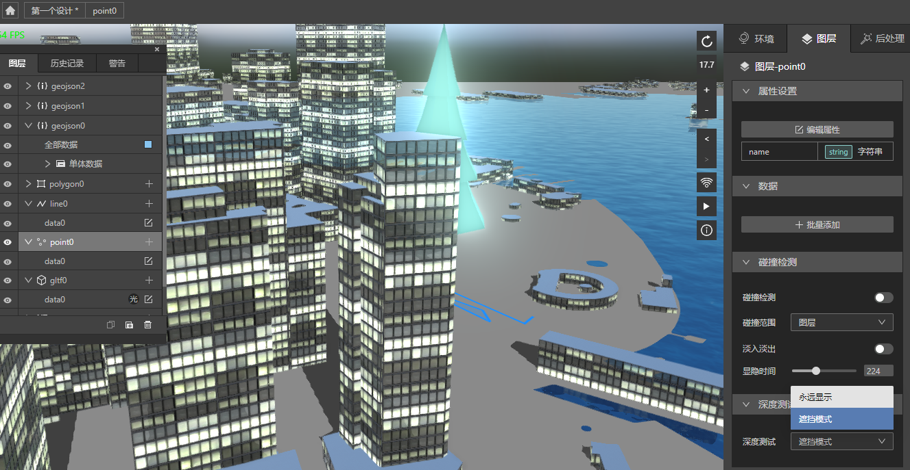

## 数据和属性设置

当您想批量添加点线面数据，可以在创建相应图层后，选中图层组，在图层面板，会出现批量添加按钮，点击它，就可以批量添加数据了。

我们支持了按行分隔的坐标输入方式，以及GeoJSON方式。通过GeoJSON方式创建点线面和创建GeoJSON图层有一定的区别，比如GeoJSON图层创建出来的是单体数据，后续您想继续添加数据，只能继续创建图层，而点线面图层，您可以在图层组内继续添加数据。包括渲染模式，点线面只内置了对应的二维渲染，而GeoJSON则根据点线面数据，可以选择不同的二维渲染，三维渲染，水体渲染，或者可视化渲染等。

点线面和gltf可以设置属性，并且在文字设置处可以使用它。

您可以看到该条数据的属性，并且通过选中文字的属性，它在地图上显示出效果。

另外，如果您的业务想对某些数据做过滤，通过属性做过滤再接其他功能，也是个很不错的选择。

## 点图层的碰撞检测和深度测试

关于点图层的碰撞检测，我们需要再创建一组点图层，然后添加两个数据，并改图标为方形图标。

开启方形图标所在图层组的碰撞检测，则它与其他组发生重叠时，它如果在其他组图标的前方，就会显示，如果在其他组图标的后方，就会隐藏。

深度测试有永远显示和遮挡模式，针对点图层的图标，选择永远显示，即便有3d的建筑，该图标仍然会显示出来，效果如下。

*注意看树字上面的图标*

选择遮挡模式，则如果有建筑需要挡住图标，它表现的就是真实的视觉。

*树字上面的图标看不到了*

