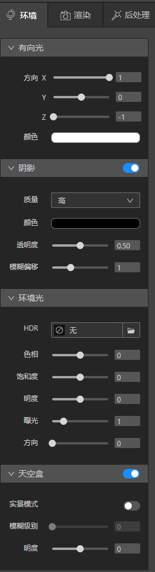
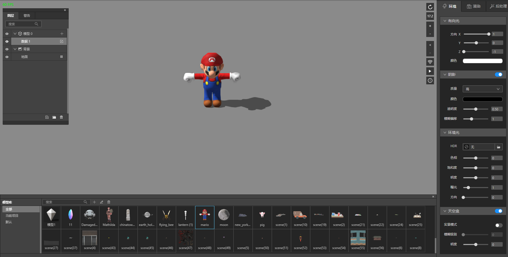
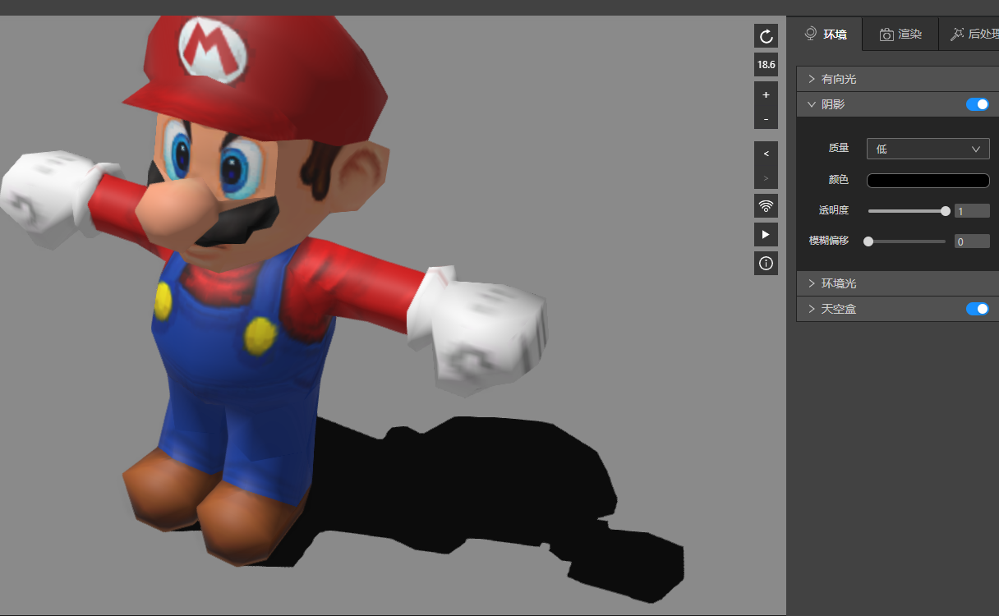
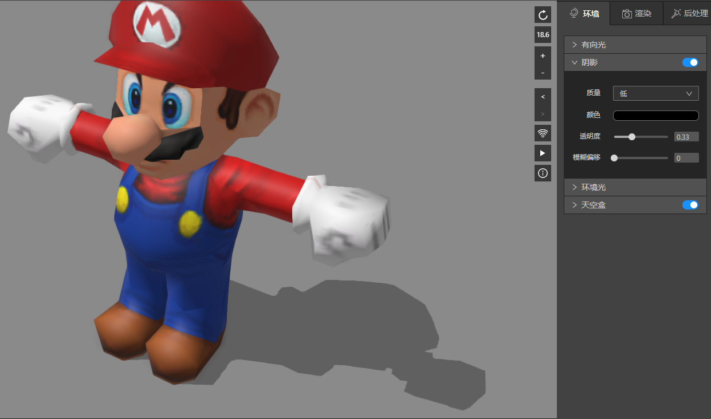
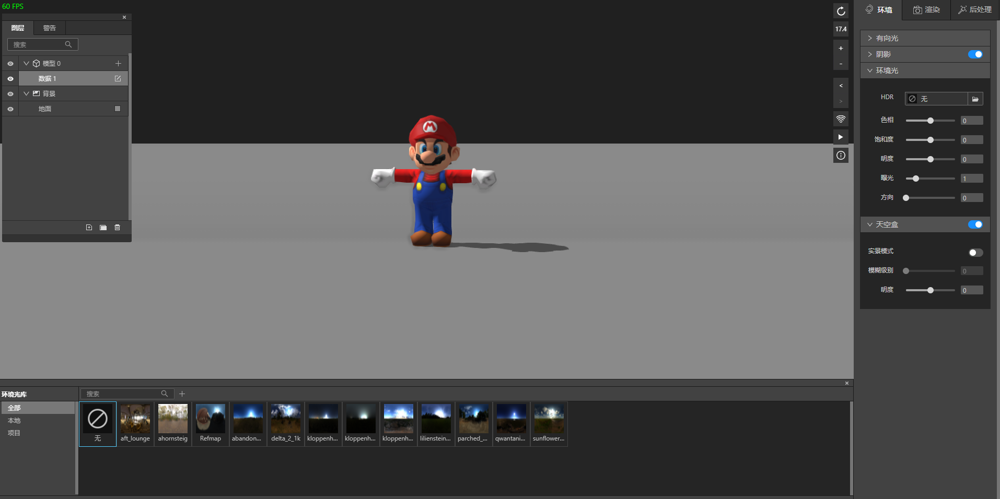
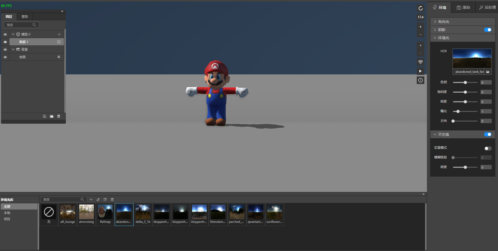
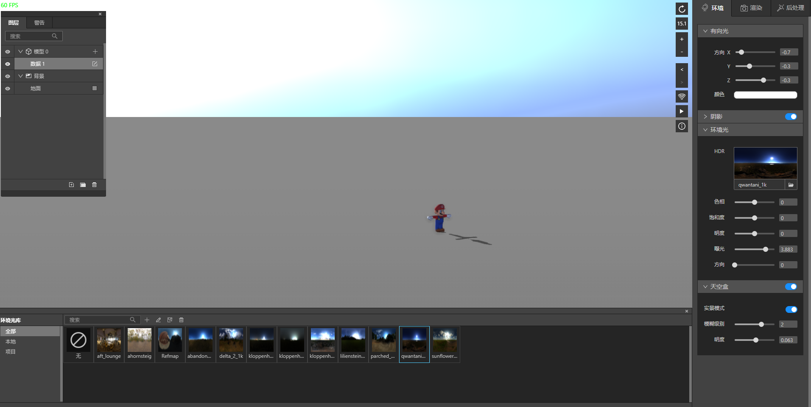

## 环境光

　　在IDE中，我们为您提供了如下的设置选项。

　　我们新建一个模型图层，导入一个小人模型，勾选背景地面图层，默认的环境光如下图效果。

### 1、有向光

　　有向光模拟的太阳的效果，类似于不同时间段，太阳照射的方向，您可以通过改变方向xyz轴，来模拟任意时刻任意角度的太阳。

　　通过颜色控件，您能改变小人身上的明暗变化，达到模拟太阳强弱的感觉。

### 2、阴影

　　您可以修改阴影颜色查看小人在地面的阴影颜色的变化。透明度可以看到阴影在地面的强弱。

### 3、环境光和天空盒

　　在环境光面板，默认没有选择HDR, 下方参数中仅曝光有效果，默认的天空中的效果，是取决于canvas画布最近有背景色的父节点的背景色的。比如在IDE中，它是"#202020"。在其它环境，他可能是白色。

　　当我们想要一个天空的效果时，我们在环境光库选择一个HDR。没有您没有合适的HDR，请自行制作和导入。

　　色相会影响颜色变化，饱和度影响颜色的饱和，明度改变明暗关系，曝光会影响小人身上的明暗。

　　方向会改变HDR的角度，如果您无法查看到明显的变化，可以打开天空盒的实景模式，可以看到背景的方向确实发生了改变，这能更好的模拟周围环境光的变化，方便您对阴影和光源的角度相对应。

　　选择合适的方向后，需要把有向光的方向和hdr上看上去的光源方向对上，这样效果上看上去才能光源阴影一致。

　　调整合适的模糊级别和明度，您就能得到一个天空盒效果。

