## 一个完整示例

　　在本教程中，我们会介绍如何使用我们的IDE，并将设计的结果应用到您的实际项目中。

## 在IDE中设计效果

　　在您登录后，在首页，选择新建，进入设计页面。

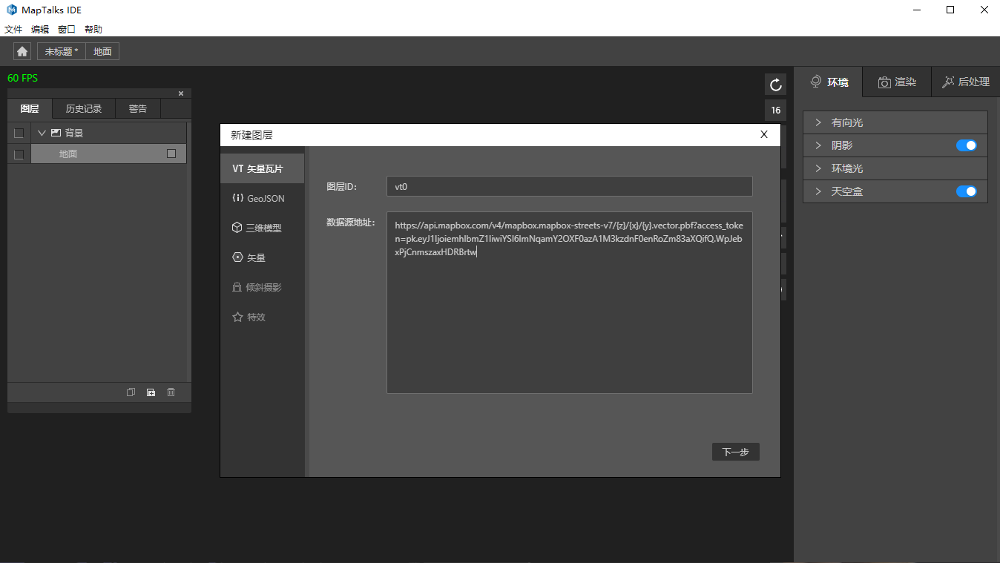

### 1、创建矢量瓦片图层

　　您根据设计需要选择图层，比如我们选择矢量瓦片图层，选择"建筑"，"水系"，"二级道路"等数据。

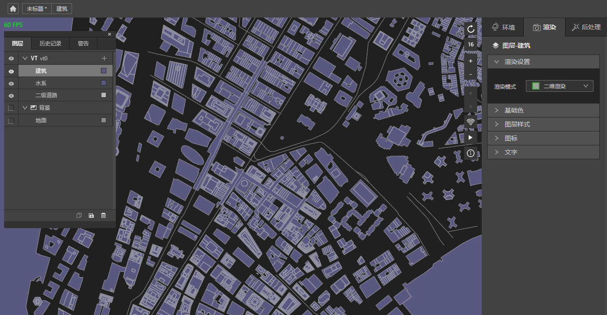

　　此时，你将得到一个最简单的矢量底图的示例。

### 2、设计背景颜色

　　我们勾选背景，为它选个符合设计要求的颜色。在图层面板，勾选背景，选中地面，在右侧渲染面板，基础色面板里找到填充选项，选择合适的颜色，比如"9EAED1"，确认后查看效果。

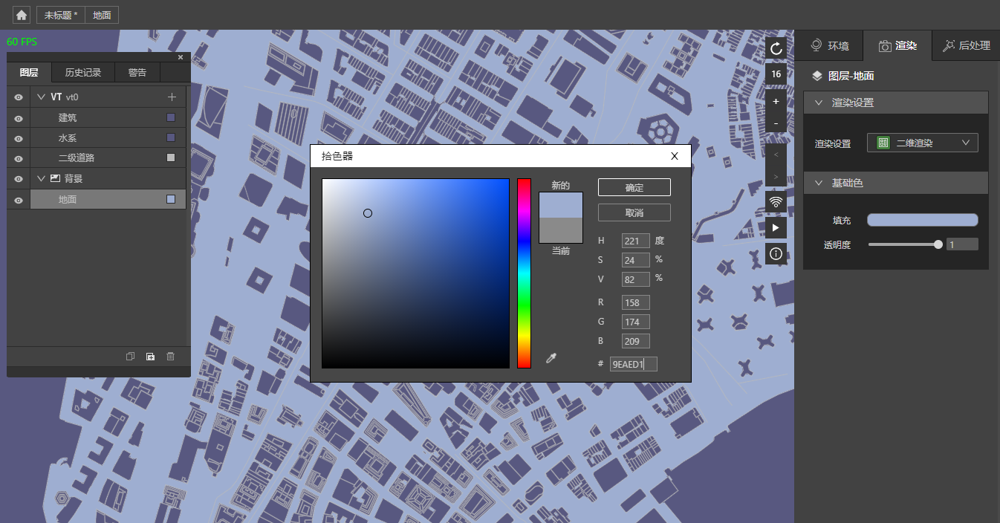

*注意：如果你没有勾选背景，导出后的背景，取决于您的最终页面中，canvas的最近父节点的颜色，比如可能默认的白色。如果出现对不上背景的情况，你可能需要查看此处。我们在IDE中，没有为您勾选默认的背景，上图中您看到的黑色是因为我们的canvas的父节点设置的"#202020"，可能与您实际期望值有差距，希望您主动设置背景地面的颜色来达到您要求的效果。*

### 3、设计矢量瓦片图层

　　在地图上右键一处有建筑图层的地方，选择建筑图层，将渲染模式设置为三维渲染，调整角度和级别.

　　在基础色面板的填充选项，调整建筑颜色为"A8BFDD"， 您将看到以下设计效果。

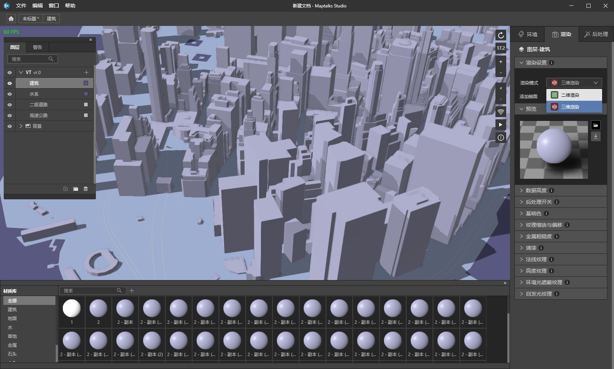

　　如果您需要设计材质球和纹理，请自行查看材质球和纹理章节。

　　如果您需要预览运动时候的效果，可以在左上角的窗口选项里，选择"旋转/停止选项"，预览旋转的效果，也可以使用快捷键F1，或者地图右侧的辅助功能"播放/暂停"图标，点击它也可以。

　　将效果调整到您需要的程度后，我们再选择其他图层，来完成我们需要的其他效果。

### 4、设计gltf模型图层

　　创建gltf模型图层。点击"创建新图层"按钮, 选择三维模型，我们可以使用我们上传的模型，来设计需要的效果。如果您对模型有疑问，请查看模型章节的内容。

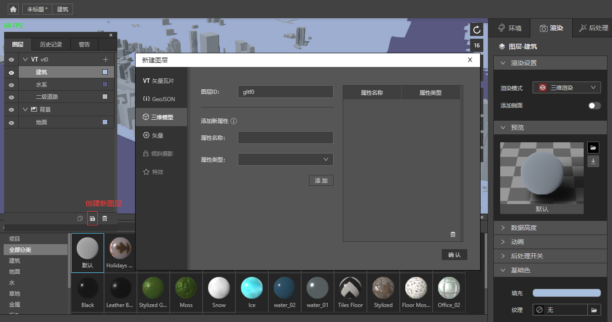

　　在模型图层右侧"添加数据"图标上点一下，然后在地图上您需要放置模型的地方点击一下，我们会默认为您设置一个模型。您可以在右侧渲染面板的尺寸面板下调整位置，大小等。

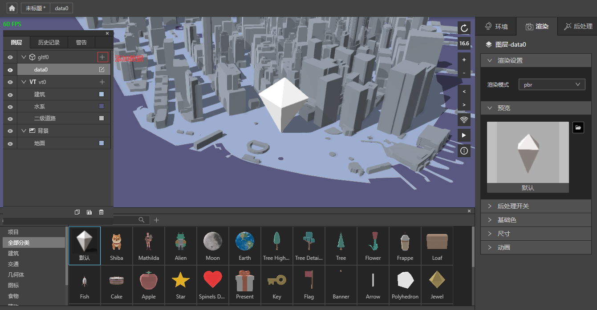

　　在模型库面板，将它切换成您需要的模型。我们选择一个树模型后，效果如下

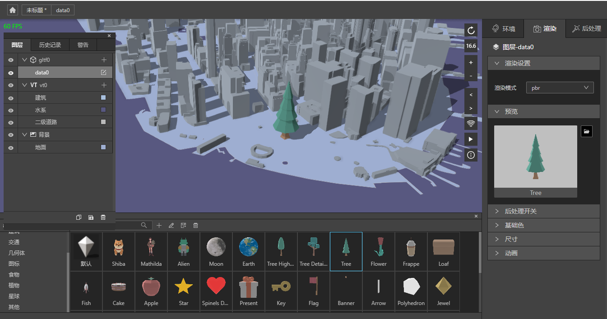

　　如果您觉得此时效果风格不搭配，可以重新设计您觉得不合适的部分，比如我们重新选择建筑图层，在拾色器面板上，看到有一个吸管工具，我们可以使用它，吸取一个合适的颜色，把它赋值给建筑。

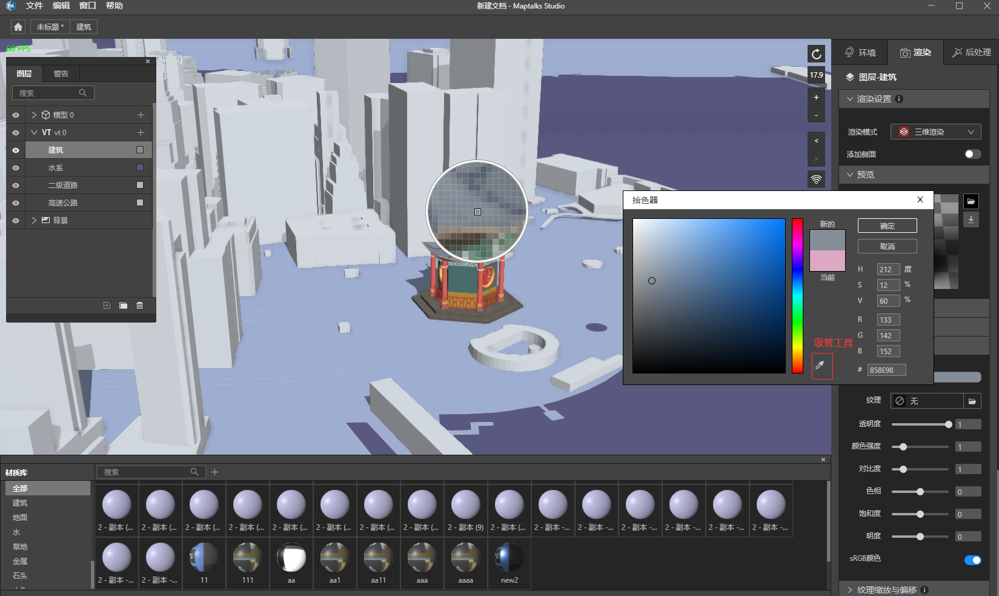

　　设计好后，你可以继续旋转合适的角度，让其旋转运动查看各方位的效果，以期满足您的要求。

### 5、设计环境光

选择一个合适的HDR, 调整有向光的方向和环境光的方向，确保光的方向和阴影的方向对得上，将天空盒的实景模式勾选上，模糊级别设置为2。以上参数仅供参考，具体效果根据您实际需要来调整。

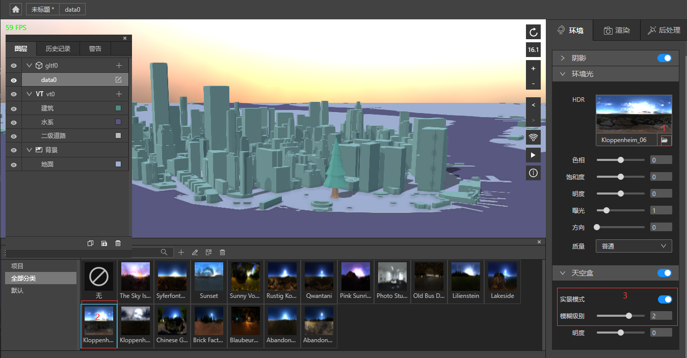

### 6、设计水系

　　选择水系，采用水体渲染模式，调整以下几个参数，可以看到如下效果。

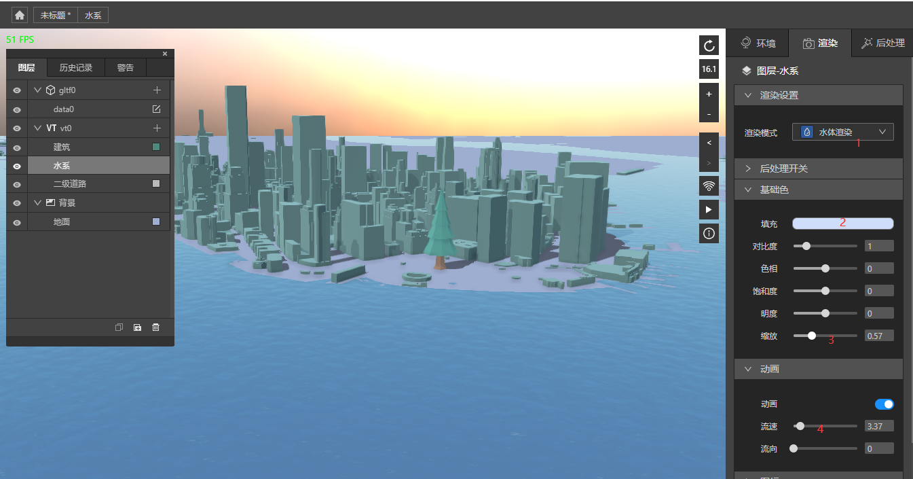

### 6、设计geo图层或者点线面图层

　　关于geo图层和矢量的点线面图层，你可以参照以上方法，根据您实际需要，决定选择用什么，来设计您最终的效果。如果您需要更好的设计效果，请参考其他章节。

　　比如我们加入一个点图层，给树设计文字。新建矢量点图层，添加新属性，输入属性名称"name"，选择字符串类型，点击"添加"，然后确定。

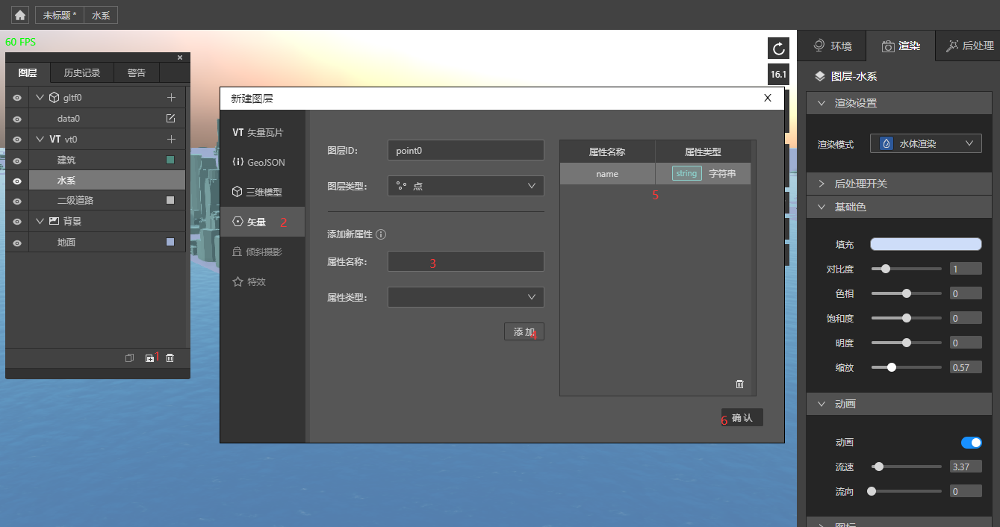

　　点击"point0"右侧添加数据按钮，输入name的属性值"树", 在设置面板取消掉图标，调整文字参数配置。最终得到如下效果。

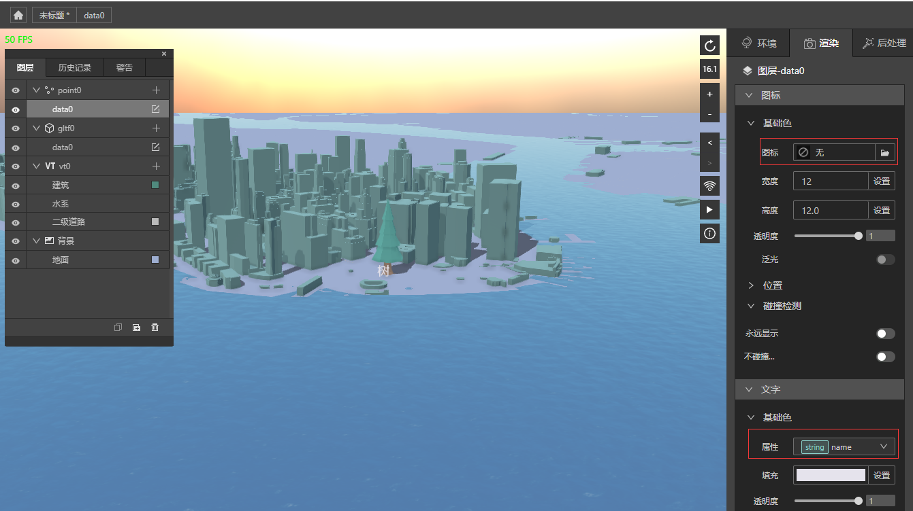

### 7、保存

　　您在设计的途中，如果觉得此阶段满意了，我们建议您保存或另存为。在左上角菜单选择文件，保存或者另存为，取个合适的名字，比如"第一个设计"。此时，您的整个设计工作就完成了。我们在您整个设计过程中，会定时备份，防止崩溃后文件丢失，如果您在设计的过程中，出现了崩溃，可以打开此文件所在目录的同名的.bak.msd文件，它保存了最近一次的备份。

　　当然，我们更建议您阶段性自己保存或另存为，这样更可靠。备份仅能恢复至最近的一次，仍然存在近期操作丢失的可能。

## 导出以及使用方式

　　您此时设计的东西保存为了msd格式（但是此文件目前暂不支持由web端引入使用，我们未来会提供msd loader来使用它）的文件，您可以在另一台电脑上继续设计。

　　您可以在文件菜单, 点击"导出"按钮。您将得到以下内容。

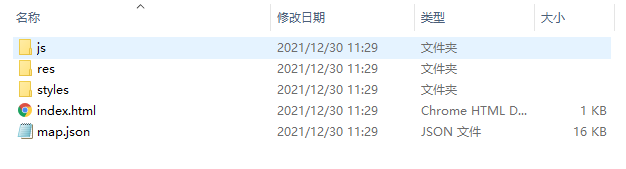

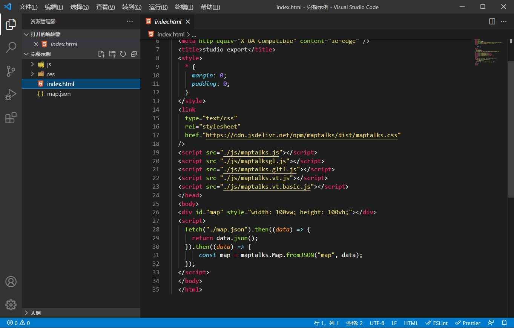

　　您可以将它在本地起一个静态服务器，然后通过浏览器访问它。具体起静态服务器的知识，鉴于静态服务器的多样化，我们不在此介绍。比如您可以通过把文件放置tomcat的静态资源目录下，或者node的命令行工具http-server，或者express， 或者通过nginx等等。

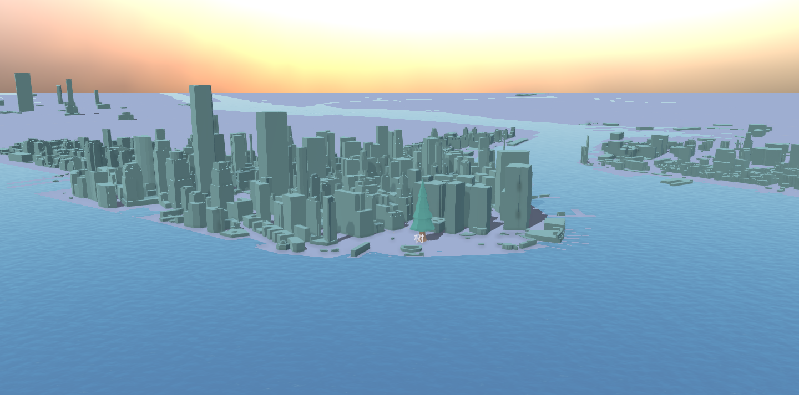

　　您可以根据您项目的实际情况，合理使用导出的代码和数据，您的前端工程师应该对此会比较熟悉。

　　如果您在接您的数据和业务的过程中，产生了一些问题，请查看FAQ章节或者与我们联系，我们会对通用问题提供帮助。
