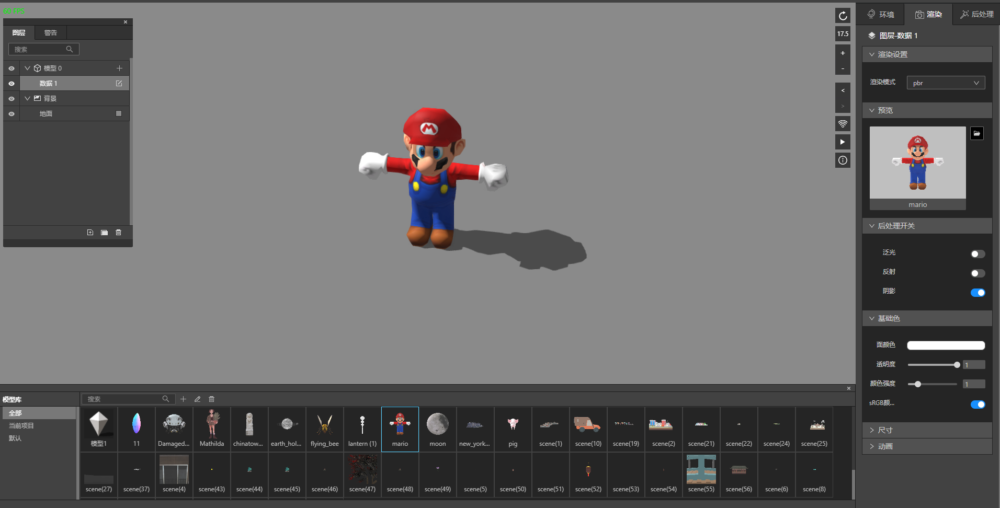
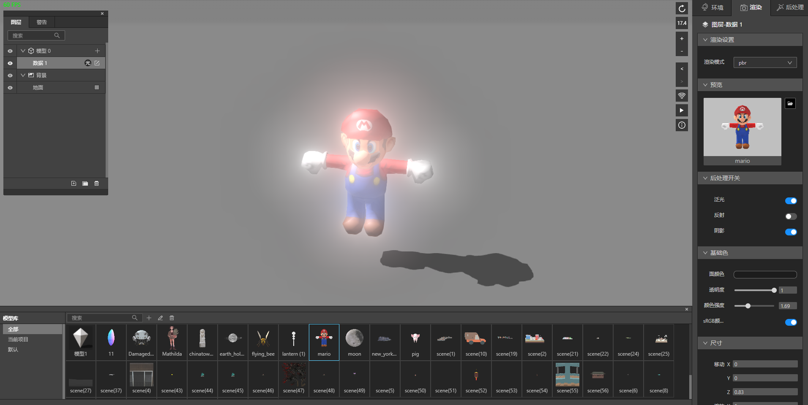
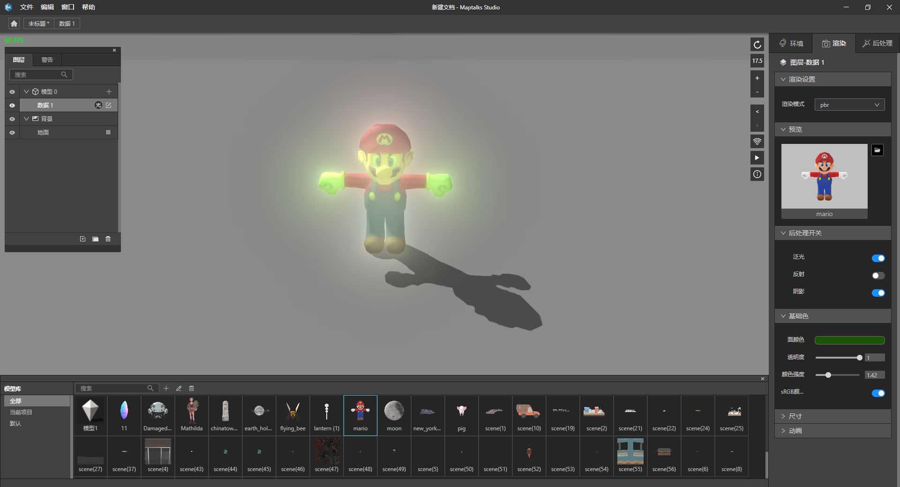

## gltf模型

　　GLTF代表Graphics Language Transmission Format（图形语言传输格式）。这种跨平台格式已成为Web上的3D对象标准。它由OpenGL和Vulkan背后的3D图形标准组织Khronos所定义，这使得GLTF基本上成为3D模型的JPG格式：Web导出的通用标准。

　　目前大多数工具采用了gltf2.0版本，它添加了基于物理的渲染（PBR），取代了glTF 1.0中使用的WebGL 着色器。其他升级包括稀疏访问器和面向对象的变形目标，例如面部动画，模式调整以及针对极端情况或性能的重大更改，例如将顶级glTF对象属性替换为数组以加快基于索引的访问。

　　GLB文件格式是GLTF的二进制形式，其中包括纹理，而不是将它们引用为外部图像。引入了GLB作为GLTF 1.0的扩展，并直接合并到glTF 2.0中。

　　在IDE中，您可以导入gltf或者glb格式的模型。我们也支持obj格式的支持，在您导入的过程中，我们会帮您转换成gltf格式。如果您的模型是其他格式的，可以采用其他三维软件转换成gltf格式。您也可以给我们提出意见反馈，在我们衡量后，可能会加入对其他格式的转换。

## 在IDE中使用gltf

### 1、导入模型

　　新建图层，选择三维模型，如果您有其他业务过滤要求，可以根据模型数据添加新属性帮您做业务模型数据过滤。在您确认后，可以看到页面上出现了模型图层，以及模型库面板。

　　在模型库面板，你可以选择导入模型，编辑模型，删除模型，以及选中他们，把他们添加到地图上。

　　我们根据您的gltf数据做了抽稀算法去重，如果重复了无法导入，超过2m会有提示，但并没有做任何限制。

### 2、关于模型大小和尺寸

　　由于模型的大小和纹理尺寸会影响您的用户访问速度，所以您在导入模型前，认真检查模型尺寸大小。如果您导入的模型大小整体超过几百兆，可能在web端跑起来的效果会受限于网络和电脑性能，这种情况您需要优化您的模型。具体的尺寸问题，请参考尺寸章节。

### 3、关于渲染设置

　　我们提供了pbr渲染模式，和wireframe渲染模式，相信您可以很快熟悉他们。

　　比如我们，导入一个小人到地图上，勾选后处理开关的泛光，调整面颜色，以及颜色强度，即可得到下面的会发光的小人效果，是不是很简单又很有趣呢？

*<small>原图</small>*  

*<small>泛光效果的小人1</small>*  

*<small>泛光效果的小人2</small>*  

　　如果您觉得泛光过量，可以调整面颜色，或者环境面板的有向光的颜色。关于光的知识，参见光的章节。
