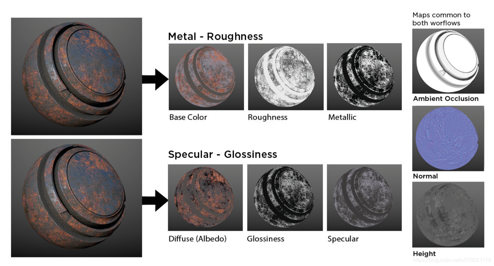
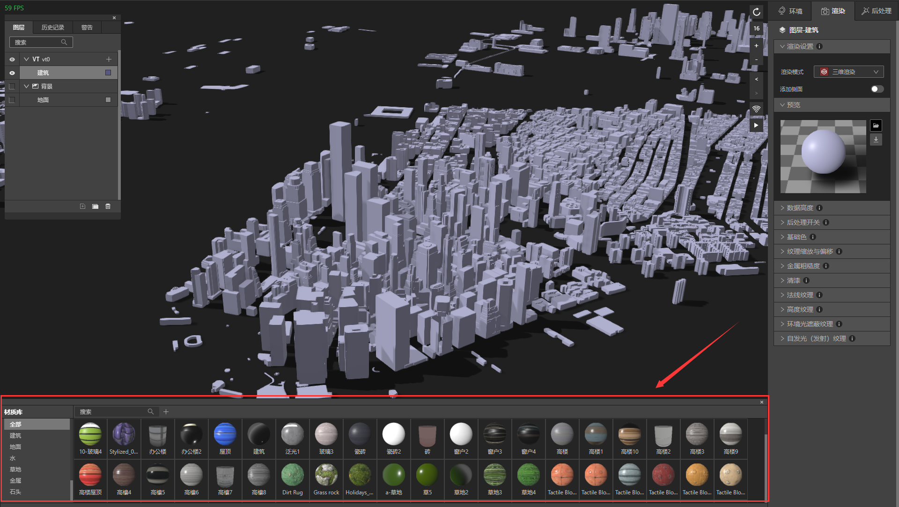
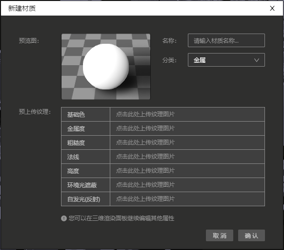
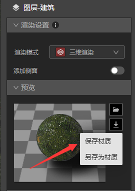

## 导入新的材质球

　　本教程中，我们将演示如何导入新的材质球。

　　现在主流有2种PBR材质工作流：金属/粗糙度工作流（Metal/Roughness）和镜面反射/光泽度工作流（Specular/Glossiness）。

　　IDE支持第一种工作流，即金属/粗糙度工作流（Metal/Roughness）。所以我们可以导入Base Color-基础色纹理、Roughness-粗糙度纹理、Metallic-金属度纹理、Normal-法线纹理、Height-高度纹理、Ambient Occiusion-环境光遮蔽纹理、Emission-自发光纹理，一共7种纹理图片，但是粗糙度和金属度实际会最终合并为一个金属粗糙度纹理。

* 基础色: 用于定义所有类型反射的颜色。

* 粗糙度: 用于定义曲面是平滑（低值）还是粗糙（高值）。

* 金属度: 使用白色高光反射层或金属（没有漫反射，反射采用基础颜色）定义反射是否为漫反射。

* 法线: 在平面上实现凹凸效果，用于保留和丰富细节。法线百度解释是法线是始终垂直于某平面的虚线，通俗来说就是通过反射造成视觉误差，从而达到假凹凸的效果。

* 高度: 高度图可用于在材料上创建细节阴影和高光，或实际替换对象的几何形状。

* 环境光遮蔽(缩写AO): 指人为控制环境光源对物体的照射强度及其分布。在直观上给用户的感受主要体现在画面的明暗度上，未开启AO特效的画面光照稍亮一些；而开启AO特效之后，局部的细节画面尤其是暗部阴影会更加明显一些。AO贴图的制作原理是将物体本身光影关系制作成贴图，作用就是完善阴影面的细节，从而保证物体光影信息，让模型更加立体和逼真。

* 自发光: 物体本身发光强弱。自发光会使物体材质不受光照影响，同时结合特效面板中的晕光，可以起到发光的效果。自发光（Emissive）贴图则是影响发光物体的发光区域和颜色，结合晕光的计算规则，材质明度越高越先亮的原则，可以很好的实现优质的发光效果。

这是一个需要使用贴图才能出效果的属性，使用的贴图为环境（AmbientOcclusion）贴图，如下图：

### 1、 准备导入材质球

* 启动IDE，，新建一个文件，新建VT图层，VT图层里添加建筑数据。

* 地图上即出现建筑数据，接下来在渲染面板将”渲染模式”下的“二维渲染”切换成“三维渲染”

* 此时地图上建筑图层变成三维模式，同时在最下方会自动弹出材质库。

* 单击材质库工具栏的“新建”按钮+，弹出新建材质面板

* 点击对应的上传框，即可以上传纹理图片。PS：并不是所有的纹理图片都需要上传，根据实际情况调整。

* 上传完毕后，点击确认，新的材质球就可以保存在材质库里了。

### 2、 编辑材质球

* 创建新的材质球后，我们可以在地图上应用，看看是不是想要的效果，如果有不理想的地方，我们可以继续在渲染面板编辑材质球。 

* 调整完毕后，我们可以单击渲染面板的“预览”最右边的保存按钮  ，选择直接保存或者是另存为。

