## 后处理

　　后处理是在场景渲染结束后对结果进行处理，我们有抗锯齿，反射，泛光，环境光遮蔽阴影，以及锐化等选项，默认情况下，开启后处理，关闭锐化。下面将一一解释每个选项的意义。

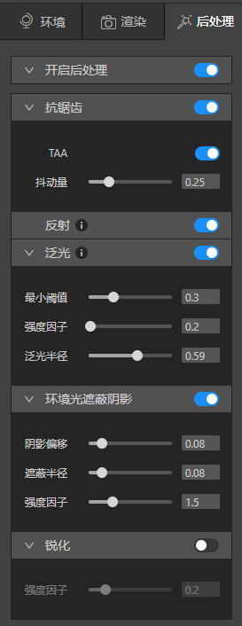

## 抗锯齿

　　由于在3D图像中，受分辨的制约，物体边缘总会或多或少的呈现三角形的锯齿，而抗锯齿就是指对图像边缘进行柔化处理，使图像边缘看起来更平滑，更接近实物的物体。它是提高画质以使之柔和的一种方法。

　　抗锯齿的技术有很多种，多重采样抗锯齿（MSAA）, 快速近似抗锯齿（FXAA）,子像素增强抗锯齿（SMAA）， 覆盖采样抗锯齿（CSAA），时间性抗锯齿（TXAA，TAA），可编程过滤抗锯齿（CFAA），多帧采样抗锯齿（MFAA）。

　　TAA不吃配置，抗锯齿效果好，不掉帧，没有锯齿感，缺点是画面会变模糊。而TXAA是TAA和MSAA的结合，掉帧严重，很吃配置。

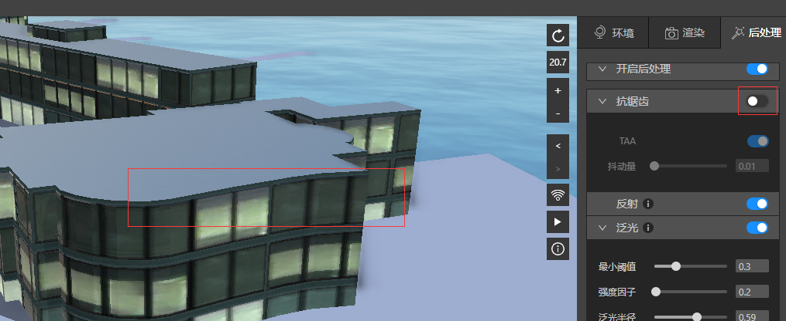

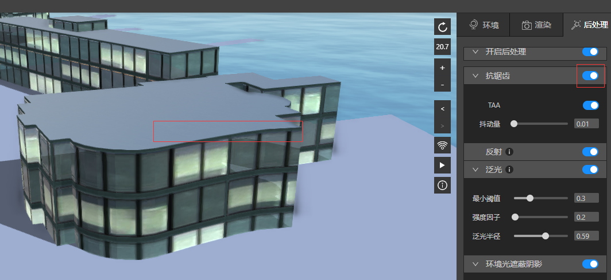

　　这两张图，可以清楚看到抗锯齿带来的效果。

　　参数TAA的效果
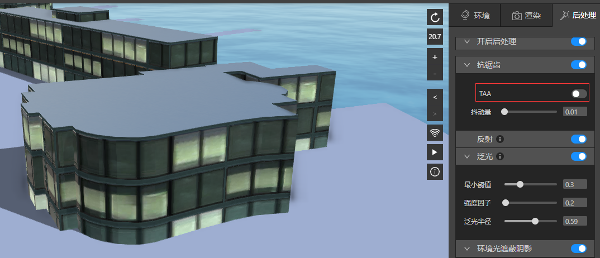

## 反射

　　反射在物理学的解释是：波在抵达媒质界面时发生折回传播的现象。

　　我们直接看效果，打开全局后处理的反射，在水系图层进行水体渲染后，在渲染面板的后处理开关面板打开反射按钮，就可以看到水中运动的建筑倒影。

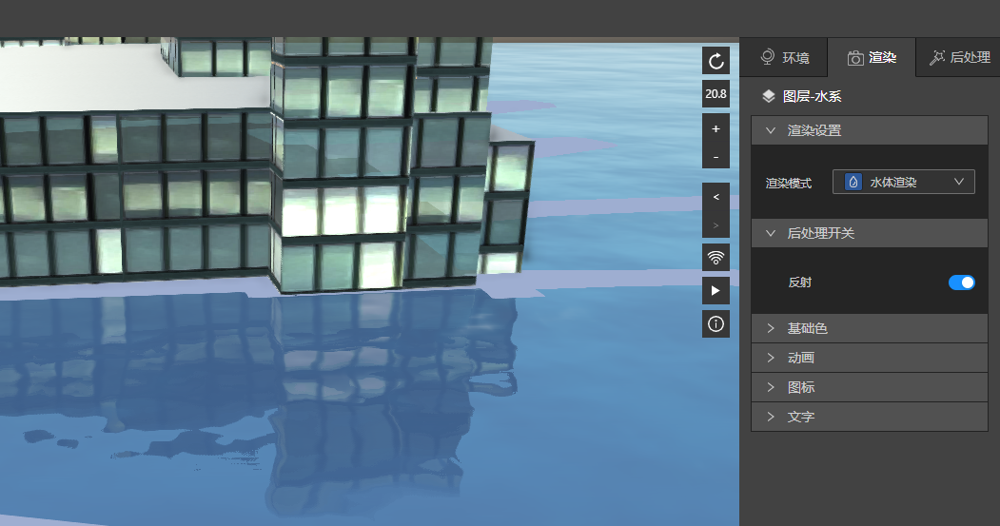

　　关掉反射，就不会有水中倒影了。

## 泛光

　　我们对参数不做过多的解释，您直接操作得来的感官感受更重要。

　　如下，针对一个树模型，在gltf模型的渲染设置面板中打开后处理开关中的泛光按钮，然后调节后处理面板中的泛光参数。

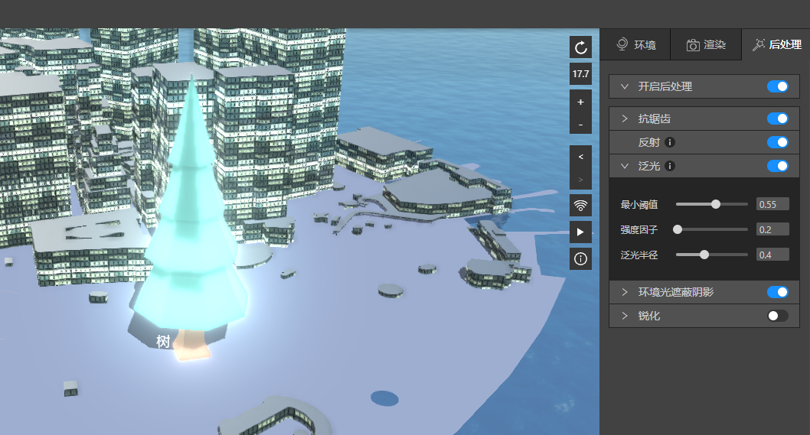
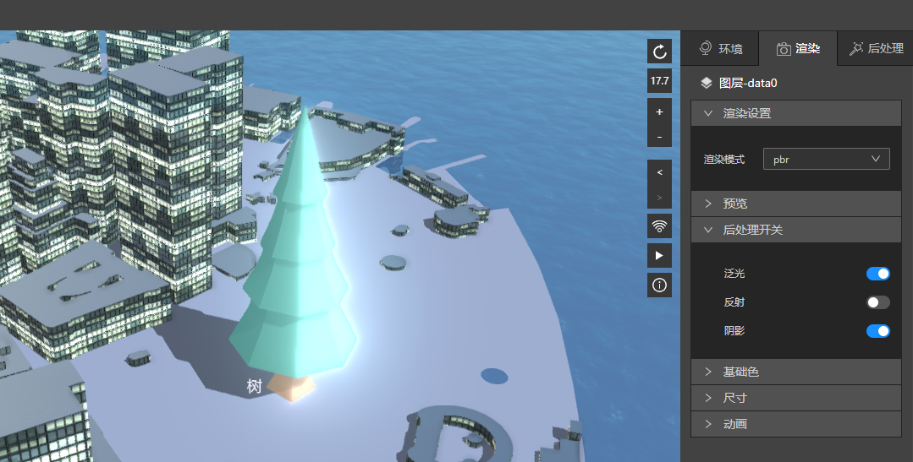

*需要注意的是：由于泛光很耗性能，所以，我们只在后处理中提供了一个全局的泛光处理方式，而针对每个图层，只能应用它，如果您想对不同图层做不同泛光参数的调节，目前是做不到的。*

## 环境光遮蔽阴影（AO）

　　AO是来描绘物体和物体相交或靠近的时候遮挡周围漫反射光线的效果，可以解决或改善漏光、飘和阴影不实等问题，解决或改善场景中缝隙、褶皱与墙角、角线以及细小物体等的表现不清晰问题，综合改善细节尤其是暗部阴影，增强空间的层次感、真实感，同时加强和改善画面明暗对比，增强画面的艺术性。可以说：AO特效在直观上给我们玩家的感受主要体现在画面的明暗度上，未开启AO特效的画面光照稍亮一些；而开启AO特效之后，局部的细节画面尤其是暗部阴影会更加明显一些。

　　以上解释比较绕口，我们直接看效果。

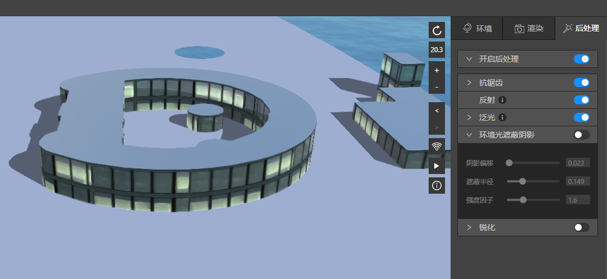
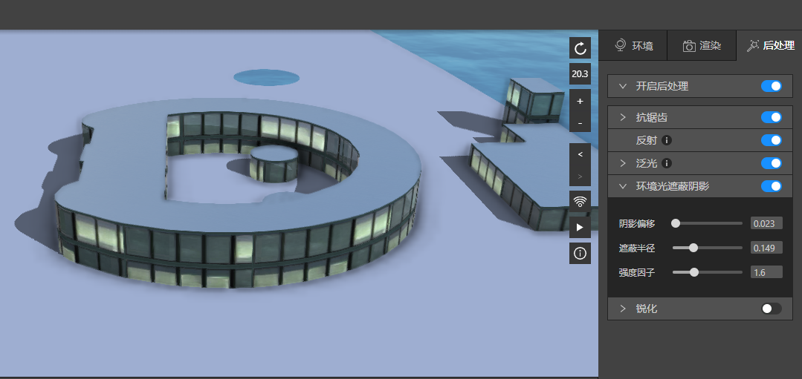

　　可以看到，它使得阴影没有那么生硬，变得更真实了。

　　里面的三个参数，您可以自行调节来感受。

　　需要注意的是，如果您选择的遮蔽半径过小，可能产生一种灰蒙蒙的感觉，如果您想模拟这种场景，配合上合适的HDR，它是个不错的选择。
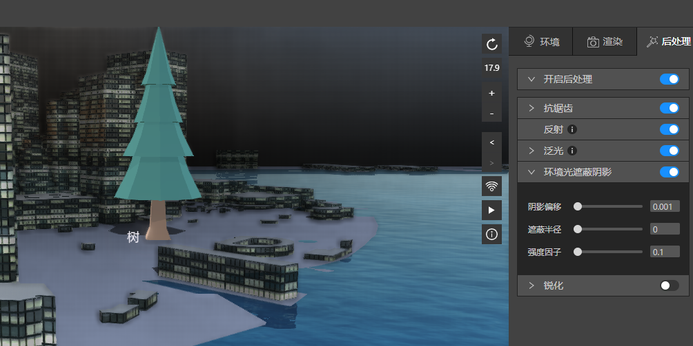

## 锐化

　　锐化会对地图上所有东西产生影响，您需要评估对您的场景的影响，再来决定是否开启它，大多数情况，并不需要。

　　以下三张图，可以非常明显的看到开启后，强度因子引发的变化。

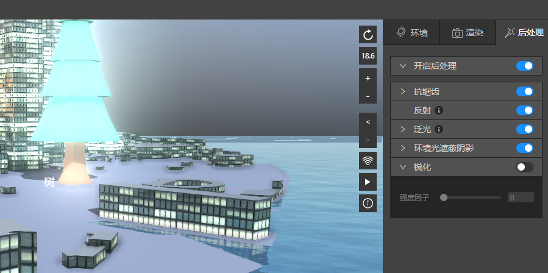
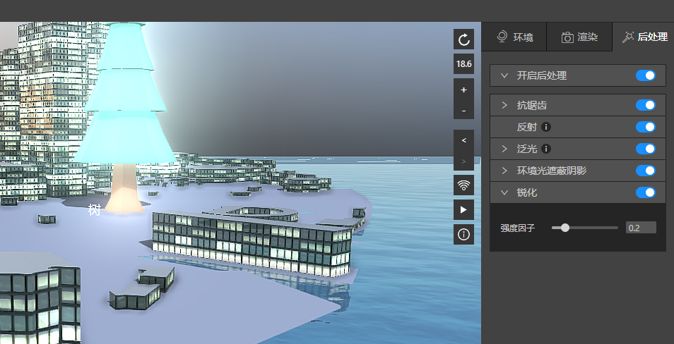
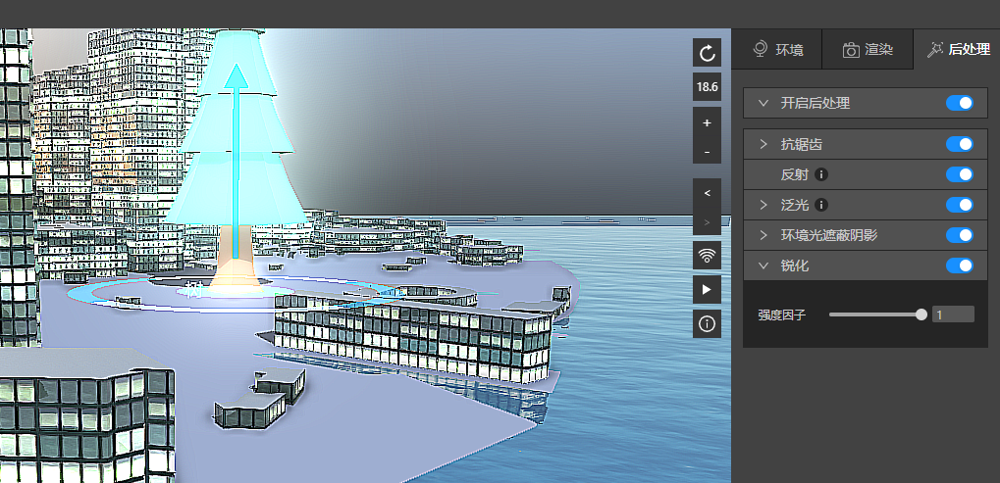

## 总结
　　后处理在表现渲染细节上，有很大的作用，我们默认为您开启后处理，关闭锐化，且精心准备了默认参数。当这些效果不满足您的场景要求时，调整它，来满足您的场景。
