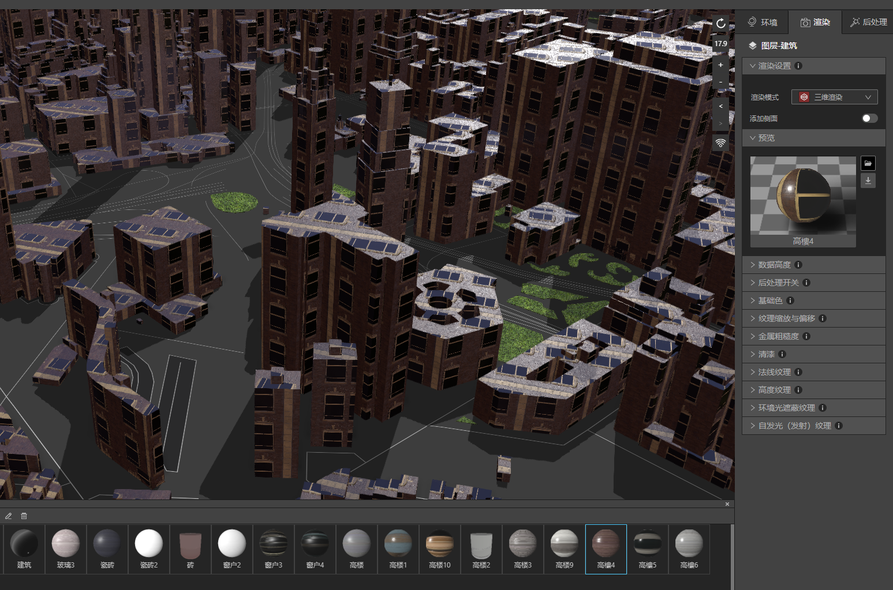
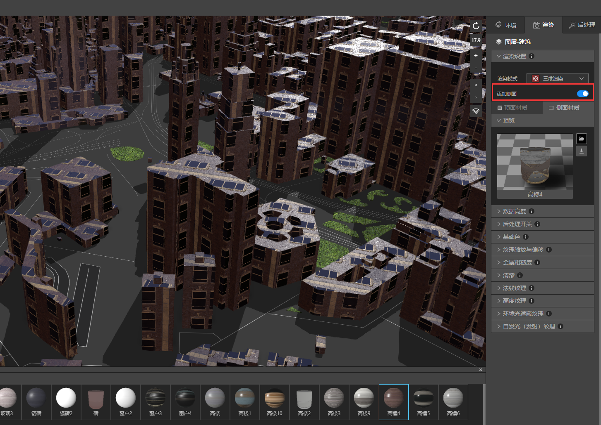

## 给建筑物添加屋顶

本教程中，我们将演示如何简单方便的给建筑物增加屋顶

### 1、准备好建筑物

* 启动IDE，新建一个文件，新建一个VT图层，添加建筑数据。

* 在渲染设置中将建筑从二维渲染切换到三维渲染。

* 赋予建筑图层一个材质球。

* 文件准备就绪，让我们进入下一步。

### 2、增加侧面

* 在渲染-》渲染设置下打开“添加侧面”按钮。你会发现下方多出“顶面材质”和“侧面材质”2个选项卡。

* 选择“顶面材质” ，然后在材质库里选择一个新的材质球，就可以让建筑物顶部增加一个不同的材质。

### 3、增加顶部厚度

*  在“数据高度”下，将顶面厚度数值从“0”改到“6”，或者任意觉得合适的数值，顶部就会实时增加厚度了。

