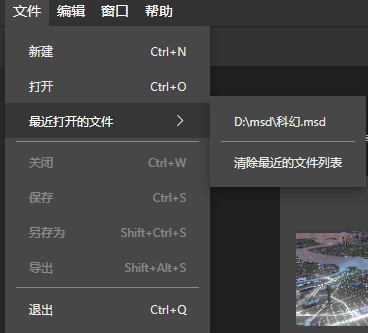
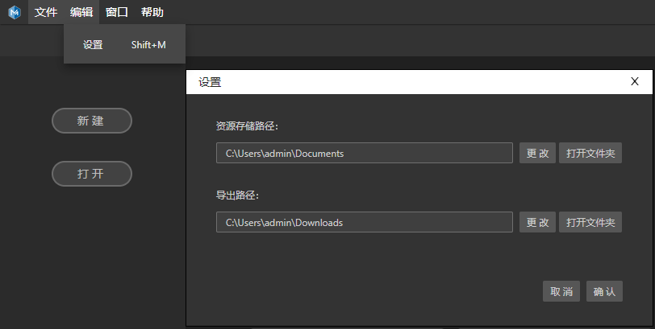
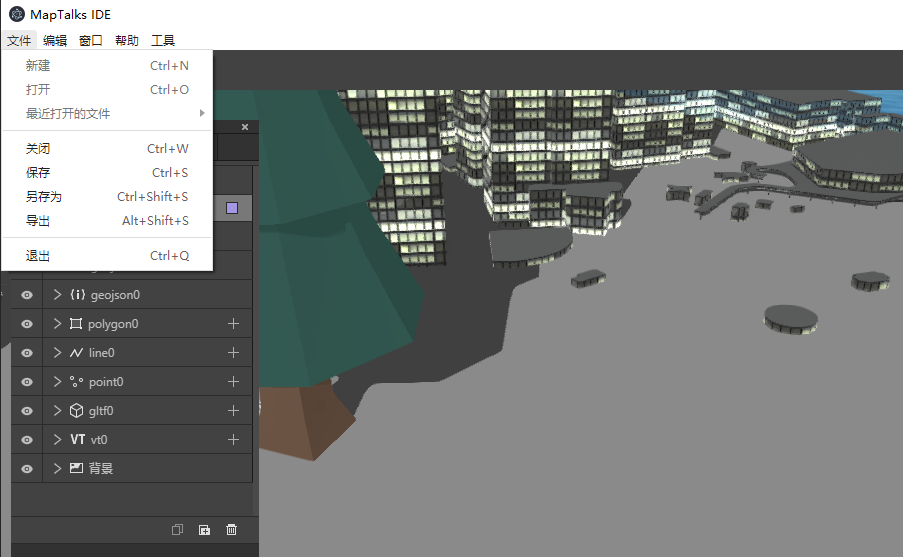
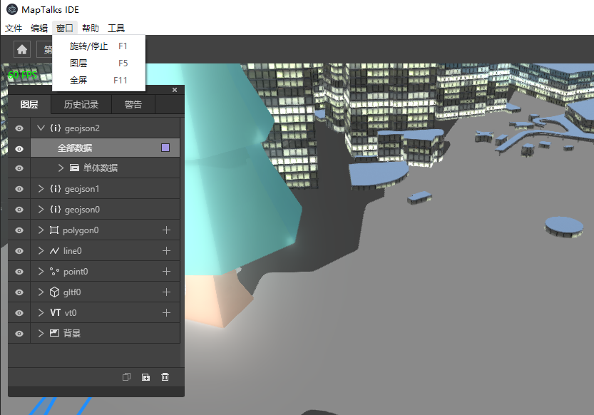
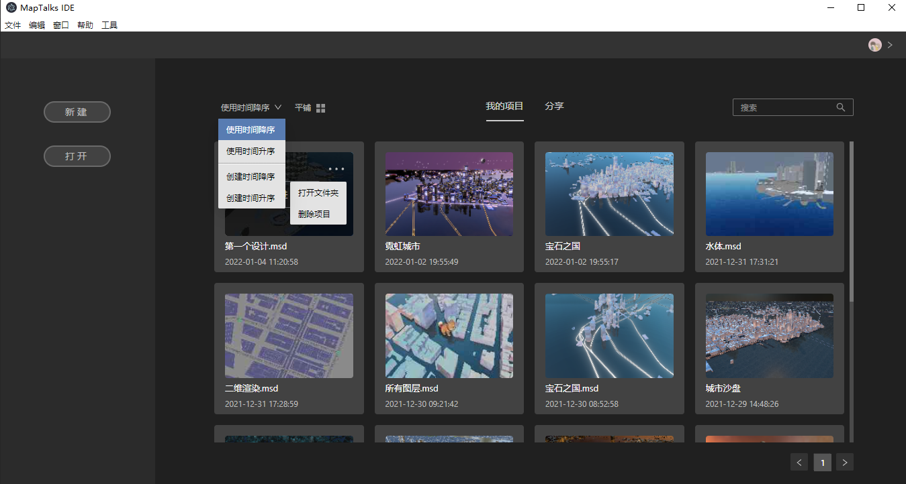
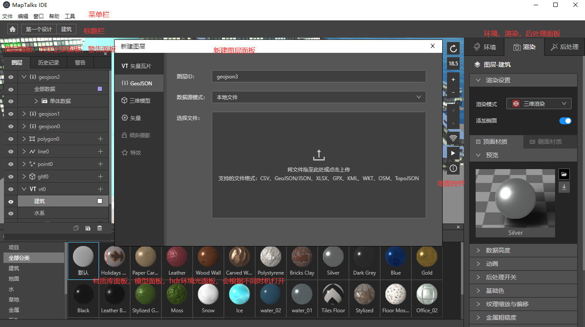
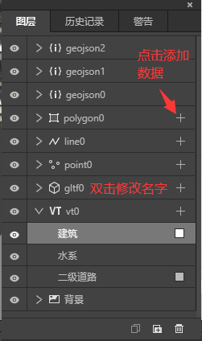
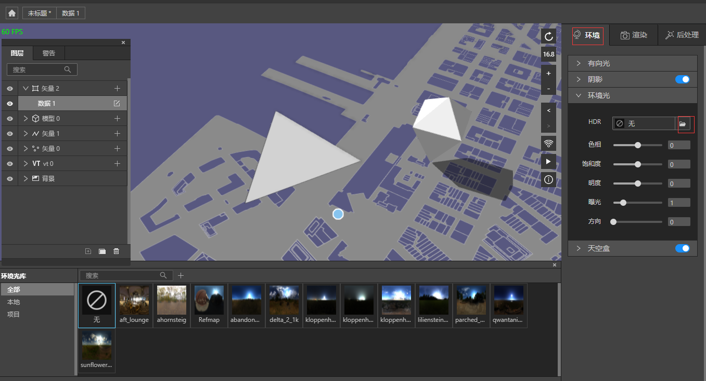
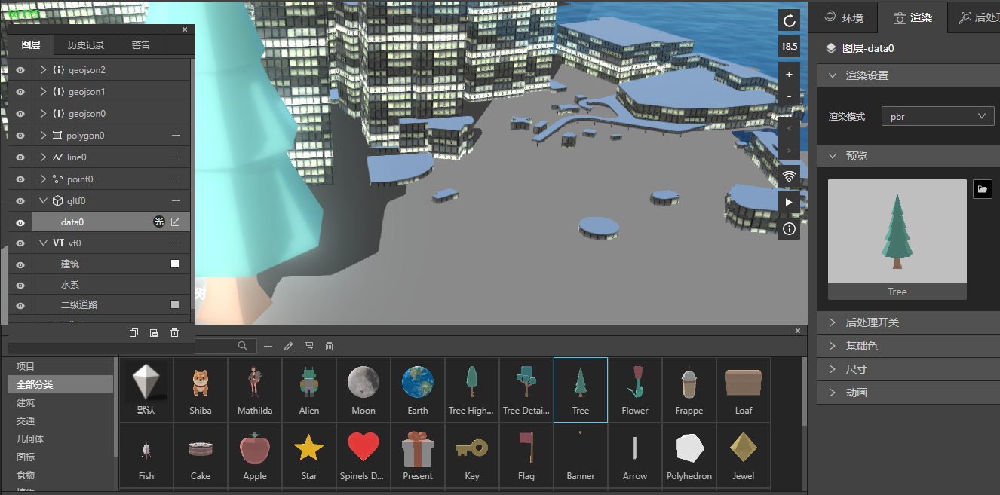
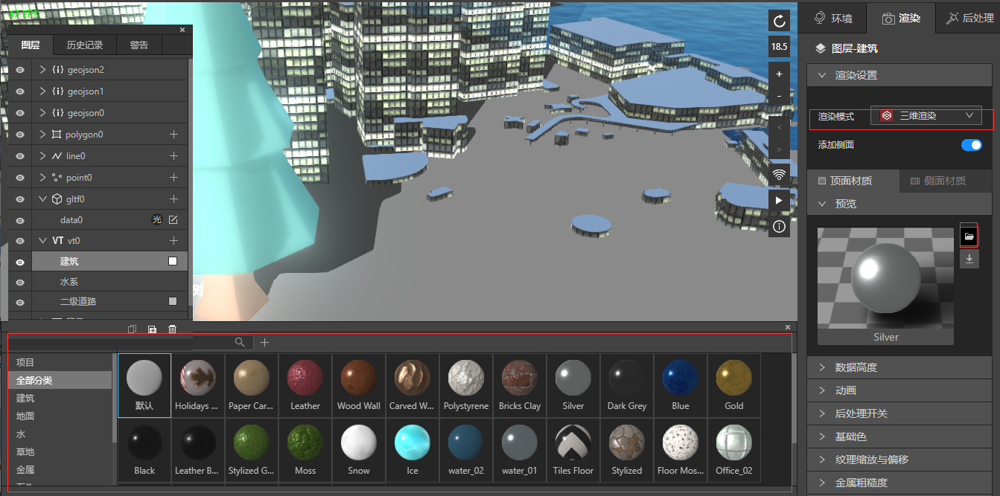

## IDE软件介绍

　　本教程中，我们为您介绍IDE软件。

### 菜单栏

　　在左上角，我们提供了菜单选项，分为"文件"，"编辑"，"窗口"，"帮助"四个选项，每个选项在不同页面，有些会被禁用，某些功能在特定页面才能显示。比如帮助可以全页面使用，窗口里面的功能只能在设计页使用，编辑的设置功能只能在首页使用。具体如下。

　　首页中可用的功能：

*<small>仅在首页可用，设计页不能使用</small>*  

　　在设计页面可用的功能：

 

### 首页

　　首页的功能并不多，我们提供了退出登录，新建，打开，搜索，列表排序，切换布局为平铺和列表，打开项目所在目录夹，以及删除项目等功能。

### 设计页

　　IDE的核心功能都在这个页面内，它提供了各种功能。

　　在您新建一个msd之后，进入设计内页，您将默认看到如下页面。

* 新建图层面板：

　　我们提供了四种图层，矢量瓦片图层，GeoJson图层，三维模型图层，矢量点线面图层。具体的图层介绍，请参考图层章节。

* 图层面板：

　　在最下角，我们提供了创建图层，删除图层，复制模型三个小按钮。

　　在图层面板，我们提供小眼睛勾选来决定显示隐藏本图层，如背景地面默认没有勾选，您可以勾选以启用它。

　　双击图层面板名字，您能修改图层名字，比如您默认创建一个"vt0"的矢量瓦片图层，双击图层名称后可修改为"矢量底图"。

　　在矢量底图图层，您按后面的加号图标，可以继续在本图层里添加矢量图层。

　　在三维模型图层，您按后面的加号图标，在地图上您需要添加模型的地方点击一下，地图上就会添加一个模型，您可以在模型库面板，切换为任意模型。如果您想继续添加模型，重复上诉过程即可。

　　矢量点线面图层，您可以在创建的时候，添加属性数据，比如"name"字段，使用它，比如您创建了点图层后，可以在设置面板中，设置关于文字的样式。

* 警告面板：

　　目前有vt图层加载瓦片失败，环境光hdr错误，图片宽高的最高像素超过1024，纹理丢失等警告。瓦片加载失败需要排查网络是否有问题，或者对应的数据源是否有问题。图片宽高过大您需要检查是否确实需要用到这么大的尺寸。纹理丢失需要在对应的位置补齐纹理图片。

　　警告并不会造成崩溃，您的设计仍然能使用，只是对应当前的资源不是最好的结果，需要您手动修复一下。

* 设置面板：

　　设置面板分为环境，渲染，后处理三大块。其中环境和后处理是全局的，跟图层无关。而渲染面板跟您当前选中的图层有关，里面的设置选项会根据图层的不同，以及您勾选的设置不同，有不同的显示。

　　关于环境和后处理的设置，您可以查看对应的文档。本章主要介绍渲染面板。

* 渲染面板：

　　在矢量瓦片中，我们有二维渲染和三维渲染。二维渲染中，提供了基础色，图层样式，图标，文字的选项面板。三维渲染中，您可以根据需要设计顶面材质和侧面材质。

　　在gltf模型渲染面板中，有pbr和wireframe的渲染模式，具体的设置您可以参考gltf的文章。

　　geo和点线面的渲染面板，则根据不同数据，会有不同的显示，您可以自行调节面板中的参数，来达到设计效果。具体可以参考图层的文章中关于geojson的部分和矢量点线面的部分。

* 环境光库面板：

　　点击环境面板，展开环境光，点击HDR后面的文件夹按钮，就可以看到环境光库。

　　我们默认提供了一些系统环境光(HDR)，如果不符合您的设计要求，您可以导入您需要的环境光。

　　如果您希望环境光能重用在多个项目中，可以选择将它导入为本地，但是如果您更换电脑，另一台电脑并不会有这些HDR。当您在使用HDR的时候，它会被保存到msd中，方便您将msd在任意电脑上打开。当您选择将HDR保存在本项目中时，我们建议您一个项目就存一个HDR，避免msd过大，拥有没有使用的文件。

　　对于所有HDR, 我们提供了另存为功能。

　　对于非系统HDR, 我们提供了修改，删除功能。

　　关于HDR的运用，请查看HDR的文章。

* 模型库面板：

　　创建一个模型图层，默认会为您打开模型库，如果您不知道如何打开它，也可以点击图层面板任意一个模型图层。

　　我们为您提供了一个默认模型，以及导入模型，删除模型，修改模型名称的功能。

　　关于GLTF模型的导入和设置，请查看模型的文章。

* 材质库面板：

　　当您使用了三维渲染的时候，我们为您打开材质库面板。比如，在创建矢量瓦片图层后，选择建筑，采用三维渲染。

　　我们为您提供了导入材质球，编辑和删除等功能，您可以根据需要把材质球进行分类。

　　关于材质球的使用，请查看材质球的文章。

## 总结

　　以上就是我们目前对于IDE总体的设计，未来可能会有许多其他的功能更新。如果您对此有疑问，欢迎在菜单栏帮助选项里报告问题。或者直接点击[此处](https://support.qq.com/products/324753)来反馈。
