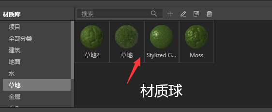
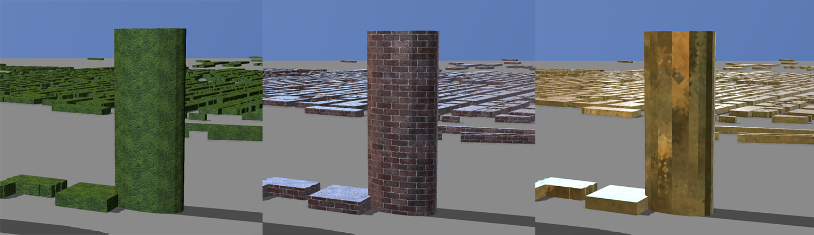
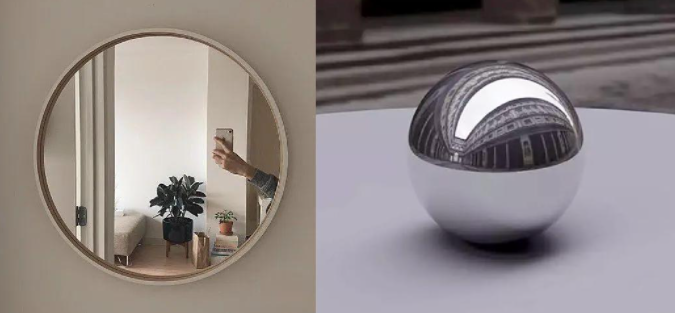
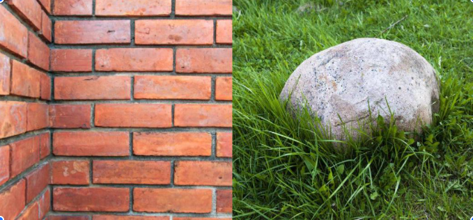
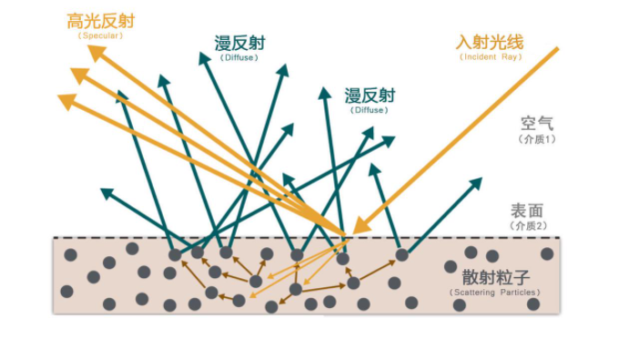

## 什么是PBR　　

在IDE中，三维数据可以通过更换材质球的方式轻松方便的一键更换三维物体质感、颜色等属性。

这个是怎么做到的呢？材质球的设计中我们运用了一种叫做PBR的技术，PBR（Physically Based Rendering）是一种基于物理的着色和渲染技术。

早期创造 3 维场景中，艺术工作者们会选择各种材质球或者纹理图片，比如金属、砖墙，去表现真实世界物体的质感和颜色，当好不容易做了大量的调试，设置各种参数让模型看起来像真正的金属、砖墙，结果导入到不同的三维软件后，即使是同样的模型和贴图，因为不同的光照方案，着色器设置等，看起来会完全不一样。为了解决这些问题，业界开展了大量的研究，迪士尼动画工作室在 SIGGRAPH 2012 上著名的 talk《Physically-based shading at Disney》中提出了迪士尼原则的 BRDF(Disney Principled BRDF），在电影和游戏业界引起了不小的轰动。从此，基于物理的渲染正式进入大众的视野，也奠定了 PBR 的方向和标准。

无需进行复杂的设置，只需要设置少数的纹理贴图，并根据现实世界中的材质属性输入参数，不管在什么光照场景和软件中，都可以做出正确的材质质感，简单说，在 PBR 工作流中，我们可以用非常直观的少量变量去表达材质复杂的物理属性。这是如何做到的呢？如果你想深入学习蕴含其中的物理规律，我们建议你可以阅读由 Substance 官方推出的[《The PBR Guide》](https://substance3d.adobe.com/tutorials/courses/the-pbr-guide-part-1-zh)，这本手册由 3D 领域各路专家共同编制，从理论到实践，深度解析 PBR 的工作原理。但现在，抛开难懂的技术术语，对于使用 IDE 的艺术家们来说它意味着什么呢？让我们提纲挈领，简要介绍一下关于 PBR 的知识。

### 1、所有物体或多或少都会反射光线

不管是闪亮的金属，还是半透明的塑料，甚至一件衣服，它们都会反射光线。有些介质，比如镜子或者光滑的金属，如下图，实际上你看到的周边环境远多于它自身的材质，这是因为照射在它上面的光线大部分完美反射到你的眼睛里。

*<small>镜子和光滑的金属球</small>*

而有些介质，光线照射到表面时会穿透到内部，光线会在介质内部撞击不同的散射粒子，并被多次散射，然后再重新折射穿出这个物体。因此不同于金属介质完美的反射光线，我们眼中接收的是一团混乱方向的反射光线，也就是漫反射，再基于物体本身的材质和光线的入射波长，就让我们看到了材质本身的颜色。

*<small>非金属的砖墙和石头</small>*

### 2 、材质不是金属就是非金属

金属具有导电性，也被叫做导体。光照到金属时，光线大部分会被反射，被抛光过的金属的反射值在 70%-100%之间，而所有的折射光都会被吸收。

非金属是较差的电导体，也叫做非导体，比如石头、陶瓷、木头等。材质内被折射的光一般会被散射或者同时被吸收（通常会穿透物体二次折射）

### 3、物体越粗糙，反射高光越模糊

如果物体是不规则的平面，因为接触面的粗糙度，光线反射的方向会变得非常随机。越粗糙的表面，它的高光范围会越大，表现也越暗。

### 4、物体越光滑，反射高光越清晰

如果物体是规则完美的平面，光线反射的方向也会非常完美一致，同时高光更聚焦，在特定的角度下观看，高光会更亮更强。

### 5、菲涅尔系数

菲列尔系数是用法国物理学家 Augustin-Jean Fresnel 名字命名的，他发现用更斜的角度去观察水面，并慢慢与水面趋于平行时，能看见越来越多的高光反射。F0（菲涅尔零点）是指使用介质表面的折射率（IOR）导出折射的光线量。

## 结束语

在 PBR 世界中已制定好各种规则，你并不需要掌握复杂的方程式就可以自如创造真实世界的材质，以上就是我们关于 PBR 的简单介绍，希望这篇文章能起到抛砖引玉的作用。
