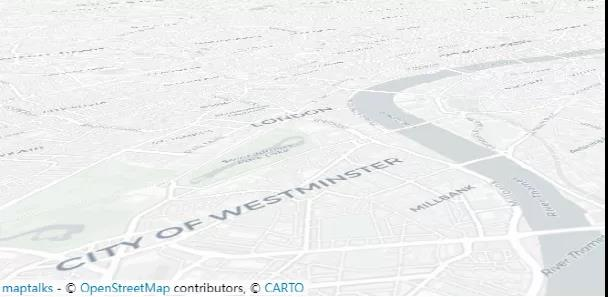
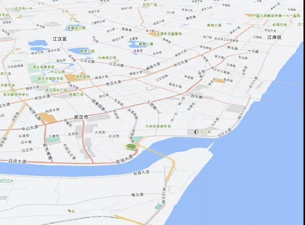
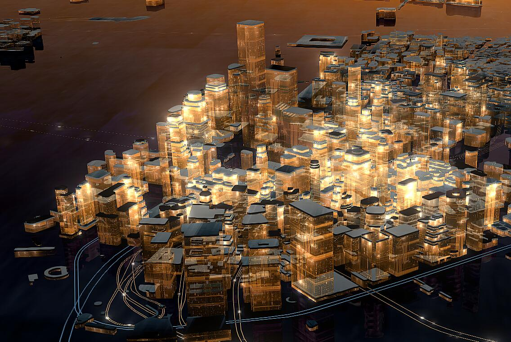

矢量瓦片格式全称 mapbox vector tile format，是 [mapbox](https://mapbox.com) 公司制定的一种替换传统栅格瓦片的数据格式标准。

传统栅格底图最大的问题是制备成本高，因为底图设计不仅需要专业的GIS制图师和专业的制图软件，而且栅格瓦片的切片也需要大量的时间与算力。例如22级精度到1：50的全国底图需要数周时间来生成切片。而更麻烦的是，每次底图样式的修改都需要重新生成所有的地图瓦片。

为了解决这个问题，mapbox提出了矢量瓦片格式(mvt)。

矢量瓦片不再是传统静态图片格式，瓦片中的数据是矢量格式，不包含任何的样式信息。底图的最终呈现，是依靠矢量瓦片渲染引擎在浏览器端实时的按照给定样式对瓦片中的矢量数据实时渲染的结果。因为瓦片数据和样式的分离设计，所以底图样式的修改不再需要重新生成瓦片。

除了瓦片制作更方便，矢量瓦片也比栅格瓦片更适合三维场景。

与二维地图不同，三维地图场景下存在大量的旋转和倾斜视角，传统的栅格底图此时会有明显的拉伸模糊失真，纵使场景中的模型数据如何精致，模糊失真的底图也会拉低整个三维地图的表现格调。

但矢量瓦片技术因为对底图元素都是实时渲染的，无论地图如何旋转和倾斜，都能保持清晰的渲染效果与质感（特别是文字）。

同时矢量瓦片也能用于实时构建三维地图模型，配合三维渲染技术构建表现形式丰富的三维地图。

## 参考
* [矢量瓦片标准](https://github.com/jingsam/vector-tile-spec/blob/master/2.1/README_zh.md)