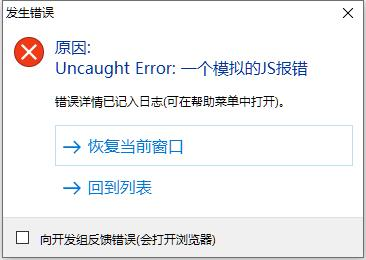

世界上不存在没有bug的软件，因此IDE提供了崩溃恢复机制，保障您的设计工作不会丢失。

IDE后台每隔10秒会自动保存一次当前的设计文档，当程序发生错误时，IDE会提供两个选项给您:

* 恢复当前窗口：如果您选择了这个选项，IDE会回到上一次保存的状态。
* 回到列表：直接回到MSD列表，需要注意的是，未保存的设计进度都会丢失。

推荐您勾选`向开发组反馈错误`选项，IDE会在浏览器中打开[错误反馈论坛页面](https://forum.maptalks.com.cn)，用微信登陆后将错误反馈给开发组。
