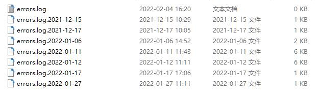

IDE会以天为单位，记录使用过程中的错误信息。

错误日志中主要包含了错误发生时的调试信息和程序堆栈，可以用来帮助开发团队追踪分析bug。

## 日志文件夹

你可以选择IDE的帮助-打开日志文件夹 菜单，来打开日志文件夹。

其中 error.log 是当天的错误日志文件。历史日志以errors.log.yyyy-mm-DD 的格式命名，其中 yyyy-mm-DD 是日志的年月日。
[报告bug](../report)时，请提供相应的错误日志，以帮助开发团队定位和修正bug。

## 敏感数据

错误日志中只包含调试信息和程序堆栈信息，不会包含您个人或组织的敏感数据。