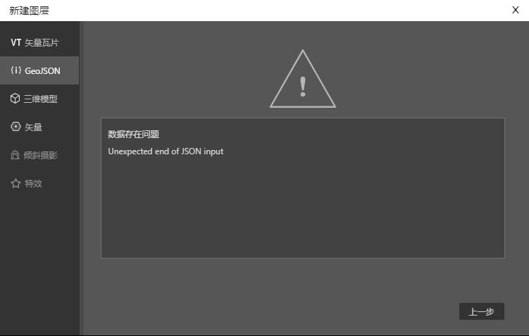
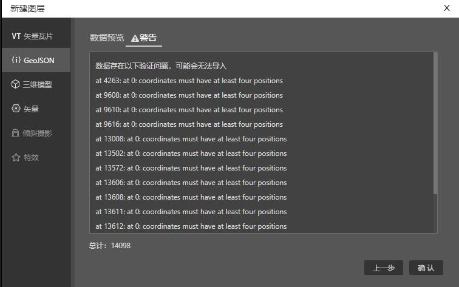

您在导入GeoJSON数据的时候，异常情况非为三类：
* 错误，数据无法正常导入。
* 警告，数据能正常导入，但有警告的数据可能无法在地图上正常显示。
* 正常导入，但地图不显示数据

错误提示界面：



警告界面：



以下是一些常见的数据问题，您可以参考它们用于修正数据。 如果文档中没有包含您的情况，可以及时反馈给我们。

## 数据不是经纬度数据

能正常导入，但地图不显示数据。

按照GeoJSON标准，坐标数据都必须是经纬度数据。 以下为一个合法的GeoJSON数据示例：
```json
{
  "type": "Feature",
  "geometry": {
    "type": "Point",
    "coordinates": [114.32894, 30.585748]
  },
  "properties": {
    "name": "Dinagat Islands"
  }
}
```
但有些GeoJSON数据的坐标并不是经纬度坐标，而是类似 `[12727039.383734727, 3579066.6894065146]` 之类的墨卡托坐标或其他坐标。

这种GeoJSON数据是无法在IDE中正常导入的，您可以先用QGIS等软件把坐标转化为经纬度后再导入。

## 坐标不是数组

该问题会导致报错。 报错信息: `TypeError: Cannot read property 'length' of null` 或者 `Position must be an array`。

如下面示例，当 Coordinates 属性不是数组时时会抛这个错误，没有坐标系的 Feature，您可以选择删除或者根据您的数据要求修复它。
```json
{
  "type": "FeatureCollection",
  "name": "point-1",
  "crs": {
    "type": "name",
    "properties": { "name": "urn:ogc:def:crs:OGC:1.3:CRS84" }
  },
  "features": [
    {
      "type": "Feature",
      "properties": {
        "osm_id": "3406566",
        "highway": "traffic_signals",
        "ref": null
      },
      "geometry": { "type": "Point", "coordinates": null }
    }
  ]
}
```

## Geometry的类型不正确

该问题会导致报警。报警信息： `type must be one of: "Point", "MultiPoint", "LineString", "MultiLineString", "Polygon", "MultiPolygon" or "GeometryCollection"`

geometry.type必须为以上这些值中的某个。

```json
{
  "type": "FeatureCollection",
  "name": "point-1",
  "crs": {
    "type": "name",
    "properties": { "name": "urn:ogc:def:crs:OGC:1.3:CRS84" }
  },
  "features": [
    {
      "type": "Feature",
      "properties": {
        "osm_id": "3406566",
        "highway": "traffic_signals",
        "ref": null
      },
      "geometry": { "type": "", "coordinates": [114.32894, 30.585748] }
    }
  ]
}

```

## Feature类型不正确

该问题会导致报警。 报警信息：`type must be "Feature"`。

Feature的type必须是"Feature",下方数据为"",需要把type从""改成"Feature"

```json
{
  "type": "FeatureCollection",
  "name": "point-1",
  "crs": {
    "type": "name",
    "properties": { "name": "urn:ogc:def:crs:OGC:1.3:CRS84" }
  },
  "features": [
    {
      "type": "",
      "properties": {
        "osm_id": "3406566",
        "highway": "traffic_signals",
        "ref": null
      },
      "geometry": { "type": "Point", "coordinates": [114.32894, 30.585748] }
    }
  ]
}
```
