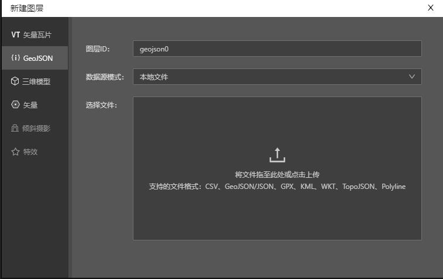

MapTalks IDE 是通过一个叫`GeoJSONVectorTileLayer`的程序接口实现数据文件的导入的。

如名所示，`GeoJSONVectorTileLayer`仅支持[GeoJSON数据格式](https://geojson.org)，但IDE通过转换程序，对丰富的数据格式提供了支持。

## GeoJSON格式

GeoJSON是一种基于JSON的地理空间数据交换格式，它定义了几种类型JSON对象以及它们组合在一起的方法，以表示有关地理要素、属性和它们的空间范围的数据。

<!-- [i18n]其他语言版本里需要替换为维基百科的相应语言链接 -->

(以上引用自[维基百科](https://zh.wikipedia.org/wiki/GeoJSON))

因为GeoJSON基于web端的通用数据格式JSON格式，因此GeoJSON对于前端程序和人眼阅读都非常友好，从而成为web端GIS系统中应用最为广泛的数据格式。

## 支持的其他格式

IDE通过转换程序，能将以下格式转换为GeoJSON后导入到地图上。

* CSV：用逗号(,)分隔的电子表格(Excel)数据格式
* GPX：是一种基于XML的通用GPS数据格式
* KML：是一种基于XML的地理数据存储格式，OGC标准
* WKT：全称Well-known text，是一种文本标记语言，用于表示矢量几何对象、空间参照系统及空间参照系统之间的转换
* TopoJSON：是GeoJSON的扩展，用于将地理数据结构编码为共享拓扑。
* Encoded Polyline：是一种谷歌开发的[坐标压缩数据格式](https://developers.google.com/maps/documentation/utilities/polylinealgorithm)。 

## CSV的导入

因为CSV表格数据中没有固定的地理信息属性列，所以导入CSV时，需要人工指定哪一列是精度，哪一列是纬度。

这也意味着CSV格式目前只支持点类型(Point)的数据导入。

## Shapefile的导入

<!-- [i18n]其他语言版本里需要替换为维基百科和英文的导入教程 -->
[Shapefile格式](https://baike.baidu.com/item/shapefile%E6%96%87%E4%BB%B6/11041662?fr=aladdin)是ESRI公司开发的一种常用地理信息数据存储格式，常用于ArcGIS等流行软件。

因为Shapefile转换为GeoJSON的程序成熟度和稳定性的原因，IDE目前暂时不支持直接导入Shapefile格式。 如果您想导入Shapefile数据，推荐使用开源地理信息软件[QGIS](https://www.qgis.org/)将shapefile转换为GeoJSON数据格式后再导入。

<!-- [i18n]其他语言版本里需要替换为相应语言的导入教程 -->
具体的转换教程请参考下面[这篇教程](http://events.jianshu.io/p/6b540e7f446b)。