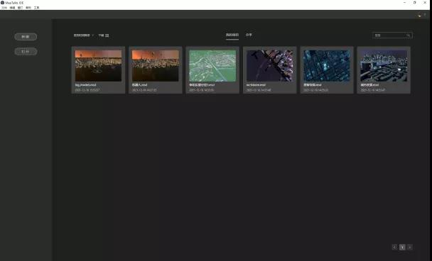
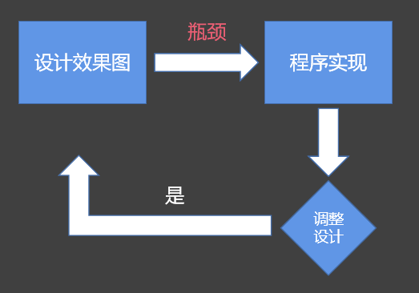
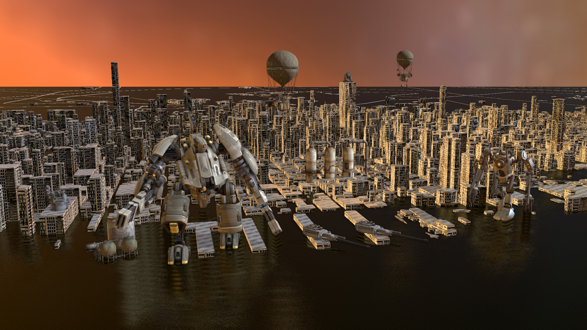
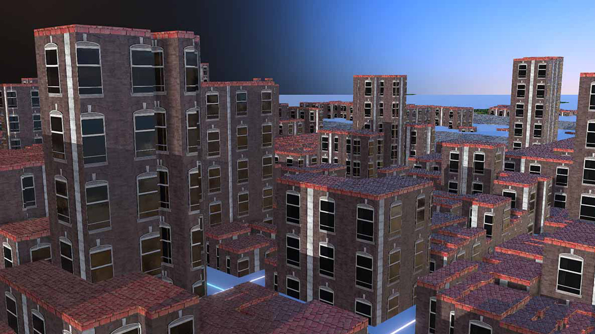

MapTalks IDE 全称 MapTalks集成设计环境（Integrated Design Environment），是由[MapTalks技术团队](https://github.com/maptalks)开发的新一代web地图设计软件。

通过MapTalks IDE，您可以自由的创建二维和三维地图，在其中载入或创建地理数据，可视化和分析数据。您还可以把创建的地图分发给开发人员，在javascript程序中加载其中的地理数据或配图样式。
## 特点
MapTalks IDE软件的特点如下：
* 专业面向设计师
* 桌面端软件，方便大个头三维数据的加载，同时设计成果保存在本地，安全可靠
* 针对Web端应用，提供所见即所得的三维地图样式设计功能
* 最终服务于web前端程序，只需用少量代码就能把IDE上的设计成果应用到web页面中
* 帮助GIS团队提升70%的项目开发效率

### IDE是如何提升项目开发效率的？
地图项目典型的实施过程是，由设计师设计出地图效果图，再由GIS前端工程师实现出效果，这个过程中如果设计有调整，则重复上述过程。

这个迭代过程中，GIS工程师负责的效果图到实现是一个明显的瓶颈，至少占有70%左右的工作量。而MapTalks IDE能让设计师的设计成果直接应用到页面里，进而将工作量减少到原有的30%。

## 用户登录

第一次使用IDE时，用您的微信扫描界面上的二维码即可免费登录使用。

## 工程文件

MapTalks IDE的所有设计工作和资源都保存在msd文件中，您可以通过在网盘或其他备份设备中备份该msd文件来保存备份您的设计工作，也可以通过通信软件将msd发送给其他人来分享您的设计工作。

但需要注意的是，如果您的设计工程中引用了部署在远程服务上的数据资源，这些资源并不会保存在msd文件里。

## 案例

