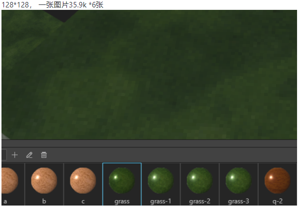
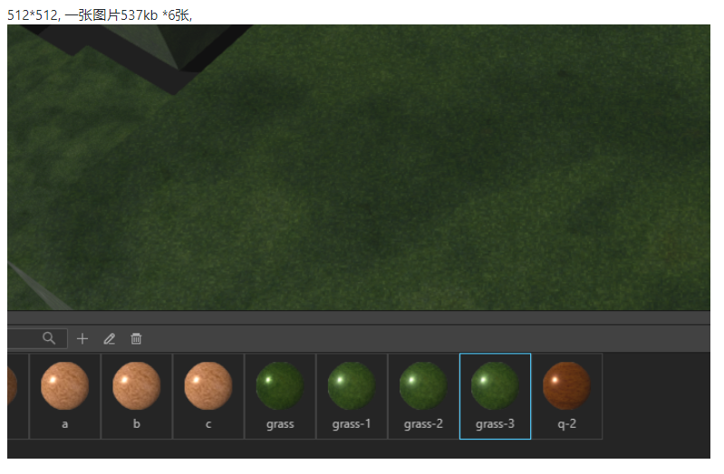
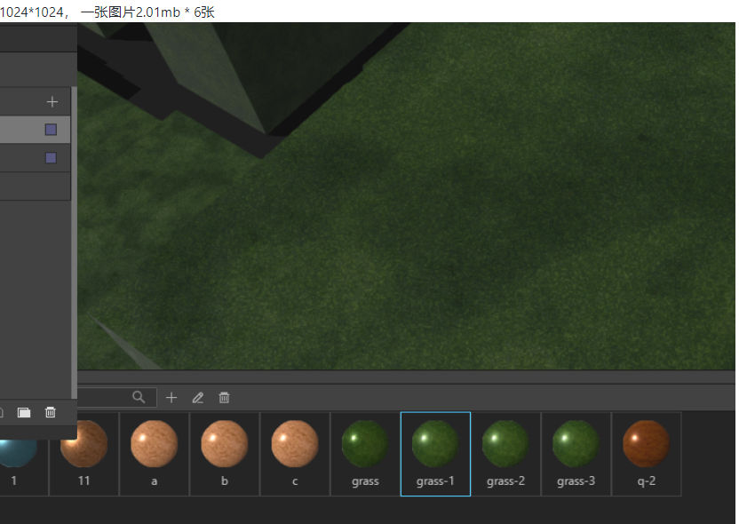

在设计地图时，您能用IDE方便的添加各种设计资源，但是为了平衡最终页面程序的效果和性能，您需要对资源尺寸对页面加载速度和渲染性能的影响有所了解。

因为IDE是本地客户端程序，即使上百M的模型或纹理也能快速加载，但由于IDE发布的msd JSON最终由html程序加载，如果添加的GLTF模型，纹理贴图或hdr等资源尺寸太大，可能需要很久才能加载完这些模型或纹理。

所以在进行设计时，你需要时刻注意资源的尺寸问题。

## 模型尺寸

您在上传GLTF模型时，如果您的模型超过了2M, IDE会给出超过2M的警告，但该警告不影响模型的上传，但如果客户电脑网速较慢，大于2M的模型可能会需要很长的下载时间。

### 模型纹理
GLTF模型的纹理图片尺寸也可能成为加载瓶颈。为此IDE在上传模型时提供了纹理压缩功能，您可以根据需要选择合适的纹理最大尺寸。 

默认的纹理最大尺寸是512，意味着如果GLTF某个纹理图片高宽超过512像素时，IDE会用同比例宽高比压缩算法对纹理图片进行压缩。

### draco 压缩

[draco](https://github.com/google/draco)是谷歌开发的一种三维模型压缩算法，能将顶点数据，法线数据压缩为原有的1/4，有效提升模型下载速度和页面上的渲染性能。

导入GLTF模型时，您可以选择是否让IDE采用draco压缩模型，默认开启。

该功能开发中。

## 纹理尺寸

在您添加新的纹理时，虽然IDE并没有限制，您可以选择一个合适的图片尺寸。图片超过2M时，IDE会给出警告，但不会阻止上传。

根据经验，大多数情况下，高宽上限为256或者128就能满足大多数要求，如果精度允许，我们建议您可以把纹理设置得更小，例如64甚至32，以获得更高的性能。

不同纹理尺寸的demo如下，您可以直观感受不同尺寸纹理的效果。

## hdr尺寸

IDE终超过7M的hdr将无法上传。

2k精度的hdr一般小于7m, 当hdr尺寸过高，达到几十m甚至几百m，一方面下载会很慢，另外也会明显影响地图的渲染性能。

所以综合考虑，IDE把hdr的最大尺寸设为7M。

## 小结

除了hdr，IDE对资源的尺寸并没有严格的限制。 如何平衡效果和性能，选择权在您自己的手中。

如果您出现设计的作品在用户目标终端上首次加载很慢的情况，可能就需要您在设计过程中，宏观的把控以上这些资源的尺寸，在每一个局部，尽可能的优化这些资源尺寸，来达到好的性能和展示效果的平衡。
