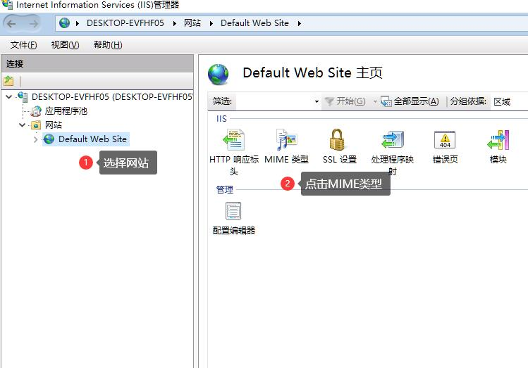
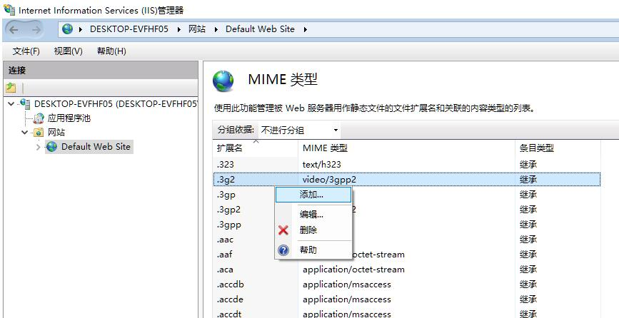
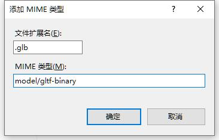

IDE导出的msd JSON数据发布到IIS时，默认情况下，IIS缺少必要的资源文件MIME类型注册，因此加载MSD示例HTML或JSON引用的资源时，会报错。

您只需要在IIS中增加下列MIME类型即可：

## 注册MIME类型的步骤

* 在IIS左侧点击你需要配置MIME类型的网站，选择MIME类型

* 在右边的MIME列表上点击右键，选择添加

* 增加新的MIME类型

在弹出的对话框中添加新的MIME类型，例如添加 `.glb` MIME类型，扩展名填 `.glb`, MIME类型填 `model/gltf-binary`

## MIME类型列表

IIS中推荐注册的与MapTalks IDE相关的MIME类型如下：

|  后缀名 | MIME类型 | 说明 |
|  ----   | :----:  | :----: |
| .glb   | model/gltf-binary | glb三维模型 |
| .gltf   | model/gltf+json | gltf三维模型 |
| .drc    | application/octet-stream | draco压缩数据格式 |
| .hdr    | image/x-hdr | hdr环境光图片格式 |
| .webp   | image/webp | webp图片格式 |
| .svg    | image/svg+xml | svg图片格式 |
| .csv    | text/csv | csv数据格式 |
| .geojson| application/json | geojson数据格式 |
| .b3dm   | application/octet-stream | 3dtiles b3dm格式 |
| .i3dm   | application/octet-stream | 3dtiles i3dm格式 |
| .cmpt   | application/octet-stream | 3dtiles cmpt格式 |
| .pnts   | application/octet-stream | 3dtiles pnts格式 |
| .s3mb   | application/octet-stream | 超图S3M格式      |
| .scp    | application/json         | 超图S3M索引文件  |