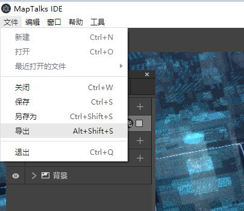
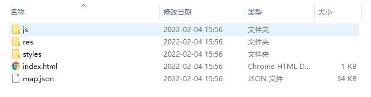

IDE导出的数据可以发布到MapHub服务或是您自己的HTTP服务上。

## 导出msd JSON数据

用IDE打开某个msd文件后，在文件菜单中选择`导出`即可导出msd JSON数据。

导出的文件如下：

## 发布到MapHub服务

发布到MapHub服务上的msd JSON会拥有一个独一无二的静态url，您可以在应用程序中用此url加载您的设计。

每次您在IDE中一键提交后，应用程序也会从MapHub加载最新的样式数据，与您IDE的设计始终保持同步。

这样能省却每次人工导出，发布到HTTP服务的繁琐步骤。

发布的具体步骤待补充。

## 发布到HTTP服务

导出的数据均为静态文件，您可以根据喜好选用任意HTTP服务软件来发布文件，例如 [Apache](https://httpd.apache.org/)， [Nginx](https://www.nginx.org/)，IIS等。

默认配置的IIS加载msd JSON数据会报错，这是因为IIS缺少对必要的MIME类型支持，可以参考[IIS的MIME类型](../iis)注册必要的MIME类型。

## 发布到公有云服务

你也可以把msd JSON发布到云服务的对象存储服务中，例如[阿里云的对象存储(OSS)](https://www.aliyun.com/product/oss)，[腾讯云的COS服务](https://cloud.tencent.com/document/product/436)，[华为云的OBS服务](https://www.huaweicloud.com/product/obs.html)等。

具体教程请参考您选用的HTTP服务或云服务的相关教程或文档。