## 1. 扫码登录

新用户使用 MapTalks IDE 无需注册，启动 IDE 后，用微信扫描二维码就能登录使用。

用户登录后，IDE会把登录数据缓存在系统里，下次启动时会自动登录并在每次成功登录后更新登录数据。如果长时间未登录，登录数据过期后不再自动登录，此时只需再次用微信扫描二维码重新登录即可。

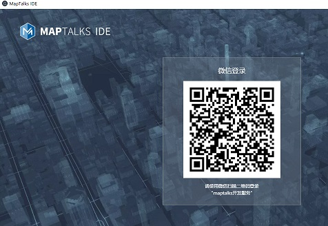

## 2. 打开工程文件

进入IDE后，点击左侧打开按钮，从本地直接打开工程文件，或者在右侧展示区中选择缩略图，单击“进入”。

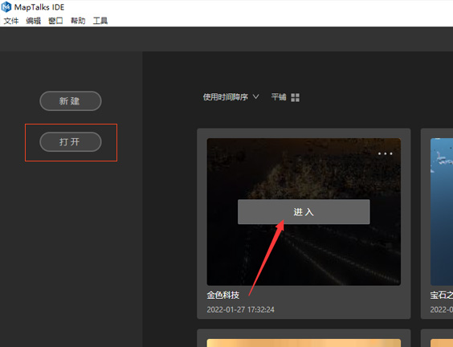

所选的文件将会在IDE工作区打开

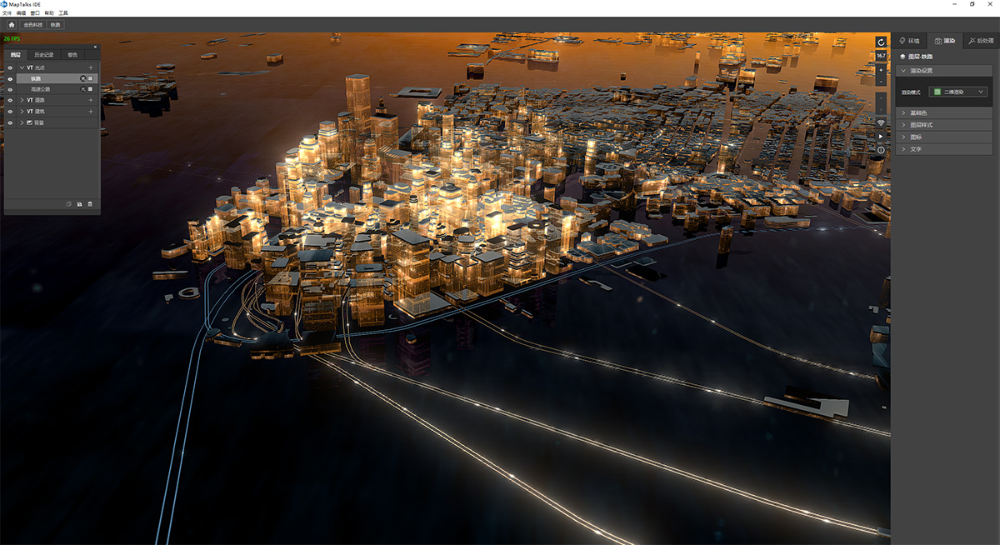

## 3. 创建工程文件

进入IDE后，点击新建按钮，创建工程, 或者在顶部的菜单中单击文件，选择新建。

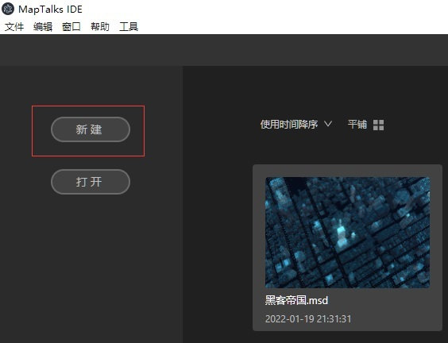

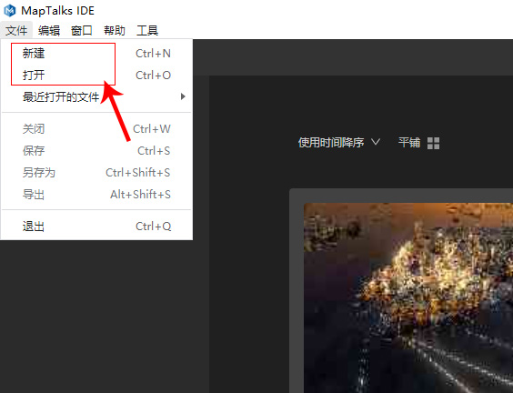

## 4、导入数据

单击新建后，会弹出新建图层面板，提前预设导入的数据类型和属性，目前IDE可以导入VT矢量图层、Geojson、三维模型、矢量4种数据。
(ps:倾斜摄影和特效图层正在加紧施工中，会在下个版本更新)

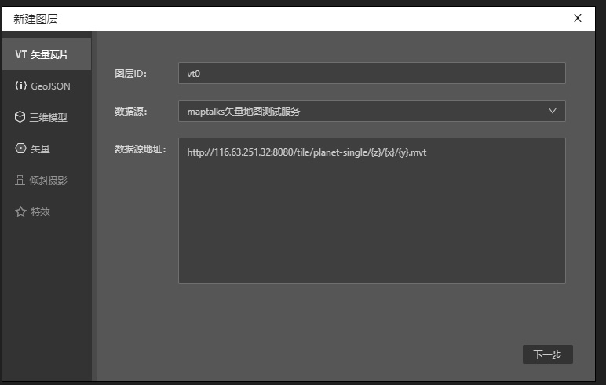

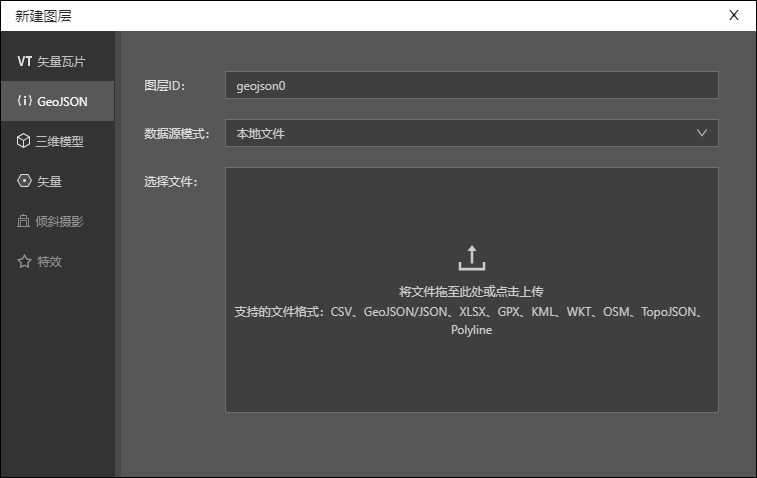

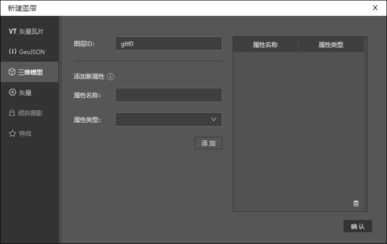

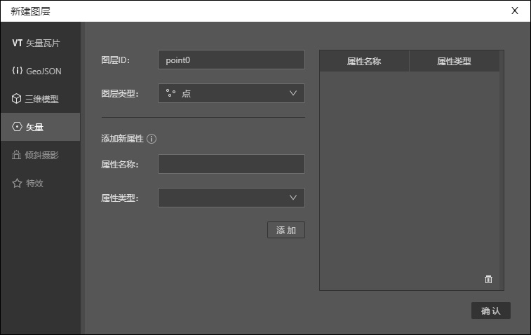

## 5、设置数据属性

不同数据类型有不同的属性设置。比如我们选择VT矢量图层，单击下一步，会弹出数据选择面板。

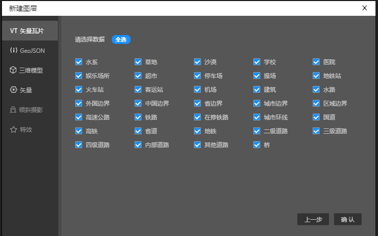

如果选择GeoJSON图层，上传数据后，会弹出数据预览面板。

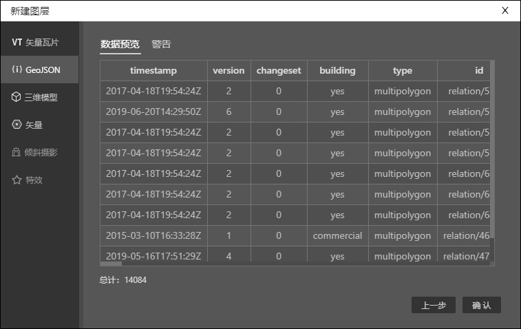

## 6、完成创建

属性设置完成后，单击确定，地图上即可出现预览，同时图层面板上会显示刚刚加载的图层，我们就此完成创建工作。

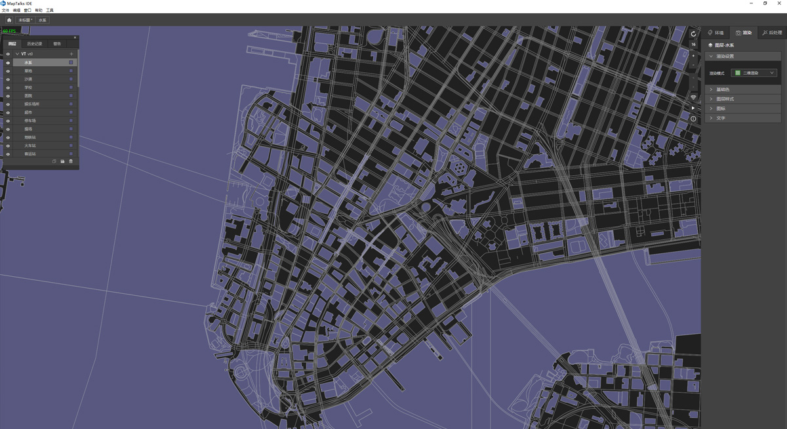

