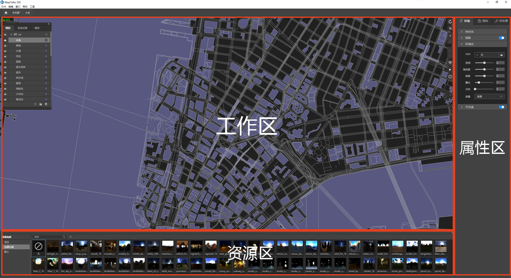
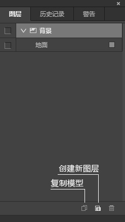
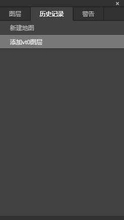
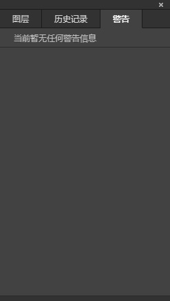
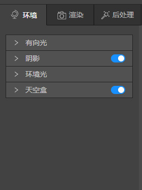
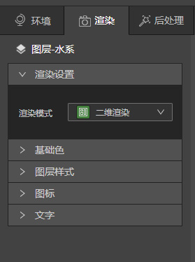
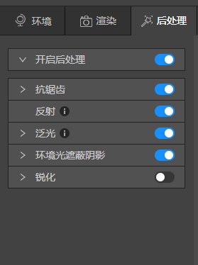
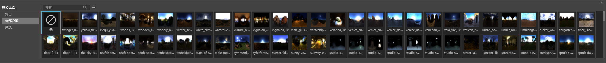
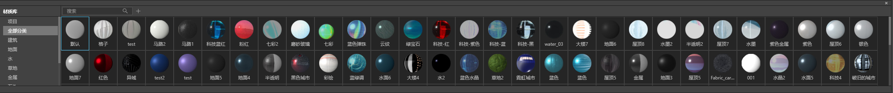
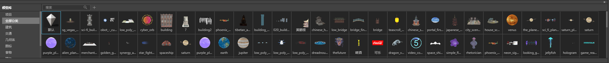

## 总体介绍

在界面中央是预览区，我们在这里预览各种地图效果；预览区右边是编辑区，里面有各种编辑控件、属性选项；最下方是资源区。

## 界面介绍
### 预览区
预览区左上角是工作面板，工作面板有3个选项：图层、历史记录、警告。如果要查看其中一个面板，可以单击它的选项卡。

### 编辑区
编辑区有3个选项：环境、渲染、后处理。如需查看可以单击对应的选项卡。

### 资源区
资源区有3个库：环境光库、材质库、模型库，可以单击[这里](../../../../design-guide/basic/resource)查看打开库的方法

